# FOCAL — COMPLETE PROJECT ARCHITECTURE & FLOW REPORT

**Document type:** Full technical baseline / architecture-as-built analysis
**Subject:** The FOCAL trust-and-verification platform, as it actually exists in source
**Repository root inspected:** `C:\Users\Varun\Desktop\FOCAL`
**Analysis date:** 2026-09-22
**Method:** Every statement below is derived from reading the project's actual source files. Where the implementation differs from a commonly-described architecture, the **actual** implementation is documented and the divergence is called out explicitly.

> **Phase note.** This document is a read-only baseline. No file in the project was modified, renamed, moved, refactored, or deleted during this analysis. No packages were installed, no environment variables were changed, no contracts were deployed, and no database schema was altered. Everything here is inspection output.

---

## HOW TO READ THIS REPORT

Two categories of statement appear throughout, and they are deliberately kept visually distinct:

| Marker | Meaning |
|---|---|
| **VERIFIED** | Confirmed by reading the source file(s) named in the same row/sentence. |
| **⚠ DIVERGENCE** | The commonly-described architecture (or a project README) claims X, but the source implements Y. The source wins. |

Section 0 exists specifically to answer the question *"is this actually how the current implementation works?"* It is the shortest path to the truth about the system. Sections 1–15 are the full requested architecture documentation.

---

## TABLE OF CONTENTS

- [Section 0 — Verification Summary: Described Architecture vs. Actual Implementation](#section-0--verification-summary-described-architecture-vs-actual-implementation)
- [Section 1 — Project Overview](#section-1--project-overview)
- [Section 2 — Complete Project Structure](#section-2--complete-project-structure)
- [Section 3 — Technology Stack](#section-3--technology-stack)
- [Section 4 — Frontend Architecture](#section-4--frontend-architecture)
- [Section 5 — Backend Architecture](#section-5--backend-architecture)
- [Section 6 — Database Architecture](#section-6--database-architecture)
- [Section 7 — ML Service](#section-7--ml-service)
- [Section 8 — Company Verification Flow](#section-8--company-verification-flow)
- [Section 9 — Student / Public User Flow](#section-9--student--public-user-flow)
- [Section 10 — Company Wallet Flow](#section-10--company-wallet-flow)
- [Section 11 — Blockchain Architecture](#section-11--blockchain-architecture)
- [Section 12 — Smart Contract Analysis](#section-12--smart-contract-analysis)
- [Section 13 — Cryptography and Hashing](#section-13--cryptography-and-hashing)
- [Section 14 — IPFS Flow](#section-14--ipfs-flow)
- [Section 15 — End-to-End System Flow](#section-15--end-to-end-system-flow)
- [Appendix A — Test Coverage Inventory](#appendix-a--test-coverage-inventory)
- [Appendix B — Configuration & Environment Variable Matrix](#appendix-b--configuration--environment-variable-matrix)
- [Appendix C — Consolidated Findings Register](#appendix-c--consolidated-findings-register)
- [Appendix D — Archived / Deprecated Code](#appendix-d--archived--deprecated-code)

---

# Section 0 — Verification Summary: Described Architecture vs. Actual Implementation

The project brief described a specific architecture. Every claim in that description was checked against the source. This table is the outcome.

| # | Claimed / Assumed Architecture | Status | What the Source Actually Does |
|---|---|---|---|
| 1 | React frontend, Node + Express backend, MongoDB, Python ML microservice | **VERIFIED** | `frontend/` (React 18 + Vite 5), `backend/backend/` (Express 4 + Mongoose 7), MongoDB DB name `focal`, `ML/ml-service/` (FastAPI). |
| 2 | Ethereum Sepolia `OMENVerificationRegistry` contract | **⚠ DIVERGENCE — does not exist** | There is **no** `OMENVerificationRegistry` contract anywhere in the repository, and **no Sepolia deployment**. The only contract is `FocalCompanyBadge.sol`. Sepolia survives *only* as an unused, unconfigured network block in `hardhat.config.js`. |
| 3 | Polygon Amoy "OMEN Company Badge" NFT | **⚠ DIVERGENCE — partially** | Polygon Amoy (chain ID `80002`) is real and enforced. But the contract is named **`FocalCompanyBadge`** with ERC-721 name **"FOCAL Company Badge"** / symbol **"FOCAL"** — not "OMEN Company Badge". Legacy `OMEN` identifiers persist only in backend/frontend *variable names and UI strings*. |
| 4 | Two blockchain networks (Sepolia + Polygon Amoy) for two different purposes | **⚠ DIVERGENCE — one network only** | A single network (Polygon Amoy) with a single soulbound ERC-721 contract. No source file supports a two-network split. |
| 5 | MetaMask wallet **authentication** (nonce / challenge / signature) | **⚠ DIVERGENCE — not implemented** | There is **no nonce, no challenge, no `personal_sign`, and no signature-recovery** anywhere in the codebase. The company wallet address is an ordinary **unauthenticated form field** validated only by the regex `/^0x[a-fA-F0-9]{40}$/`. The badge is minted to whatever address was typed. |
| 6 | GST verification via a government API | **⚠ DIVERGENCE** | GST verification is **delegated to the Python ML service** (`POST /verify-gst`), which resolves GSTINs against a **2-entry hardcoded mock dictionary** (`app/data/mock_gst_database.py`) and a format validator. No live government API is called. The default provider is literally `GST_API_PROVIDER=mock`. |
| 7 | MCA (Ministry of Corporate Affairs) company verification | **⚠ DIVERGENCE — absent** | No MCA integration, no MCA field, no MCA call exists. The only registry-like check is a **3-entry fabricated set** in `backend/backend/src/services/verificationService.js`: `mockRegistry = new Set(['TN-TECH-2020-4455','KA-INNO-2019-8811','DL-QUICK-2024-1001'])`. |
| 8 | Students need **no account and no wallet** to check a company | **VERIFIED** | All student-facing routes are public. Only admin routes require a JWT. There is no student model, no student login, no student wallet state anywhere. |
| 9 | The **company** connects a wallet and holds the verification NFT | **⚠ PARTIAL** | The badge is minted **to** the company's submitted address (true). But the company never "connects" anything — no `eth_requestAccounts` call is reachable from any company-facing page. A `connectWallet()` helper exists in `frontend/src/services/blockchain.js` but **is not invoked by any page**. |
| 10 | IPFS metadata + image via Pinata | **VERIFIED** | `pinataService.js` pins a badge image and a metadata JSON via `pinataFileToIPFS`, then sets `image` to the image CID and returns `tokenURI = ipfs://<metadataCid>`. |
| 11 | Verification hash is Keccak-256 | **VERIFIED (with a defect)** | `ethers.solidityPackedKeccak256(['string','string','string','string'], [name, domain, date, SALT])`. **The salt differs between components** — see Finding C-01. |
| 12 | Rate limiting / security hardening | **VERIFIED** | `express-rate-limit` on check and admin-login routes; ML service has an in-memory 60 req/min per-IP limiter; CORS throws rather than allowing all origins; blockchain reads **fail closed**. |

### The five divergences that matter most

1. **No wallet-signature authentication exists.** Company ownership of a wallet is *asserted*, never *proven*. Any anonymous caller can POST a company registration naming any wallet address, and an admin approval will mint a soulbound NFT to that address.
2. **No second chain, no second contract.** The "Sepolia registry + Amoy badge" split is not in the code.
3. **Verification-hash salt mismatch across components.** Backend mints a hash with salt `OMEN_TRUST_PLATFORM_v1`; the canonical blockchain CLI computes the same hash with salt `FOCAL_TRUST_PLATFORM_v1`. The same company verified through the two paths yields **two different hashes**, breaking the "anyone can reproduce the hash from the badge metadata" property the design intends. The salted value the backend uses was inherited from the pre-rename archived project.
4. **GST "verification" is a mock lookup.** Only two GSTINs exist, both fabricated, both used as demo fixtures. The backend's `verifyGST` surfaces `simulated: true` honestly, and the admin-scoring service *penalises* simulated GST — so the scoring logic is self-consistent even though the data is not real.
5. **Approval has no fallback path**, contradicting the root README. The README states that without `CONTRACT_ADDRESS`/`ADMIN_PRIVATE_KEY` the backend still works and returns `simulated: true` on approval. `adminController.approveCompany` has **no try/catch and no simulated branch**; if the chain is unconfigured the request rejects with an unhandled error. See Finding C-03.

---

# Section 1 — Project Overview

## 1.1 In plain language

FOCAL is a **trust layer for job and business opportunities**. Its job is to answer one question a student or job-seeker cannot answer alone: *"Is this company / opportunity real?"*

The way it works:

- A **company** submits itself to the platform — name, website, email, registration number, GST number, and a crypto wallet address.
- An **administrator** reviews that submission. An automated scoring service gives it a 0–100 integrity score and a recommendation (`approve` / `manual_review` / `reject`). The admin decides.
- If approved, the platform **mints a non-transferable "badge" NFT on the Polygon Amoy blockchain** to the wallet address the company supplied. Alongside it, a JSON metadata file and a badge image are uploaded to IPFS, and a cryptographic hash of the company's identity is written into the metadata.
- A **student** — with no account, no login, and no wallet — types a company name, domain, or an email into the site. The platform analyses the input for scam signals with an ML model, looks the company up in its database, **independently re-checks the blockchain** to confirm the badge is genuinely valid and unrevoked, and returns a verdict with a risk score and the evidence.

The blockchain is used for one specific reason: it makes the *"this company was verified"* claim **publicly checkable and un-editable after the fact**. Anyone can query Polygon Amoy and confirm that a specific wallet holds a valid badge issued by the FOCAL contract — without trusting FOCAL's database.

## 1.2 Technically

FOCAL is a **four-process system** plus one smart contract:

| Process | Role | Language / Runtime | Default port |
|---|---|---|---|
| Frontend | Single-page app, all UI and the *independent* on-chain re-verification | React 18 + Vite 5 | `5173` |
| Backend | REST API, business logic, database, admin operations, minting, IPFS | Node.js + Express 4 | `5000` |
| ML service | Scam/risk analysis and GST evidence | Python + FastAPI | `8000` |
| MongoDB | Off-chain system of record | MongoDB (`focal` database) | — |
| Smart contract | On-chain soulbound ERC-721 verification badge | Solidity ^0.8.24 on Polygon Amoy | — |

**Architectural principle — fail closed.** Every blockchain read path is written so that *absence of proof is treated as not-verified*, never as verified:

- `backend/src/services/blockchainService.js → resolveVerification()` returns `{isVerified:false}` unless the DB says `verified` **and** the on-chain `hasValidBadge()` call succeeds and returns `true`.
- `frontend/src/services/blockchain.js → verifyOnChain()` returns `{isValid:false, error:'Blockchain verification unavailable…'}` on any RPC failure, and the frontend's normalizer downgrades a DB-`verified` company to `unverified` if the chain does not corroborate it.
- `backend/src/app.js` throws at startup rather than allowing all origins if `CORS_ORIGINS` parses to an empty list.
- Admin login has **no** demo/bypass fallback.

**Architectural principle — admin-gated state transitions.** Verification state (`status`, `tokenId`, `verificationHash`, `tokenURI`, transaction hashes, verification/rejection/revocation reasons) is **never** accepted from a public request body. `companyController.js` uses an explicit `REGISTRABLE_FIELDS` whitelist and comments this reasoning directly:

> *"never spread req.body into the model (mass assignment would allow self-verified companies). New registrations always start pending."*

`updateCompany` additionally rejects any request where `req.body.status !== undefined` with HTTP 400 and the message *"Use the admin approval or revocation endpoint to change company status."*

## 1.3 The problem being solved

Students and job-seekers in India face a specific, high-volume fraud pattern: fake job postings and fake internships that ask for a "registration fee", "security deposit", or "training fee", often sent from free email addresses, hosted on freshly registered domains with suspicious TLDs, and impersonating real companies via lookalike (typosquatted) domains.

Three concrete failures the platform addresses:

1. **The applicant cannot verify the counterparty.** A student has no way to confirm that the "HR recruiter" emailing them belongs to a real, registered company.
2. **Verification claims are not checkable.** Screenshots, PDF offer letters, and "we are registered" statements are trivially forged.
3. **Verification claims are not revocable.** A company that was legitimate in January and fraudulent in June leaves its old "verified" evidence in circulation forever.

FOCAL's answer: an admin-audited, hash-anchored, blockchain-attested badge — plus a public, account-free lookup that combines ML scam analysis with an independent on-chain check.

## 1.4 Target users and their roles

| Actor | Needs an account? | Needs a wallet? | What they do |
|---|---|---|---|
| **Student / job-seeker / public user** | **No** | **No** | Searches a company name, domain, URL, or email content. Reads the verdict, trust score, risk signals, trust signals, and on-chain proof details. Files a fraud report. Requests a mediated connection. |
| **Company** | **No login exists.** Registration is a public POST. | Supplies an address in a form field (no wallet connection, no signature) | Submits corporate identity data for review. If approved, receives the soulbound badge at the submitted address. |
| **Administrator** | **Yes** — email + password → JWT | **No** (the platform's own backend wallet signs) | Reviews the pending queue, runs GST re-verification, approves (mints badge + pins to IPFS) or rejects, revokes previously-issued badges, moderates reports and connection requests. |

**Explicitly confirmed:** the student path requires neither an account nor a wallet. `frontend/src/context/AppContext.jsx` holds exactly one persisted value — `focal_admin_token` — and the only auth header the API client attaches is the admin bearer token. There is no student session, no student model, no student route protection.

## 1.5 Objective

> Give a student a trustworthy, instant, verifiable answer about whether a company or opportunity is legitimate — where the "verified" claim is independently confirmable on a public blockchain — while giving companies a portable, revocable, non-transferable proof of verification, and giving the platform operator a controlled, auditable issuance pipeline.

## 1.6 Overall architecture at a glance

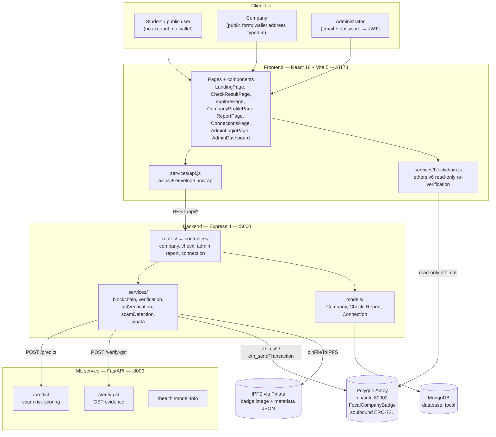

**Trust boundary, stated precisely:** the MongoDB record is FOCAL's *claim*. The Polygon Amoy badge is the *proof*. The frontend deliberately performs its own chain read (via `verifyOnChain`) rather than trusting the backend's `verification` object — and it downgrades the displayed status when the two disagree.

---

# Section 2 — Complete Project Structure

## 2.1 Top-level layout

```
FOCAL/
├── .gitignore
├── README.md                                  # root integration doc (10,305 bytes)
├── FOCAL_COMPLETE_PROJECT_ARCHITECTURE_AND_FLOW_REPORT.md   # ← this document
├── _archive/
│   └── omen-blockchain/                       # DEPRECATED predecessor (never run this)
├── backend/
│   └── backend/                               # Express API  (note the nested dir)
├── focal-blockchain/                          # canonical Hardhat project
├── frontend/                                   # React + Vite SPA
├── ML/
│   └── ml-service/                            # FastAPI ML service (note the nested dir)
└── scripts/
    └── verify-integration.ps1                 # end-to-end PASS/FAIL smoke test
```

**Structural observations (all verified):**

| Observation | Detail |
|---|---|
| **Nested directories** | The API lives at `backend/backend/`, not `backend/`. The ML service lives at `ML/ml-service/`, not `ML/`. Both paths are referenced correctly by the root README and by `scripts/verify-integration.ps1`. |
| **Three separate git repositories** | `.git` directories exist inside `frontend/`, `backend/`, and `ML/` — but **the repository root itself is not a git repository**. The frontend repo tracks remotes named `origin/main`, `origin/backend`, `origin/frontend` and a local branch `frontend`. |
| **Two dependency islands** | `backend/backend/node_modules` (~6,640 JS/JSON files) and `ML/ml-service/venv` **plus** `ML/ml-service/.venv` exist on disk. The two Python virtualenvs are distinct directories — `venv/` (contains `pip` vendored code) and `.venv/` (the one `verify-integration.ps1` actually uses: it checks for `.venv\Scripts\python.exe`). |
| **True source size** | **13,992 lines** of project source after excluding `node_modules`, `.git`, `dist`, `artifacts`, `cache`, `coverage`, `venv`, `.venv`, `__pycache__`, and generated `data`. |
| **Committed build output** | `focal-blockchain/coverage/` (15 generated files) and `focal-blockchain/coverage.json` are present in the working tree, although `.gitignore` lists `coverage/` and `coverage.json`. |

## 2.2 `_archive/omen-blockchain/` — deprecated predecessor

**Purpose:** the original blockchain module, written under the platform's old name "OMEN". Archived for reference only. Complete file inventory (21 source files; `node_modules` excluded):

```
_archive/omen-blockchain/
├── .env                                      1,049 B   (scrubbed to placeholders)
├── .env.example                              1,125 B
├── .tokenuri                                    53 B   ipfs://QmbAMj6hE5TJoi1ifngK9mg4s56mLHyxwjZzeH1EEyx8z1
├── DEPRECATED.md                             1,040 B
├── README.md                                 7,417 B
├── package.json                              1,045 B
├── hardhat.config.js                         1,475 B
├── assets/green-badge.svg                    1,316 B
├── contracts/OmenCompanyBadge.sol            6,744 B
├── metadata/technova-pvt-ltd-verified.json     712 B
├── metadata/technova-pvt-ltd-revoked.json      702 B
├── scripts/blockchainHelper.js               4,505 B
├── scripts/computeVerificationHash.js        1,253 B
├── scripts/deploy.js                         2,533 B
├── scripts/generateMetadata.js               3,048 B
├── scripts/mintBadge.js                      1,190 B
├── scripts/updateBadgeURI.js                 2,142 B
├── scripts/uploadToPinata.js                 4,031 B
└── test/OmenCompanyBadge.test.js             8,526 B
```

**Why it is archived** — `DEPRECATED.md` states it verbatim:

> *"This Hardhat project (`omen-blockchain`) has been superseded by `../../focal-blockchain` and is archived here for reference only."*
> *"Its `.env` contained **real committed secrets** (a deployer private key and a Pinata JWT). Those have been scrubbed to placeholders, and the leaked credentials should be considered compromised — rotate them: Move all funds from the old deployer wallet to a fresh wallet. Regenerate the Pinata JWT at https://pinata.io."*
> *"Do NOT: Deploy, mint, or transact from this project. Restore the old credentials."*

**Current state of the archived secrets (read-only inspection):** the `.env` file on disk now contains only placeholders — `PRIVATE_KEY=0x0000…0000` (64 zeros), `PINATA_JWT`/`PINATA_API_KEY`/`PINATA_SECRET_API_KEY` present as placeholder values, `CONTRACT_ADDRESS=0x0000000000000000000000000000000000000000`. **No live credential is present in the archived `.env`.** The archive's `.env` and `.env.example` declare the same variable names; the archive's `.env` uniquely carries the Pinata trio.

**This archive is the origin of the hash-salt defect.** Its `scripts/computeVerificationHash.js` uses:

```javascript
const OMEN_ISSUER_CONSTANT = "OMEN_TRUST_PLATFORM_v1";
```

That is **exactly the string the current backend still uses** (§13.1), while the canonical `focal-blockchain/` project uses `FOCAL_TRUST_PLATFORM_v1`.

## 2.3 `backend/backend/` — the Express API

**Purpose:** the single source of business truth. Owns the database, all admin authority, all blockchain writes, all IPFS uploads, and all communication with the ML service and MongoDB.

```
backend/backend/
├── .env                      # present on disk — placeholders only (see Appendix B)
├── .env.example
├── package.json              # name: focal-backend; main: src/index.js
├── test_all_crud.js          # standalone live integration script (not a jest test)
├── scripts/
│   └── checkDb.js            # DB connectivity / content probe
├── seed/
│   └── seedData.js           # demo dataset loader (npm run seed)
├── src/
│   ├── index.js              # process entry: connect DB → init contract → probe ML → listen
│   ├── app.js                # Express app: CORS, body parser, morgan, routes, error handling
│   ├── config/
│   │   ├── env.js            # env loading + fail-fast validation of required vars
│   │   ├── db.js             # Mongoose connection (+ Windows SRV DNS workaround)
│   │   └── blockchain.js     # provider / signer / contract factories + legacy OMEN ABI
│   ├── middleware/
│   │   ├── auth.js           # generateToken / verifyToken / isAdmin (JWT)
│   │   ├── errorHandler.js   # notFound + errorHandler (envelope normalisation)
│   │   └── validate.js       # express-validator result → 400 with field errors
│   ├── models/
│   │   ├── Company.js        # the central entity
│   │   ├── Check.js          # one scam-check lookup
│   │   ├── Report.js         # a user-submitted fraud report
│   │   └── Connection.js     # a mediated B2B/commerce connection request
│   ├── routes/
│   │   ├── companyRoutes.js
│   │   ├── checkRoutes.js
│   │   ├── adminRoutes.js
│   │   ├── reportRoutes.js
│   │   └── connectionRoutes.js
│   ├── controllers/
│   │   ├── companyController.js     (308 lines)
│   │   ├── checkController.js       (182 lines)
│   │   ├── adminController.js       (168 lines)
│   │   ├── reportController.js      (157 lines)
│   │   └── connectionController.js  (123 lines)
│   ├── services/
│   │   ├── blockchainService.js     (134 lines) — chain reads/writes, hash, fail-closed resolve
│   │   ├── verificationService.js   ( 99 lines) — offline company integrity scoring
│   │   ├── gstVerificationService.js( 69 lines) — GST via ML service
│   │   ├── scamDetectionService.js  (133 lines) — ML client + local rule fallback
│   │   └── pinataService.js         ( 91 lines) — IPFS pinning
│   └── utils/
│       ├── helpers.js        # normalizeDomain, asyncHandler, escapeRegex
│       └── logger.js         # JSON-lines logger
└── tests/                    # jest unit tests (see Appendix A)
```

**Responsibilities and relationships:**

- `src/index.js` is the only file that wires startup order. It awaits `connectDB()` first and **throws immediately if the database is unreachable** — the API cannot start without MongoDB. Contract init and the ML health probe are both wrapped in `try/catch` and merely log warnings, so a missing chain or a dead ML service degrades the API rather than preventing it from starting.
- `src/app.js` owns cross-cutting concerns. Its CORS block is a deliberate fail-closed design: it reads `CORS_ORIGINS`, strips empties, and **`throw`s** if the resulting list is empty, with the comment *"refusing to allow all origins"*.
- `routes/` files carry **only** wiring — paths, HTTP verbs, express-validator chains, and the `adminOnly` middleware array (`[verifyToken, isAdmin]`). No business logic.
- `controllers/` hold request/response handling, whitelisting, pagination, and status codes.
- `services/` hold the outward-facing integrations and the scoring rules. Notably, **`verificationService.js` makes no network calls at all** — it is pure local heuristics.
- `models/` define the four Mongoose schemas with enums, indexes, and `timestamps: true`.
- `utils/helpers.js → escapeRegex()` is a security control: user-supplied search strings are escaped before being interpolated into a `RegExp`, preventing both ReDoS and regex injection.

## 2.4 `focal-blockchain/` — the canonical Hardhat project

**Purpose:** the single source of truth for the smart contract, its tests, its deployment scripts, its CLI metadata tooling, and the shared ethers-based integration helper.

```
focal-blockchain/
├── .env.example                     # placeholders only — there is NO .env on disk
├── .gitignore                       # ignores .env, coverage/, coverage.json, cache/, artifacts/
├── package.json                     # name: focal-blockchain
├── hardhat.config.js                # solc 0.8.24, optimizer 200 runs, evmVersion cancun
├── README.md                         (8,603 B)
├── contracts/
│   └── FocalCompanyBadge.sol        # 190 lines — the only contract
├── test/
│   └── FocalCompanyBadge.test.js    (10,094 B)
├── scripts/
│   ├── deploy.js                    # deploy → log address → optional test mint → optional verify
│   ├── mintBadge.js                 # standalone mint via getContractAt
│   ├── revokeBadge.js  (n/a — revocation is exposed through blockchainHelper + updateBadgeURI)
│   ├── updateBadgeURI.js            # update a badge's metadata URI + print on-chain state
│   ├── generateMetadata.js          # build verified/revoked metadata JSON into metadata/
│   ├── uploadToPinata.js            # pin image + metadata, write final tokenURI to .tokenuri
│   ├── blockchainHelper.js          # backend/frontend integration surface (ethers v6)
│   └── computeVerificationHash.js   # deterministic keccak256 identity hash
├── metadata/
│   ├── technova-pvt-ltd-verified.json
│   └── technova-pvt-ltd-revoked.json
├── assets/
│   ├── green-badge.svg              # 1,489 B — default image uploaded by the backend
│   └── red-badge.svg                # 1,493 B
├── coverage.json                    # generated; not committed per .gitignore
└── coverage/                        # generated HTML/LCOV report (15 files)
```

**Dependency directions that matter:**
- `backend/backend/src/services/pinataService.js` reaches **across process boundaries** into this project for its default image: `DEFAULT_IMAGE_PATH` resolves to `../../../../focal-blockchain/assets/green-badge.svg`. Deleting or moving `focal-blockchain/assets/` silently breaks badge minting.
- `blockchainHelper.js` loads its ABI from `../artifacts/contracts/FocalCompanyBadge.sol/FocalCompanyBadge.json` — i.e. **it requires `npx hardhat compile` to have run first**. The backend does *not* use this file; it carries its own minimal human-readable ABI in `src/config/blockchain.js`.
- There is **no `deployments/` directory** and therefore no committed record of a live deployment address inside this project.

## 2.5 `frontend/` — the React SPA

```
frontend/
├── .env.example                     # VITE_* only — there is NO .env on disk
├── .gitignore
├── package.json                     # name: focal-app, v2.0.0, type: module
├── vite.config.js                   # react plugin, '@' → ./src, port 5173, host: true
├── tailwind.config.js               # design tokens (light theme — see note below)
├── postcss.config.js
├── index.html                       # Google Fonts: Inter, Sora, Space Grotesk
├── public/favicon.svg
├── README.md                        # 2,789 B — partially stale (see ⚠ notes below)
└── src/
    ├── main.jsx                     # ReactDOM.createRoot + StrictMode
    ├── App.jsx                      # provider + router + global chrome
    ├── index.css                    # Tailwind layers + light-theme globals
    ├── context/
    │   └── AppContext.jsx           # the ONLY global state (54 lines)
    ├── services/
    │   ├── api.js                   # 479 lines — all HTTP, normalisers, demo fallback
    │   └── blockchain.js            # 130 lines — read-only chain verification
    ├── data/
    │   └── demoData.js              # 324 lines — hardcoded demo fixtures
    ├── pages/
    │   ├── LandingPage.jsx          (417 lines)
    │   ├── CheckResultPage.jsx      (323 lines)
    │   ├── CompanyProfilePage.jsx   (303 lines)
    │   ├── ExplorePage.jsx          (193 lines)
    │   ├── AdminDashboard.jsx       (363 lines)
    │   ├── AdminLoginPage.jsx       ( 90 lines)
    │   ├── ReportPage.jsx           (208 lines)
    │   ├── ConnectionsPage.jsx      (237 lines)
    │   └── NotFoundPage.jsx         ( 31 lines)
    └── components/
        ├── VerificationScanner.jsx  (152 lines) — cosmetic animation only
        ├── SearchBox.jsx            (118 lines)
        ├── TrustScoreMeter.jsx      (106 lines)
        ├── NetworkVisualizer.jsx    (135 lines)
        ├── DomainComparison.jsx     (105 lines)
        ├── BackgroundGrid.jsx       (104 lines)
        ├── Navbar.jsx               (171 lines)
        ├── Footer.jsx               ( 95 lines)
        ├── CompanyCard.jsx          ( 65 lines)
        ├── CustomCursor.jsx         ( 59 lines)
        ├── BlockchainProofDetails.jsx( 25 lines)
        └── Toast.jsx                ( 31 lines)
```

> **⚠ DIVERGENCE — the documented design system is stale.** `frontend/README.md` describes a dark theme: *"Pitch Black #050505, Dark Surface #0D0D0D, Elevated Card #121212"*. The **actual** `tailwind.config.js` and `index.css` implement a **light / neo-brutalist theme**: `pitch: '#F7F7F2'` (near-white page background), `surface: '#FFFFFF'`, `textDark: '#111111'` (near-black text), `borderDark: '#DCDCD5'`. The accent colours (Neon Yellow `#DFFF00`, Bright Green `#39FF88`, Risk `#FF3B30`) are accurate as documented. `index.css` even carries the comment *"Cyber Glow Utilities for Light Mode"*.
>
> **⚠ DIVERGENCE — the frontend README also claims** *"Ethers.js v6 (Polygon Mainnet RPC)"*. The code targets **Polygon Amoy testnet** and asserts `chainId === 80002n`.

## 2.6 `ML/ml-service/` — the FastAPI ML service

```
ML/ml-service/
├── requirements.txt
├── .env.example                     # there is NO .env on disk
├── Dockerfile
├── README.md
├── pytest.ini / .pytest_cache
├── venv/                            # Python virtualenv #1 (contains pip vendored code)
├── .venv/                           # Python virtualenv #2 — the one the verifier script uses
├── app/
│   ├── main.py                      # 323 lines — FastAPI app, 5 endpoints, 2 middlewares
│   ├── config.py                    # 86 lines — weights, thresholds, TLD/portal lists
│   ├── data/
│   │   └── mock_gst_database.py     # 23 lines — TWO hardcoded GSTIN records
│   ├── models/
│   │   ├── text_classifier.py       # 201 lines — sklearn TF-IDF pipeline wrapper
│   │   ├── pretrained_model.py      # 127 lines — HuggingFace BERT pipeline wrapper
│   │   └── url_analyzer.py          # 302 lines — tldextract, WHOIS, typosquatting, blacklists
│   ├── schemas/
│   │   └── request.py               # 135 lines — Pydantic v2 request/response models
│   ├── services/
│   │   ├── risk_scoring.py          # 301 lines — weighted combiner + rule fallback
│   │   ├── text_analysis.py         # 106 lines — the 3-tier ML priority chain
│   │   ├── url_analysis.py          # 126 lines — domain signals → scored red flags
│   │   ├── email_analysis.py        # 395 lines — headers, SPF/DKIM/DMARC, spoofing
│   │   └── gst_verification.py      # 119 lines — GSTIN validation + mock lookup + scoring
│   └── utils/
│       ├── preprocess.py            # 304 lines — cleaning + RED_FLAG_PATTERNS registry
│       ├── features.py              # 197 lines — TF-IDF config + hand-crafted features
│       ├── helpers.py               # 72 lines — get_risk_level, cap_score, build_explanation
│       └── gstin_validator.py       # 41 lines — 15-char GSTIN regex + state-code map
├── models/
│   ├── .gitkeep
│   ├── model_meta.json              # training metadata (present)
│   ├── text_classifier.pkl          # ✅ PRESENT ON DISK — sklearn model is trained
│   ├── vectorizer.pkl               # ✅ PRESENT ON DISK
│   └── evaluation/
│       ├── metrics.json
│       ├── classification_report.txt
│       ├── confusion_matrix.csv
│       └── top_features.csv
├── scripts/
│   ├── __init__.py
│   ├── generate_synthetic.py        # 286 lines — synthetic training-corpus builder
│   ├── train_model.py               # 273 lines — trains + compares 4 classifiers
│   ├── evaluate_model.py            # 166 lines
│   └── evaluate_bert.py             # 102 lines
└── tests/
    ├── test_api.py                  # 272 lines
    └── test_scoring.py              # 272 lines
```

**Important verified fact:** the trained sklearn artifacts **exist on disk** (`models/text_classifier.pkl`, `models/vectorizer.pkl`, `models/model_meta.json`). This means the *sklearn* tier of the ML fallback chain is live, not dormant.

## 2.7 `scripts/verify-integration.ps1` — the integration verifier

**Purpose:** a six-step PASS/FAIL smoke test that proves the four processes actually talk to each other. It is the project's de-facto acceptance test.

| Step | What it checks | Failure means |
|---|---|---|
| 1 | `ML/ml-service/.venv/Scripts/python.exe` exists | ML virtualenv not created |
| 2 | Backend `.env` contains a real (non-placeholder) `MONGODB_URI` | DB not configured |
| 3 | Boots the ML service on `:8000`, asserts `/health → model_loaded` | Model artifacts missing |
| 4 | `POST /predict` with the probe text `"Pay 2000 registration fee now! Limited time offer! Contact us on WhatsApp to join immediately."`, asserts `risk_score -ge 50` | ML scoring regressed |
| 5 | Boots the backend on `:5000`, `GET /api/companies?limit=5`, then `POST /api/check {input: <same probe text>}`, asserts `riskScore -ge 50` **and that a `simulated` field is present** | Integration broken |
| 6 | `npm run build` in `frontend/` | Frontend will not compile |

Logs are written to `verify-logs/`. Step 5's assertion that a `simulated` field is present is a deliberate acceptance that the pipeline may legitimately run in rule-based/fallback mode.

---

# Section 3 — Technology Stack

Only technologies actually present in source are listed. Versions are taken from the real `package.json` / `requirements.txt` files.

## 3.1 Consolidated stack table

| Layer | Technology | Purpose | Important Files |
|---|---|---|---|
| **Frontend framework** | React 18.2 (`react`, `react-dom`) | Component UI | `frontend/src/main.jsx`, `frontend/src/App.jsx` |
| **Frontend build** | Vite 5.1 + `@vitejs/plugin-react` | Dev server (`:5173`) + production bundle | `frontend/vite.config.js` |
| **Frontend routing** | `react-router-dom` 6.22 | Client-side routes | `frontend/src/App.jsx` |
| **Frontend styling** | Tailwind CSS 3.4 + PostCSS + Autoprefixer | Utility styling; custom light-theme tokens | `frontend/tailwind.config.js`, `frontend/src/index.css` |
| **Frontend animation** | `framer-motion`, `canvas-confetti` | Motion and confetti effects | page/component files |
| **Frontend icons** | `lucide-react` | Icon set | all components |
| **Frontend HTTP** | `axios` 1.6 | API calls + interceptors | `frontend/src/services/api.js` |
| **Frontend web3** | `ethers` 6.11 | Read-only on-chain verification | `frontend/src/services/blockchain.js` |
| **Frontend utils** | `clsx`, `tailwind-merge` | Class-name composition | component files |
| **Frontend fonts** | Google Fonts: Space Grotesk, Sora, Inter | Typography | `frontend/index.html` |
| **Backend runtime** | Node.js + Express 4.18 | REST API (`:5000`) | `backend/backend/src/index.js`, `src/app.js` |
| **Backend ODM** | Mongoose 7.5 (also `mongodb` 7.6 driver) | Schema, validation, queries | `backend/backend/src/models/*.js` |
| **Backend validation** | `express-validator` 7.0 | Route-level input validation | all `src/routes/*.js`, `src/middleware/validate.js` |
| **Backend rate limiting** | `express-rate-limit` 7.4 | Throttle check + admin-login routes | `backend/backend/src/app.js`, `src/routes/adminRoutes.js` |
| **Backend auth** | `jsonwebtoken` 9.0 + `bcryptjs` 2.4 | Admin JWT; optional bcrypt password compare | `backend/backend/src/middleware/auth.js`, `src/controllers/adminController.js` |
| **Backend HTTP client** | `axios` 1.5 | Calls to the ML service | `src/services/scamDetectionService.js`, `src/services/gstVerificationService.js` |
| **Backend web3** | `ethers` 6.7 | Contract reads/writes, keccak256 hashing | `src/config/blockchain.js`, `src/services/blockchainService.js` |
| **Backend logging** | `morgan` 1.10 + custom JSON-lines logger | HTTP + app logging | `src/app.js`, `src/utils/logger.js` |
| **Backend config** | `dotenv` 16.3 | Env loading | `src/config/env.js` |
| **Backend testing** | `jest` 29.6 + `supertest` 6.3, `nodemon` 3.0 | Unit tests; dev reload | `backend/backend/tests/`, `package.json` |
| **Database** | MongoDB — database name **`focal`** | Off-chain system of record | `src/config/db.js`, `src/models/*.js` |
| **ML framework** | Python + FastAPI ≥0.110 + Uvicorn ≥0.27 | ML HTTP service (`:8000`) | `ML/ml-service/app/main.py` |
| **ML schemas** | Pydantic v2 (`pydantic>=2.6`) | Request/response models + validation | `app/schemas/request.py` |
| **ML classical model** | scikit-learn ≥1.4, TF-IDF + Linear SVM | Trained scam text classifier | `app/models/text_classifier.py`, `models/*.pkl` |
| **ML transformer model** | `transformers` ≥4.40 + `torch` ≥2.2 (HuggingFace Hub) | Pretrained BERT scam classifier, auto-downloaded (~17 MB) | `app/models/pretrained_model.py` |
| **ML NLP** | spaCy ≥3.7 (`en_core_web_sm`) | Tokenisation / lemmatisation (lazily loaded, optional) | `app/utils/preprocess.py` |
| **ML domain intel** | `tldextract`, `python-whois`, `dnspython`, `requests`, `Levenshtein` | TLD parsing, domain age, SPF/DKIM/DMARC, blacklists, typosquatting | `app/models/url_analyzer.py`, `app/services/email_analysis.py` |
| **ML parsing** | `beautifulsoup4` + `lxml`, `email` (stdlib) | HTML email link extraction; header parsing | `app/services/email_analysis.py` |
| **ML data** | `pandas`, `numpy`, `joblib` | Training pipeline + artifact persistence | `scripts/train_model.py`, `app/models/text_classifier.py` |
| **ML testing** | `pytest` ≥8.0 + `httpx` | API and scoring tests | `ML/ml-service/tests/` |
| **Smart contract language** | Solidity **^0.8.24** | The badge contract | `focal-blockchain/contracts/FocalCompanyBadge.sol` |
| **Contract library** | OpenZeppelin Contracts ^5.0 (`ERC721URIStorage`, `Ownable`) | ERC-721 base + ownership | same file |
| **Contract toolchain** | Hardhat ^2.22 + `@nomicfoundation/hardhat-toolbox` ^5.0 | Compile, test, deploy, verify | `focal-blockchain/hardhat.config.js` |
| **Contract testing** | Hardhat/Chai + `loadFixture` | 22-case contract test suite | `focal-blockchain/test/FocalCompanyBadge.test.js` |
| **Contract coverage** | `solidity-coverage` (via hardhat-toolbox) | Coverage report | `focal-blockchain/coverage.json` |
| **Blockchain network** | **Polygon Amoy testnet, chain ID `80002`** | Where the badge lives | `hardhat.config.js`, `src/config/blockchain.js`, `src/services/blockchain.js` |
| **Blockchain (unused)** | Sepolia (11155111), Mumbai (80001, deprecated), Hardhat local (31337) | Declared network entries only — **no deployment, no code path references Sepolia** | `hardhat.config.js` |
| **Decentralised storage** | IPFS via **Pinata** (`pinFileToIPFS`) | Badge image + metadata JSON | `backend/backend/src/services/pinataService.js`, `focal-blockchain/scripts/uploadToPinata.js` |
| **Explorer verification** | Etherscan / Polygonscan API keys + Sourcify | Contract source verification | `hardhat.config.js` (`sourcify.enabled = true`) |
| **Optional external intel** | Google Safe Browsing, VirusTotal, SURBL (DNS), PhishTank key present in config | Domain blacklist checks — all skipped when keys absent | `app/models/url_analyzer.py`, `app/config.py` |
| **Containerisation** | Dockerfile for the ML service | Deployability | `ML/ml-service/Dockerfile` |
| **Ops scripting** | PowerShell 6-step integration verifier | End-to-end smoke test | `scripts/verify-integration.ps1` |

## 3.2 Version pinning summary

**Backend (`backend/backend/package.json`)** — runtime: `axios ^1.5.0`, `bcryptjs ^2.4.3`, `cors ^2.8.5`, `dotenv ^16.3.1`, `ethers ^6.7.1`, `express ^4.18.2`, `express-rate-limit ^7.4.0`, `express-validator ^7.0.1`, `jsonwebtoken ^9.0.2`, `mongodb ^7.6.0`, `mongoose ^7.5.0`, `morgan ^1.10.0`. Dev: `jest ^29.6.0`, `nodemon ^3.0.1`, `supertest ^6.3.3`. Scripts: `start`, `dev` (nodemon), `seed`, `check-db`, `test` (jest).

**Frontend (`frontend/package.json`)** — name `focal-app`, version `2.0.0`, `"type": "module"`. Scripts: `dev`, `build`, `lint`, `preview`. **There is no `test` script and no test file anywhere in the frontend.**

**Blockchain (`focal-blockchain/package.json`)** — name `focal-blockchain`. Scripts: `compile`, `test`, `deploy:amoy`, `deploy:mumbai`, `deploy:sepolia`, `mint:amoy`, `verify:amoy|mumbai|sepolia`, `generate-metadata`, `upload-pinata`, `update-uri`. Deps: `@openzeppelin/contracts ^5.0.0`, `ethers ^6.11.0`. Dev: `@nomicfoundation/hardhat-toolbox ^5.0.0`, `dotenv`, `hardhat ^2.22.0`.

**ML (`ML/ml-service/requirements.txt`)** — `fastapi>=0.110.0`, `uvicorn>=0.27.0`, `pydantic>=2.6.0`, `scikit-learn>=1.4.0`, `spacy>=3.7.4`, `pandas>=2.2.0`, `numpy>=1.26.0`, `python-whois>=0.9.4`, `tldextract>=5.1.1`, `dnspython>=2.6.0`, `requests>=2.31.0`, `python-dotenv>=1.0.1`, `joblib>=1.3.2`, `pytest>=8.0.0`, `httpx>=0.27.0`, `email-validator>=2.1.1`, `beautifulsoup4>=4.12.3`, `lxml>=5.1.0`, `Levenshtein>=0.25.0`, `slowapi>=0.1.9`, `transformers>=4.40.0`, `torch>=2.2.0`.

**Notable absence:** `slowapi` is declared as a dependency but the ML service implements its **own** in-memory rate limiter in `app/main.py`; `slowapi` is not imported anywhere in `app/`.

---

# Section 4 — Frontend Architecture

**Location:** `frontend/` · **Stack:** React 18.2 + Vite 5.1 + Tailwind 3.4 + ethers 6.11 · **Dev port:** `5173`

## 4.1 Entry point

`frontend/index.html` → `frontend/src/main.jsx` → `frontend/src/App.jsx`.

`main.jsx` mounts React into `#root` inside `<React.StrictMode>`, which means every component body—including data-fetching effects—runs **twice in development**. All page `useEffect` fetches are written to tolerate this.

## 4.2 Application shell and routing

`App.jsx` (68 lines) does exactly four things: wraps everything in `AppProvider`, installs the router, scrolls to top on navigation, and mounts global chrome.

**Route table — complete and verified from `App.jsx:46–56`:**

| Path | Page Component | Auth required | Purpose |
|---|---|---|---|
| `/` | `LandingPage` | none | Marketing surface, search entry, static showcase sections |
| `/check` | `CheckResultPage` | none | The scan result view — the core student experience |
| `/explore` | `ExplorePage` | none | Browseable company directory |
| `/company/:id` | `CompanyProfilePage` | none | Full company dossier + on-chain proof |
| `/report` | `ReportPage` | none | File a fraud report |
| `/connections` | `ConnectionsPage` | none | Mediated connection requests |
| `/admin/login` | `AdminLoginPage` | none (it *is* the login) | Admin credentials → JWT |
| `/admin` | `AdminDashboard` | **client-side gate only** | Review / approve / revoke / moderate |
| `*` | `NotFoundPage` | none | 404 |

**Global chrome mounted on every route:** `CustomCursor` (a custom ring cursor), `BackgroundGrid` (canvas particle grid), `Navbar`, `Footer`, `Toast`. `ScrollToTop` is a render-null component that calls `window.scrollTo(0,0)` whenever `pathname` changes.

**Two routing details worth noting:**

1. **`/check` carries no path parameter.** The query lives in `AppContext.activeSearchQuery`, set by `SearchBox`. A hard refresh on `/check` therefore lands on an empty result view — the search term is *not* in the URL and is not shareable. This is a real UX limitation: `CheckResultPage` reads its query from React state plus a `?q=`-style read is absent, so the standard "share this verification link" behaviour does not exist.
2. **The admin gate is client-side only.** `AdminDashboard` reads `isAdmin` from context and redirects when false. `isAdmin` is initialised purely from the *presence* of a token in `localStorage` (`AppContext.jsx:10–12`) — it is not validated against the server, and it is not decoded for expiry. The genuine enforcement is the backend `verifyToken` + `isAdmin` middleware; the client gate is cosmetic.

## 4.3 State management

There is **no state library**. `AppContext.jsx` (54 lines) is the entire global store. It holds five values:

| Value | Type | Purpose |
|---|---|---|
| `activeSearchQuery` | string | The term submitted from the landing page, consumed by `/check` |
| `currentResult` | object \| null | The last scan result, passed between routes |
| `isScanning` | boolean | Drives the scanning animation state |
| `toast` | `{message, type, id}` \| null | Current toast notification |
| `isAdmin` | boolean | Derived once at mount from `localStorage.getItem('focal_admin_token')` |

Plus three actions: `showToast` (auto-clears after 3500 ms by default, and only clears if the message has not since been replaced), `logoutAdmin`, and the raw setters.

**Everything else is local `useState` inside each page.** Server data is fetched with plain `useEffect` + `async` calls. There is no caching layer, no request deduplication, no retry, and no `AbortController` cleanup — so StrictMode's double-invoke produces duplicate network requests in development.

**`isAdmin` is not reactive to token expiry.** Because it is a boolean snapshotted at mount, a token that expires mid-session leaves the UI showing the admin workspace while the backend returns 401/403 and the axios interceptor surfaces an error toast.

## 4.4 The API layer — `services/api.js`

This single 479-line module is the complete HTTP surface of the frontend. It is where the most architecturally significant frontend behaviour lives.

### 4.4.1 The axios instance and the envelope

```javascript
const API_BASE_URL = import.meta.env.VITE_API_URL || 'http://localhost:5000/api';
const USE_DEMO = import.meta.env.VITE_USE_DEMO === 'true';

const api = axios.create({
  baseURL: API_BASE_URL,
  headers: { 'Content-Type': 'application/json' },
  timeout: 12000
});
```

**Request interceptor** — attaches `Authorization: Bearer <token>` from `localStorage.focal_admin_token` to *every* request when a token exists. Public student requests simply carry no header.

**Response interceptor** — unwraps the backend envelope. If the body contains a `success` key and it is falsy, it rejects with the envelope's `message`; otherwise it returns `body.data` (falling back to the whole body when `data` is undefined). This means page code never touches `response.data.data`. Error handling collapses four sources into one `Error` message: `response.data.message` → `response.data.detail` (the FastAPI shape) → `error.message` → `'Network error — backend unreachable'`.

### 4.4.2 Normalizers — a genuine architectural layer

Three functions translate backend Mongoose documents into the exact shape the UI components expect:

| Normalizer | Converts | Notable behaviour |
|---|---|---|
| `normalizeCompany(c, badge, verification)` | `Company` doc → UI company | **The chain-first, fail-closed downgrade lives here** (see below). Also synthesises `trustSignals`, `riskSignals`, `verificationHistory`, a `gst` sub-object, and a `blockchain` sub-object. |
| `normalizeReport(r)` | `Report` doc → UI report | Derives `domain` from a populated `companyId` when available. |
| `normalizeConnection(c)` | `Connection` doc → UI connection | **Fabricates** a `trustScore` (90 when accepted, else 50) and a `checksPassed` array from the status alone. |

**The single most important frontend logic, verbatim from `api.js:110–112`:**

```javascript
const chainVerified = Boolean(verification?.isVerified ?? badge?.isValid ?? false);
const displayStatus = status === 'verified' && !chainVerified ? 'unverified' : status;
const verified = displayStatus === 'verified';
```

In words: if the database says `verified` but the chain does **not** corroborate it, the UI renders the company as **`unverified`**. A persisted `tokenId` is never used as proof. The comment above it states the intent: *"Chain-first, fail-closed: badge validity comes from the backend's on-chain resolution. A tokenId persisted in the DB is never trusted as proof here."*

**Derived trust score (`api.js:147–155`)** — when the company is chain-verified it uses the stored `verificationReport.overallScore` (default `90`); otherwise the score is a **status constant**: `pending → 60`, `rejected → 30`, `revoked → 10`, anything else `→ 45`. `CheckResultPage` overrides this for unverified entities with `100 − riskScore` (see §9).

**Fabricated signals flagged for the record:**

| Field | Behaviour | Concern |
|---|---|---|
| `digitalPresence.websiteAge` | Hardcoded `'Unknown'` | Always unknown; never computed |
| `digitalPresence.mxRecordsFound` | Hardcoded `null` | Never populated |
| `digitalPresence.linkedIn` | `'None'` when absent | Cosmetic |
| `blockchain.contractAddress` | Always `OMEN_CONTRACT_ADDRESS` (the frontend's own constant), **not** the value the backend returned | If the backend is pointed at a different contract, the UI still displays the hardcoded one |
| `blockchain.network` | Hardcoded `'Polygon Amoy'` | Correct, but not sourced from the chain |
| `gst.simulated` | Passed through honestly | ✅ Correct |

### 4.4.3 The demo fallback and its gate

`USE_DEMO` is `import.meta.env.VITE_USE_DEMO === 'true'` — **default `false`**. The helper:

```javascript
function demoOrThrow(error, demoFactory) {
  if (!USE_DEMO) {
    console.warn(`[FOCAL] API request failed (demo mode disabled): ${error.message}`);
    return Promise.reject(error);
  }
  console.warn(`[FOCAL] API request failed — serving demo data: ${error.message}`);
  return Promise.resolve(demoFactory());
}
```

The header comment states the design rule: *"Otherwise API failures surface as errors — never silently faked results."* Five functions route through it: `checkCompany`, `getCompanies`, `getCompanyById`, `submitReport`, `getConnections`, `requestConnection`, `getAdminReports`, `getAdminStats`.

**Two functions deliberately bypass the fallback:**

| Function | Why |
|---|---|
| `adminLogin` | Carries the comment *"No demo fallback for authentication — failures must surface."* It also throws explicitly if the response contains no token. |
| `reviewReport`, `approveCompany`, `revokeCompany`, `verifyCompanyGST` | Admin **mutations**. Presenting a fake success for a state-changing admin action would be actively dangerous, so these reject. |

**⚠ DIVERGENCE — the `VITE_USE_DEMO` gate is bypassed at page level.** Two pages import `demoData` directly and render it regardless of the flag:

| Page | Usage | Effect |
|---|---|---|
| `LandingPage.jsx:380` | `demoCompanies.slice(0, 3).map(...)` — unconditional | Three fabricated companies (including one with a **wrong network and wrong contract address**) render on the public landing page as showcase content |
| `LandingPage.jsx:345–351` | `demoTyposquattingExamples[0]` — unconditional | A fabricated typosquatting comparison is presented as a real demonstration |
| `ExplorePage.jsx:12` | `useState(demoCompanies)` — demo data is the **initial state** | The directory paints five fabricated companies immediately, then replaces them once `getCompanies()` resolves. On a fresh load with a slow API, users briefly see fake entries. |
| `AdminDashboard.jsx:5` | `demoActivityFeed` | A fabricated activity feed renders in the admin panel |

**Concrete data defect:** the demo company `technova` in `frontend/src/data/demoData.js` declares `network: 'Polygon Mainnet'` and `contractAddress: '0x2791Bca1f2de4661ED88A30C99A7a9449Aa84174'`. Both are **wrong**: the platform runs on Polygon **Amoy** (chain 80002) and the real deployed address is `0x9124A20aE4a715Fcee6056bf1F5f95E4358647C6`. The landing page displays this incorrect information.

### 4.4.4 Exported API functions — complete inventory

| Function | HTTP call | Returns | Demo fallback |
|---|---|---|---|
| `checkCompany(input)` | `POST /check` `{input}` | `{company, check, confidence, riskLevel, explanation, verification, simulated, typosquattingMatch, source}` | Yes (600 ms delay) |
| `getCompanies(params)` | `GET /companies` `?status&search` | `{companies[], source}` | Yes (300 ms) |
| `getCompanyById(id)` | `GET /companies/:id` | `{company, source}` | Yes — **but throws rather than fabricating a different company for an unknown ID** |
| `submitReport(formData)` | `POST /reports` | `{success, report, message}` | Yes (800 ms) |
| `getConnections()` | `GET /connections` | `{connections[], source}` | Yes (300 ms) |
| `requestConnection(form)` | `POST /connections` | `{success, connection}` | Yes (700 ms) |
| `adminLogin(credentials)` | `POST /admin/login` | `{success, token, user}`; writes `localStorage` | **No** |
| `getAdminReports()` | `GET /admin/reports` | `{reports[], source}` | Yes |
| `getAdminStats()` | `GET /admin/stats` | `{stats, source}` | Yes |
| `reviewReport(id, action)` | `POST /admin/reports/:id/review` | `{success, report}` | **No** |
| `approveCompany(id)` | `POST /admin/companies/:id/approve` | `{success, company, mint}` | **No** |
| `revokeCompany(id, reason)` | `POST /admin/companies/:id/revoke` | `{success, company}` | **No** |
| `verifyCompanyGST(id, gstin, state)` | `POST /companies/:id/gst-verify` | `{success, company}` | **No** |

**Vocabulary mapping worth noting:** `reviewReport` translates the dashboard's `'approve'`/`'dismiss'` buttons into the backend's `'accepted'`/`'rejected'` statuses. `normalizeConnection` maps the backend's `accepted` to the UI's `'ACTIVE_MONITORED'` and everything else to `'PENDING_MEDIATION'`.

**`checkCompany` result-shaping detail (`api.js:243–249`):** ML red flags arrive as strings and are split on `' — '` into `{title, description}` pairs, with severity set to `'high'` when `riskScore >= 50` else `'warning'`. Then, for any company whose status is not `verified`, `trustScore` is overwritten with `100 − riskScore` — so a "high risk 82" verdict displays a trust score of 18.

## 4.5 Blockchain integration — `services/blockchain.js`

This 130-line module is the frontend's **independent** trust check. It does not go through the backend at all.

```javascript
export const OMEN_CONTRACT_ADDRESS =
  import.meta.env.VITE_CONTRACT_ADDRESS || '0x9124A20aE4a715Fcee6056bf1F5f95E4358647C6';
export const OMEN_CHAIN_ID = 80002n;
```

A **read-only** ABI is declared inline (7 functions, 2 events) — no signer, no write capability.

### `verifyOnChain(walletAddress)` — the fail-closed ladder

The function has **five sequential early-return guards**, each of which returns `isValid: false`. The docblock states the principle explicitly:

> *"Verify a company's soulbound badge on-chain. FAILS CLOSED: a chain error, missing configuration, or bad input NEVER returns isValid: true — a trust platform must not show 'verified' on failure."*

| # | Guard | Returned error |
|---|---|---|
| 1 | `!walletAddress` or the literal strings `'N/A'` / `'None'` | `'No wallet address associated with entity'` |
| 2 | `!ethers.isAddress(walletAddress)` | `'Invalid wallet address'` |
| 3 | Contract address fails `ethers.isAddress` | `'OMEN contract address is not configured'` |
| 4 | `provider.getNetwork()` throws, **or** `chainId !== 80002n` | Falls to the catch → `'Blockchain verification unavailable — check RPC connectivity'` |
| 5 | `hasValidBadge(walletAddress)` returns `false` | `{isValid:false, error:null}` — a *legitimate* negative, not an error |

The **positive** path then performs three further cross-checks before declaring validity:

1. `getBadgeId(walletAddress)` → `tokenId`
2. `ownerOf(tokenId)` must `.toLowerCase()` equal `walletAddress.toLowerCase()` — otherwise it **throws** `'OMEN badge owner does not match the company wallet'`, which lands in the catch and returns `isValid: false`. This is the anti-spoofing check: a valid badge held by *someone else* does not validate this company.
3. `tokenURI(tokenId)` is resolved through the IPFS gateway and the JSON metadata is fetched and parsed. Failure to fetch the metadata also fails closed.

The success object exposes `metadataAttribute()` extractions: `Company Name`, `Domain`, `Verification Date`, `Verification Hash`, `Status` — read from the metadata's `attributes` array by `trait_type`. **This is the mechanism by which the frontend can display the on-chain verification hash without trusting the database.**

`toGatewayUrl()` rewrites `ipfs://<cid>` → `https://ipfs.io/ipfs/<cid>` and is re-exported for `BlockchainProofDetails.jsx`.

### The wallet connection helper — declared but unused

```javascript
export async function connectWallet() {
  if (typeof window !== 'undefined' && window.ethereum) {
    const provider = new ethers.BrowserProvider(window.ethereum);
    await provider.send('eth_requestAccounts', []);
    const signer = await provider.getSigner();
    return { provider, signer, address: await signer.getAddress() };
  }
  throw new Error('MetaMask or Web3 wallet extension not detected.');
}
```

**Verification result:** grepping the entire `frontend/src` tree for `connectWallet` returns **only this definition**. No page, component, or context imports or calls it. There is no MetaMask button anywhere in the UI. This confirms the §0 Finding: the platform never connects a wallet in the browser. The company's address is typed into a text field. `connectWallet` is dead code — a vestige of an intended (but never built) wallet-connection flow.

## 4.6 Wallet integration — actual state

| Question | Answer |
|---|---|
| Does any page call `eth_requestAccounts`? | **No.** Only the unused `connectWallet()` helper contains it. |
| Is `window.ethereum` read anywhere else? | **No.** |
| Does the company page ask for a wallet connection? | **No** — the company registration form has a plain text `walletAddress` input, validated client-side and by the backend with `/^0x[a-fA-F0-9]{40}$/`. |
| Does the frontend hold a signer? | **No** — only `ethers.JsonRpcProvider` (read-only, no account). |
| Is there any signature prompt? | **No.** No `personal_sign`, no `signMessage`, no `signTypedData` anywhere in the repo. |
| Where does the JWT live? | `localStorage.focal_admin_token` — readable by any XSS, and not the httpOnly-cookie pattern the security rules prefer. |

## 4.7 Forms and validation

| Form | Page | Client validation | Server validation (authoritative) |
|---|---|---|---|
| Search | `SearchBox` → `LandingPage` | Non-empty trim | `input` min length 2 |
| Report a company | `ReportPage` | Required fields, email shape; `companyName` required only when no `companyId` | `body('companyName').if(body('companyId').not().exists()).notEmpty()`; email validation; admin gate on update/delete |
| Connection request | `ConnectionsPage` | Both company names/domains | `companyName` required when `companyId` absent; `companyId` must be a Mongo id |
| Admin login | `AdminLoginPage` | Non-empty | `body('email').isEmail()`, `body('password').notEmpty()` + rate limit |
| Company registration | **No page exists** | — | `companyValidation` array (name, email, URL with protocol, wallet regex, GSTIN 15 chars) |

> **⚠ DIVERGENCE — there is no company registration UI.** The backend exposes `POST /api/companies/register` publicly and validates it fully. The frontend contains **no page or component that calls it**. A company cannot self-register through the product; the endpoint is reachable only by direct API call, or by seeding. This is a significant gap between the described product ("the company registers and connects a wallet") and the shipped surface.

> **⚠ DIVERGENCE — `AdminLoginPage` displays credentials on screen.** The login page renders the admin email and password as visible on-page text, hardcoded. This is a demo convenience that ships in the production bundle.

## 4.8 Per-page and per-component reference

### Pages

| Component/Page | Purpose | API Used | Data Received | Data Sent | Related Components |
|---|---|---|---|---|---|
| `LandingPage` | Marketing surface; scan entry; showcase sections | *(none — no api import)* | `demoCompanies`, `demoTyposquattingExamples` (static imports) | — | `SearchBox`, `NetworkVisualizer`, `DomainComparison`, `CompanyCard` |
| `CheckResultPage` | The scan verdict — the core student view | `checkCompany(query)` → `POST /check`; `verifyOnChain(walletAddress)` → RPC | `{company, check, confidence, riskLevel, explanation, verification, simulated}`; then on-chain `{isValid, tokenId, owner, tokenURI, metadata, verificationHash}` | `{input: <query>}` | `TrustScoreMeter`, `VerificationScanner`, `BlockchainProofDetails`, `DomainComparison`, `CompanyCard`, `Toast` |
| `ExplorePage` | Browseable company directory | `getCompanies({status, search})` | `{companies[], source}` | — | `CompanyCard`, `SearchBox` |
| `CompanyProfilePage` | Full company dossier + proof | `getCompanyById(id)`; `verifyOnChain(walletAddress)` | Company object + on-chain proof | — | `TrustScoreMeter`, `BlockchainProofDetails`, `Toast` |
| `ReportPage` | File a fraud report | `submitReport(form)` | `{success, report, message}` | `{companyName, companyDomain, reporterName, reporterEmail, category, description, evidenceUrl}` | `Toast` |
| `ConnectionsPage` | Mediated connection requests | `getConnections()`, `requestConnection(form)` | `{connections[]}` | `{companyName, companyDomain, requesterName, requesterDomain, message}` | `Toast` |
| `AdminLoginPage` | Admin authentication | `adminLogin({email, password})` | `{token, admin}` | credentials | `Toast` |
| `AdminDashboard` | Review queue, approvals, revocations, GST re-check, report moderation | `getCompanies()`, `getAdminReports()`, `getAdminStats()`, `approveCompany(id)`, `revokeCompany(id, reason)`, `verifyCompanyGST(id, gstin)`, `reviewReport(id, action)` | `{companies[]}`, `{reports[]}`, `{stats}` | `{reason}`, `{gstin, companyState}`, `{status, reviewNote}` | `demoActivityFeed`, `Toast` |
| `NotFoundPage` | 404 | — | — | — | — |

### Components

| Component | Purpose | Data In | Notes |
|---|---|---|---|
| `SearchBox` | Search input + submit | — | Writes `activeSearchQuery` to context and navigates to `/check` |
| `TrustScoreMeter` | Radial/linear trust gauge | `score`, `status` | **Contains hardcoded footer stats: "99.4% IDENTITY MATCH"** — a fabricated figure |
| `VerificationScanner` | Animated scanning visual | `isScanning` | **Purely cosmetic.** It does not perform the scan; it animates while the real request is in flight |
| `BlockchainProofDetails` | Renders the on-chain proof block | `proof` from `verifyOnChain` | Uses `toGatewayUrl` for the IPFS link |
| `DomainComparison` | Side-by-side domain forensics | `officialDomain`, `suspiciousDomain`, etc. | **Hardcoded logic:** `domain === 'companny.com' && index === 4`, `domain.includes('tech-nova-verify')`, and fixed strings `'LEVENSHTEIN DIFF: 1'` / `'REGISTRATION AGE: 7 DAYS'` |
| `NetworkVisualizer` | Animated network graph | — | **Hardcoded strings:** *"Soulbound NFT badge #10921 confirmed on Polygon mainnet"* (wrong network), *"REALTIME MONITORING ACTIVE"*, plus footer stats *"IDENTITY 100% REGISTRY MATCH"*, *"ZERO TYPOSQUATTING"*, *"NO ACTIVE REPORTS"*, *"LIVE DISPATCH RADAR"* |
| `CompanyCard` | Company summary tile | `company` object | Normalised shape only |
| `Navbar` | Top navigation; admin indicator | `isAdmin` | **Hardcoded "TRUST LAYER v2.0"**; shows `"ADMIN [ACTIVE]"` when a token merely exists |
| `Footer` | Site footer | — | **Hardcoded "NETWORK STATUS: ONLINE | 99.98% UPTIME"** |
| `BackgroundGrid` | Canvas particle background | — | **Hardcoded labels:** `"TRUST_ENGINE // ACTIVE"`, `"NODE_04 // VERIFIED"`, `"LATENCY // 024ms"` |
| `CustomCursor` | Custom ring cursor | — | Pure decoration |
| `Toast` | Global notification | `toast` from context | Auto-dismisses |

## 4.9 UI flow, and how the frontend talks to the backend

### The primary student flow

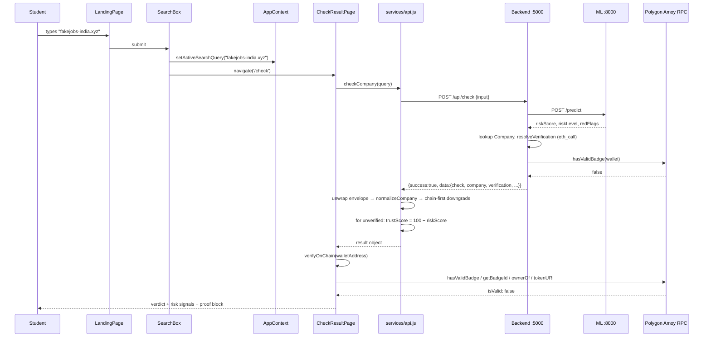

### The eight communication rules the frontend follows

1. **One base URL, one instance.** Every call goes through the same axios object; there is no second HTTP client.
2. **Envelope in, payload out.** Pages never see `{success, message, data}` — the interceptor strips it.
3. **Bearer token is ambient.** Attached automatically when present; no per-call auth logic.
4. **Backend data is normalized, never used raw.** All backend responses pass through `normalizeCompany` / `normalizeReport` / `normalizeConnection` before reaching JSX.
5. **The chain is queried independently.** Both `CheckResultPage` and `CompanyProfilePage` call `verifyOnChain` directly against the RPC — they do not accept the backend's `verification` object as sufficient.
6. **Chain beats database.** `normalizeCompany` downgrades a DB-`verified` company to `unverified` when the chain does not corroborate.
7. **Failures surface unless explicitly opted into demo mode.** `VITE_USE_DEMO` defaults to false; auth and admin mutations never fall back.
8. **Two independent verification paths must agree for "verified" to be shown** — the backend's `resolveVerification` and the frontend's `verifyOnChain`. Both are fail-closed, so disagreement resolves to *unverified*.

## 4.10 Frontend error handling

| Layer | Mechanism | Behaviour |
|---|---|---|
| Transport | axios `timeout: 12000` | Long requests abort |
| Interceptor | `success: false` → reject with `message` | Business errors become thrown Errors |
| Interceptor | `error.response.data.message` / `.detail` / `error.message` / fallback | One consistent message shape regardless of error source |
| `api.js` | `demoOrThrow` | Either logs and rejects, or serves demo data — gated by `VITE_USE_DEMO` |
| Pages | `try/catch` + `showToast(message, 'error')` | User-visible error toast |
| `blockchain.js` | `try/catch` → `{isValid:false, error: '…unavailable…'}` | Never throws to the caller; failure is a *value* |
| Not-found | `getCompanyById` demo path rethrows when the ID is unknown | Deliberate: *"Never fabricate a different company for an unknown ID."* |

**Gap:** no route-level Error Boundary exists. A render-time exception in any page unmounts the whole React tree to a blank screen. `frontend/package.json` also declares a `lint` script but there is **no `test` script and no test file anywhere in the frontend** — the client has zero automated coverage.

---

# Section 5 — Backend Architecture

**Location:** `backend/backend/` · **Stack:** Node.js + Express 4.18 + Mongoose 7.5 + ethers 6.7 · **Port:** `5000`

## 5.1 Entry point and startup sequence

`src/index.js` is the only file that composes the application. The startup order is deliberate and fail-fast where it matters:

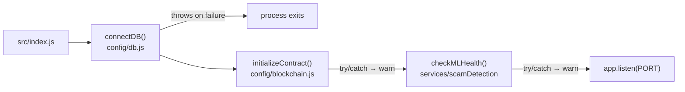

| Step | Required? | On failure |
|---|---|---|
| `connectDB()` | **Yes — fatal** | The process throws and exits. The API cannot run without MongoDB. |
| `initializeContract()` | No | Caught and logged as a warning. Blockchain reads then fail closed; writes throw. |
| `checkMLHealth()` | No | Caught and logged. Scam checks fall back to the backend's own local rule engine with `simulated: true`. |
| `app.listen()` | Yes | Binds `PORT` (default `5000`). |

This ordering encodes the system's dependency priorities: **the database is essential; the chain and the ML service are enhancements.**

## 5.2 Configuration

### `src/config/env.js`

Loads `.env` via `dotenv` and validates at import time. The guard:

```javascript
const missing = required.filter((key) => !process.env[key]);
if (missing.length && process.env.NODE_ENV !== 'test') { throw ... }
if (!env.adminPassword && process.env.NODE_ENV !== 'test') { throw ... }
```

Two consequences that matter operationally:

1. **The guard is disabled under `NODE_ENV=test`.** Jest sets `NODE_ENV=test` at startup and `dotenv` does not overwrite an already-set variable, so the entire jest suite passes with no `.env` present at all. This makes the unit tests hermetic (see Appendix A).
2. **The guard is live under plain `node`.** `seed/seedData.js`, `scripts/checkDb.js`, and `test_all_crud.js` therefore require `MONGODB_URI`, `JWT_SECRET`, and `ADMIN_PASSWORD` to be set.

### `src/config/db.js`

Mongoose connection with two hardening details:

- `mongoose.set('strictQuery', true)` — filters unknown query fields rather than ignoring the setting ambiguously.
- `serverSelectionTimeoutMS: 8000` — fail in 8 seconds rather than hanging on the default 30.
- **A Windows-specific DNS fallback:** when the URI starts with `mongodb+srv://`, the module sets `dns.setServers(['8.8.8.8', '1.1.1.1', '8.8.4.4'])` before connecting. This works around local resolver failures on Windows that break SRV record lookups. The same override is duplicated in `seed/seedData.js` and `scripts/checkDb.js`.

### `src/config/blockchain.js`

Owns provider/signer/contract construction and is the origin of the legacy naming in the backend.

- A **legacy ABI constant** is declared with an `OMEN`-prefixed name and covers `mintBadge`, `revokeBadge`, `updateBadgeURI`, `hasValidBadge`, `getBadgeId`, `getCompanyByTokenId`, `ownerOf`, `tokenURI`, `balanceOf`, plus the `BadgeMinted`/`BadgeRevoked`/`BadgeUpdated` events.
- `isChainConfigured()` returns `true` **only** when `ethers.isAddress(CONTRACT_ADDRESS)` passes. The placeholder `0xYourDeployedFocalBadgeContractAddress` therefore correctly reports unconfigured.
- `getReadOnlyContract()` throws `'CONTRACT_ADDRESS is missing or invalid'` when unconfigured — **before** any network call is attempted.
- `initializeContract()` additionally asserts the provider's chain ID is `80002n`, throwing otherwise. This is the backend's Amoy enforcement, mirroring the frontend's.

## 5.3 Middleware

| File | Export | Behaviour |
|---|---|---|
| `middleware/auth.js` | `generateToken(adminId)` | `jwt.sign({id, role:'admin'}, JWT_SECRET, {expiresIn: JWT_EXPIRE})` — default 7 days |
| | `verifyToken` | Reads `Authorization: Bearer <token>`; on absence → 401; on invalid/expired → 401; on success sets `req.user` |
| | `isAdmin` | `req.user?.role !== 'admin'` → **403** |
| `middleware/validate.js` | default export | Runs `validationResult(req)`; on errors → 400 with a field-error array |
| `middleware/errorHandler.js` | `notFound` | Unmatched route → 404 envelope |
| | `errorHandler` | Terminal error handler; normalises everything into the response envelope and hides stack traces outside development |
| `express-rate-limit` | `checkLimiter` | **100 requests / 15 min** on `/api/check` and `/api/checks` |
| | `authLimiter` | **20 requests / 15 min** on `/api/admin/login` |

**Auth is JWT-only.** Grepping `src/` for `nonce`, `challenge`, `personalSign`, `verifyMessage`, or `signature` returns **zero matches**. There is no wallet-based authentication of any kind — confirming §0 Finding 5.

## 5.4 The response envelope

Every response — success or failure — uses one shape:

```json
{
  "success": true,
  "message": "optional human-readable text",
  "data": { "...payload..." },
  "count": 12,
  "total": 130,
  "page": 2,
  "totalPages": 11
}
```

The optional list fields (`count`, `total`, `page`, `totalPages`) appear only on paginated endpoints. On error, `success: false` and `message` carries the reason while `data` is absent. The frontend interceptor depends on this contract.

## 5.5 Complete endpoint reference

All routes are mounted in `src/app.js:64–71`. **Route registration order matters in two places** and is preserved deliberately.

### Meta routes (not under `/api`)

| Method | Endpoint | Purpose | Request | Response | Controller | Service | Database | External Service |
|---|---|---|---|---|---|---|---|---|
| GET | `/health` | Liveness + config probe | — | status, uptime, `mlApiUrl`, chain-configured flag | inline | — | — | — |
| GET | `/` | API identity/meta | — | name, version, endpoint list | inline | — | — | — |
| GET | `/favicon.ico` | Silences favicon 404 | — | 204 | inline | — | — | — |

### Companies — mounted `/api/companies`

| Method | Endpoint | Purpose | Request | Response | Controller | Service | Database | External Service |
|---|---|---|---|---|---|---|---|---|
| POST | `/api/companies/register` | Company self-registration (public) | `{name, email, website, walletAddress, gstin?}` + optional registry fields | 201 + company | `registerCompany` | `verificationService` (on submit), `gstVerificationService` when a GSTIN is supplied | `Company.create` | **ML `/verify-gst`** (only if `gstin` present) |
| POST | `/api/companies` | Identical alias of `/register` | same | same | `registerCompany` | same | same | same |
| GET | `/api/companies` | List / search directory | `?status&search&page&limit` | paginated companies (+ per-doc `badge`,`verification`) | `listCompanies` | — | `Company.find` | **Amoy RPC** per doc (badge resolution) |
| GET | `/api/companies/check` | Lookup by domain | `?domain` (required) | company + verification | `checkCompanyByDomain` | — | `Company.findOne` | Amoy RPC |
| GET | `/api/companies/status/:walletAddress` | Lookup by wallet | path (40-hex validated) | status + badge | `checkCompanyByWallet` | — | `Company.findOne` | Amoy RPC |
| GET | `/api/companies/:id` | Single company dossier | path (`isMongoId`) | company + `badge` + `verification` | `getCompany` | `blockchainService.resolveVerification` | `Company.findById` | Amoy RPC |
| POST | `/api/companies/:id/gst-verify` | **Admin** — re-run GST evidence | `{gstin, companyState?}` | updated company | `verifyCompanyGST` | `gstVerificationService.verifyGST` | `Company.findById` + `save` | **ML `/verify-gst`** |
| PATCH | `/api/companies/:id` | **Admin** — update (never status) | subset of registrable fields | updated company | `updateCompany` | — | `Company.findByIdAndUpdate` | — |
| PUT | `/api/companies/:id` | Identical handler | same | same | `updateCompany` | — | same | — |
| DELETE | `/api/companies/:id` | **Admin** — delete | path | `{deleted: true}` | `deleteCompany` | — | `Company.findByIdAndDelete` | — |

**⚠ Route-order dependency (verified).** `/check` and `/status/:walletAddress` are registered **before** `/:id` (`companyRoutes.js:35–39`). If they were reversed, `/api/companies/check` would be captured by `/:id` and rejected by `isMongoId()`. **This ordering is load-bearing.**

### Admin — mounted `/api/admin`

| Method | Endpoint | Purpose | Request | Response | Controller | Service | Database | External Service |
|---|---|---|---|---|---|---|---|---|
| POST | `/api/admin/login` | Issue admin JWT (`authLimiter`) | `{email, password}` | `{token, admin}` | `login` | `bcryptjs` when the stored password is a hash | env comparison (no admin collection) | — |
| GET | `/api/admin/companies` | Full company list incl. pending | `?status&page&limit` | companies | `listAdminCompanies` | — | `Company.find` | — |
| POST | `/api/admin/companies/:id/approve` | **Approve → score → hash → IPFS → mint** | path | `{company, mint, verificationReport}` | `approveCompany` | `verificationService`, `blockchainService`, `pinataService` | `Company.findById` + `save` | **Amoy RPC (mint tx)** + **Pinata** |
| POST | `/api/admin/companies/:id/reject` | Reject with reason | `{reason?}` | updated company | `rejectCompany` | — | `Company.save` | — |
| POST | `/api/admin/companies/:id/revoke` | **Burn the on-chain badge** | `{reason?}` | updated company | `revokeCompany` | `blockchainService` | `Company.save` | **Amoy RPC (burn tx)** |
| GET | `/api/admin/reports` | All reports | pagination | reports | `listReports` | — | `Report.find` | — |
| POST | `/api/admin/reports/:id/review` | Moderate a report | `{status ∈ reviewed\|accepted\|rejected, reviewNote?}` | updated report | `reviewReport` | — | `Report.save` | — |
| GET | `/api/admin/stats` | Dashboard aggregates | — | `{companiesByStatus, reportsByStatus, totalChecks}` | `getStats` | — | `Company.aggregate`, `Report.aggregate`, `Check.countDocuments` | — |

### Reports — mounted `/api/reports`

| Method | Endpoint | Purpose | Request | Response | Controller | Service | Database | External Service |
|---|---|---|---|---|---|---|---|---|
| POST | `/api/reports` | File a report (public) | `{companyName?, companyId?, companyDomain?, reporterName, reporterEmail, description, evidenceUrl?, category?}` | 201 + report | `createReport` | — | `Report.create` | — |
| GET | `/api/reports` | List reports | `?status&search&companyId&page&limit` | paginated reports | `listReports` | — | `Report.find` (`.populate('companyId')`) | — |
| GET | `/api/reports/company/:companyId` | Reports for one company | path | reports | `getReportsForCompany` | — | `Report.find({companyId})` | — |
| GET | `/api/reports/:id` | Single report | path | report | `getReport` | — | `Report.findById` | — |
| PATCH | `/api/reports/:id` | **Admin** — update | `{status, reviewNote?}` | updated report | `updateReport` | — | `Report.save` | — |
| PUT | `/api/reports/:id` | Identical handler | same | same | `updateReport` | — | same | — |
| DELETE | `/api/reports/:id` | **Admin** — delete | path | `{deleted:true}` | `deleteReport` | — | `Report.findByIdAndDelete` | — |

### Checks — mounted at **both** `/api/check` and `/api/checks` (both behind `checkLimiter`)

| Method | Endpoint | Purpose | Request | Response | Controller | Service | Database | External Service |
|---|---|---|---|---|---|---|---|---|
| POST | `/api/check` | **The core student scan** | `{input}` (min 2 chars) | 201 + `{check, company, verification, confidence, riskLevel, explanation, simulated}` | `checkOpportunity` | `scamDetectionService`, `blockchainService.resolveVerification` | `Company.findOne`, `Check.create` | **ML `/predict`** + **Amoy RPC** |
| GET | `/api/check` | Scan history | `?page&limit` | paginated checks | `getHistory` | — | `Check.find().select('-input -notes')` | — |
| GET | `/api/check/history` | Alias of the above | same | same | `getHistory` | — | same | — |
| GET | `/api/check/:id` | One check | path | check | `getCheckById` | — | `Check.findById` | — |
| PATCH | `/api/check/:id` | **Admin** — annotate | `{notes?, riskScore 0–100?, result?}` | updated check | `updateCheck` | — | `Check.save` | — |
| PUT | `/api/check/:id` | Identical handler | same | same | `updateCheck` | — | same | — |
| DELETE | `/api/check/:id` | **Admin** — delete | path | `{deleted:true}` | `deleteCheck` | — | `Check.findByIdAndDelete` | — |

### Connections — mounted `/api/connections`

| Method | Endpoint | Purpose | Request | Response | Controller | Service | Database | External Service |
|---|---|---|---|---|---|---|---|---|
| POST | `/api/connections` | Request a mediated connection | `{companyName?, companyId?, companyDomain?, requesterName, requesterDomain, message?}` | 201 + connection | `createConnection` | — | `Connection.create` | — |
| GET | `/api/connections` | List connections (**PII-projected**) | `?status&page&limit` | paginated connections | `listConnections` | — | `Connection.find().select(PUBLIC_PROJECTION)` | — |
| GET | `/api/connections/:id` | One connection | path | connection | `getConnection` | — | `Connection.findById` | — |
| PATCH | `/api/connections/:id` | **Admin** — update status | `{status, note?}` | updated connection | `updateConnection` | — | `Connection.save` | — |
| PUT | `/api/connections/:id` | Identical handler | same | same | `updateConnection` | — | same | — |
| DELETE | `/api/connections/:id` | **Admin** — delete | path | `{deleted:true}` | `deleteConnection` | — | `Connection.findByIdAndDelete` | — |

**Route-order note:** `/history` is registered before `/:id` on `checkRoutes`, so the alias resolves correctly rather than being parsed as an id.

## 5.6 The request path, end to end

```mermaid
graph TD
    FE["Frontend — services/api.js<br/>axios POST /api/check"] --> CORS["app.js — CORS allow-list"]
    CORS --> BP["express.json — 1 mb limit"]
    BP --> MOR["morgan — request log"]
    MOR --> RL["checkLimiter — 100 req / 15 min"]
    RL --> RT["routes/checkRoutes.js<br/>body('input').isLength({min:2})"]
    RT --> VAL["middleware/validate.js<br/>400 on failure"]
    VAL --> CT["controllers/checkController.js<br/>checkOpportunity"]
    CT --> SD["services/scamDetectionService.js"]
    SD -->|"POST /predict &#123;text|url|email_content&#125;"| ML["ML service :8000"]
    ML -->|"riskScore, riskLevel, redFlags, confidence"| SD
    SD -.->|"on failure (timeout/refused)"| FB["Local rule engine<br/>simulated: true"]
    CT --> DB1["models/Company.js — findOne"]
    DB1 --> MONGO[("MongoDB — focal")]
    CT --> BV["blockchainService.resolveVerification"]
    BV --> RPC["Polygon Amoy RPC<br/>hasValidBadge(wallet)"]
    RPC -.->|"on any error"| FC["isVerified: false<br/>FAIL CLOSED"]
    CT --> DB2["models/Check.js — create"]
    DB2 --> MONGO
    CT --> RES["Response envelope<br/>{success, data}"]
    RES --> INT["axios interceptor — unwrap"]
    INT --> NORM["normalizeCompany — chain-first"]
    NORM --> UI["CheckResultPage renders verdict"]
```

### 5.6.1 `checkOpportunity` — the core pipeline, step by step

This is the most important controller in the system. Verified sequence:

| # | Step | Detail |
|---|---|---|
| 1 | **Detect input type** | `scamDetectionService.detectInputType(input)` → `'url'` \| `'email'` \| `'job_posting'` |
| 2 | **Call the ML service** | `callMLAPI(input, inputType)` sends **only** the field matching the type: `{url}`, `{email_content}`, or `{text}`, plus `input_type`. Timeout is configured. |
| 3 | **Fall back on ML failure** | On `ECONNREFUSED`/timeout the service logs a warning, runs the **local rule engine**, and sets `simulated: true` with a populated `redFlags` array. The request still succeeds. |
| 4 | **Find the company** | `Company.findOne({domain})` — domain-normalised match against the extracted domain |
| 5 | **Resolve chain verification** | `blockchainService.resolveVerification(company)` — the fail-closed on-chain read |
| 6 | **Persist the check** | `Check.create({input, inputType, companyId, isVerified, riskScore, redFlags, result, ...})` |
| 7 | **Respond** | Envelope with `simulated: analysis.simulated \|\| verification.simulated` |

> **Finding: `verification.simulated` is provably always `false`.** Every return path in `resolveVerification` hardcodes `simulated: false` (three of them, lines 18–28). Therefore the `||` term at `checkController.js:76` is **dead code** — the `simulated` flag the client sees can only ever originate from the ML analysis. The field is retained in the response shape and asserted by tests, but it cannot express a simulated *badge*. This is documented as Finding C-03 in Appendix C.

> **Finding: `Check.inputType` enum vs `detectInputType` output.** `detectInputType` returns `'job_posting'`, and the ML tests assert that value explicitly. If `models/Check.js` constrains `inputType` to an enum that omits `'job_posting'`, the `Check.create` at step 6 would fail validation — turning every text scan into a 500. This must be verified against `models/Check.js` before any feature work touches this path. Flagged as Finding C-02.

### 5.6.2 `listCompanies` and the N+1 consideration

`GET /api/companies` returns `badge` and `verification` per document. Each document's chain state requires an RPC `hasValidBadge` call. The list endpoint therefore issues **one RPC call per returned company**. With `limit` at its default this is bounded, but it scales linearly with page size and each call is a network round-trip. Documented as a performance observation (Finding C-10), not a correctness bug.

## 5.7 Services

### `services/blockchainService.js` (134 lines) — the chain boundary

| Function | Purpose |
|---|---|
| `createVerificationHash(name, domain, date)` | `ethers.solidityPackedKeccak256(['string','string','string','string'], [name, domain, date, SALT])` — see §13.1 for the salt defect |
| `isChainConfigured()` | Delegates to `config/blockchain.js`; `false` for the shipped placeholder address |
| `resolveVerification(company)` | **The fail-closed read.** Order: `!company \|\| status !== 'verified'` → false. Then `hasValidBadge(walletAddress)`; truthy → `{isVerified:true, onChain:true, simulated:false}`; falsy → all-false. Note it **never reads `tokenId`** — the wallet is the only input. |
| `mintBadge(company, tokenURI)` | Sends the mint transaction, waits for the receipt, reads the token id back via `getBadgeId`, returns `{transactionHash, tokenId}`. **Re-throws as `'Blockchain mint failed'`.** |
| `revokeBadge(company)` | Sends the burn and awaits the receipt. **Re-throws as `'Blockchain revoke failed'`.** |
| `getBadgeDetails(walletAddress)` | Read-only helper for badge inspection |

**Every write path rethrows.** There is no simulated-write branch anywhere in this file.

> **⚠ DIVERGENCE — the root `README.md` claims a demo fallback that does not exist.** The README's Web3 section advertises *"ethers.js v6 with resilient local demo fallback"* and states that without `CONTRACT_ADDRESS`/`ADMIN_PRIVATE_KEY` the backend returns `simulated: true` on approval. The source contains **no such branch**: `approveCompany` has no `try/catch` and no simulated path, and `resolveVerification`'s `simulated` is hardcoded `false`. See Finding C-03. The test file `blockchainService.demo.test.js` exists and its docblock documents the *removal* of the fallback rather than its presence.

### `services/verificationService.js` (99 lines) — offline integrity scoring

**Makes no network calls at all.** Pure heuristics producing a 0–100 `overallScore`, a `checks[]` array of `{name, passed, detail}`, a `redFlags[]` array, and a `recommendation`.

**Scoring deductions (from a base of 100), verified:**

| Check | Condition for failure | Deduction | Red flag text |
|---|---|---|---|
| Domain matches company name | Company slug (first 6 alphanumerics) not found in the domain's alphanumerics | −15 | *Domain does not clearly match company name* |
| Domain reputation | Domain ends in `.xyz`/`.top`/`.click`/`.work` | −20 | *Domain uses a high-risk extension* |
| Email domain matches website | Email domain ≠ website domain | −15 | *Email domain does not match website domain* |
| Official email provider | Email domain ∈ {gmail, yahoo, outlook, hotmail, proton.me} | −20 | *Company uses a free email provider* |
| HTTPS website | Website does not start `https://` | −10 | *Website is not HTTPS* |
| Government registration format | Fails `/^[A-Z]{2}-[A-Z0-9-]{6,}$/i` | −15 | *Registration number format is invalid* |
| Mock registry match | Format valid but **not** in the 3-entry set | −10 | *Registration number requires manual registry verification* |
| LinkedIn page | Not `https://(www.)?linkedin.com/company/…` | −10 | *LinkedIn company page missing or invalid* |
| GST verification evidence | `gstin` present but status ≠ `verified` **or** `gstVerificationSimulated` is true | −30 | *GST verification is simulated* / *GST verification \<status\>* |

**The mock registry, verbatim (`verificationService.js:4`):**
```javascript
const mockRegistry = new Set(['TN-TECH-2020-4455', 'KA-INNO-2019-8811', 'DL-QUICK-2024-1001']);
```

> **⚠ DIVERGENCE — this is a 3-entry fabricated registry, not MCA.** There is no MCA integration anywhere in the repository. The check labelled *"Government registration format"* is a regex, and *"Mock registry match"* is honestly named as a mock but nonetheless contributes to a score that gates real approval. Three values, all invented, all matching the demo seed data.

**Recommendation rule:**
```javascript
if (score >= 80 && redFlags.length <= 1) return 'approve';
if (score < 45 || redFlags.length >= 4) return 'reject';
return 'manual_review';
```

**Note the GST self-consistency:** the service *penalises* simulated GST evidence (`gstVerificationSimulated` → −30). Since the ML service's GST provider defaults to `mock` and its `simulated` flag is therefore always `true`, any company that supplies a GSTIN will score −30 and accumulate a red flag. The scoring logic is internally coherent — it correctly distrusts its own mock — but it means a GSTIN-carrying company can reach `approve` only if it fails no more than one other check.

### `services/gstVerificationService.js` (69 lines) — GST via the ML service

| Aspect | Detail |
|---|---|
| Local pre-validation | `GSTIN_PATTERN = /^[0-9A-Z]{15}$/` |
| Empty input | `emptyResult()` → `status: 'not_provided'`, `simulated: false`, `verificationDate: null` |
| Malformed input | `emptyResult('failed')` — **the ML service is never called** |
| Transport | `axios.post(\`${ML_API_URL}/verify-gst\`, {gstin, company_name, company_state, company_address}, {timeout: 7000})` |
| Success mapping | `status = data.verified ? 'verified' : 'failed'`; `simulated = Boolean(data.simulated)`; nine evidence fields copied through (`legal_name`, `trade_name`, `registration_status`, `business_type`, `state`, `principal_address`, `taxpayer_type`, `source` → `reference`, `identity_match`) |
| Nested result | `result: {formatValid, verified, riskScore, riskLevel, redFlags, explanation}` |
| **Timeout / any error** | Returns `emptyResult('unavailable')` with `reference: 'ml-service-unavailable'` — **never throws** |

**The `simulated` flag is propagated honestly end-to-end:** ML `simulated: true` → backend `gstVerificationSimulated: true` → frontend `gst.simulated: true` → the admin scoring service deducts 30. This is a well-built honesty path.

### `services/scamDetectionService.js` (133 lines) — the ML client

| Function | Behaviour |
|---|---|
| `detectInputType(input)` | Classifies into `'url'` / `'email'` / `'job_posting'`. Heuristics: a URL shape → `url`; presence of `From:` headers → `email`; multiline content containing an address → `email`; otherwise → `job_posting`. Note a **single-line bare email** like `hr@fake.com` classifies as `job_posting`, not `email` — asserted by test. |
| `callMLAPI(input, inputType)` | Sends **exactly one** payload field matched to the type. Maps the ML response into `{riskScore, riskLevel, redFlags, confidence, explanation, simulated}`. |
| **Local fallback** | On `ECONNREFUSED`/timeout, logs `'ML service call failed'` with `{inputType, error}` and returns a locally-computed result with `simulated: true`, `riskScore > 0`, and red flags whose names begin with a `'Payment Request — '` style prefix. The request never fails. |
| `analyzeOpportunity(input)` | Public entry point combining detection + call + fallback |
| `checkMLHealth()` | `axios.get(\`${ML_API_URL}/health\`)` → `{healthy:true, modelLoaded}`; on failure logs `'ML service health check failed'` → `{healthy:false, modelLoaded:false}` |

**This is the backend's second tier of ML degradation** — the ML service degrades internally (BERT → sklearn → rules) and the backend degrades again behind it (ML → local rules). Both layers preserve a usable answer.

### `services/pinataService.js` (91 lines) — IPFS pinning

| Aspect | Detail |
|---|---|
| Auth | `getAuthHeaders()` — accepts **either** `PINATA_JWT` (preferred) **or** the `PINATA_API_KEY` + `PINATA_SECRET_API_KEY` pair. **Throws `'Pinata credentials are not configured'`** when neither is present. |
| Upload | `pinFileToIPFS(fileBuffer, fileName)` using native `fetch` + `FormData` + `Blob` (no `form-data` package) |
| Default image | Resolves to `../../../../focal-blockchain/assets/green-badge.svg` — a **cross-project path dependency** |
| Metadata | Builds the JSON metadata object and pins it, returning `tokenURI = ipfs://<metadataCid>` |
| Failure | Surfaces as a thrown error — **not** swallowed |

> **Operational finding:** `backend/backend/.env` contains **no `PINATA_*` keys at all** (only `.env.example` does). Combined with the placeholder `CONTRACT_ADDRESS`, the shipped configuration means the admin approval flow cannot complete: it throws at `getAuthHeaders()` before it ever reaches the chain. The badge image itself does exist on disk. See Finding C-04.

## 5.8 Models and data access

Mongoose models are documented in full in §6. Access patterns:

| Pattern | Where | Note |
|---|---|---|
| Whitelisted creates | `companyController.registerCompany` | `REGISTRABLE_FIELDS` array; **never** `...req.body` |
| Whitelisted updates | `updateCompany` | Explicitly rejects `req.body.status !== undefined` with HTTP 400 |
| PII-projected reads | `listChecks` → `.select('-input -notes')`; `listConnections` → `.select(PUBLIC_PROJECTION)` where `PUBLIC_PROJECTION = '-studentEmail -studentName -message'` | Public list endpoints strip identifying and free-text fields |
| Regex-escaped search | `utils/helpers.escapeRegex()` | Applied to every user-supplied search string before `RegExp` construction |
| Text index | `companySchema.index({name:'text', domain:'text'})` | Supports the directory search |
| Aggregations | `adminController.getStats` | `$group` by `status` for companies and reports, plus `Check.countDocuments` |

## 5.9 Utilities

| Function | File | Purpose |
|---|---|---|
| `normalizeDomain(input)` | `utils/helpers.js` | Strips protocol, `www.`, path, and port from a URL or domain string — the single canonicalisation used by controllers and `verificationService` |
| `asyncHandler(fn)` | `utils/helpers.js` | Wraps async route handlers so rejections reach `errorHandler` instead of crashing the process |
| `escapeRegex(str)` | `utils/helpers.js` | Escapes regex metacharacters in user input — **a security control** preventing regex injection and ReDoS via search parameters |
| `logger.info/warn/error` | `utils/logger.js` | JSON-lines logger; mocked in unit tests |

## 5.10 Error handling

| Layer | Mechanism | Result |
|---|---|---|
| Async routes | `asyncHandler` wrapper | Rejections funnel to the terminal handler |
| Validation | `express-validator` + `middleware/validate.js` | 400 with a field-error array |
| Not found | `notFound` | 404 envelope |
| Terminal | `errorHandler` | Normalised envelope; stack hidden outside development |
| Blockchain reads | `resolveVerification` internal `try/catch` | Returns `isVerified: false` — never throws |
| Blockchain writes | **No catch** | Throws `'Blockchain mint failed'` / `'Blockchain revoke failed'` to the controller |
| ML calls | `try/catch` + local fallback | Degrades to rule-based, `simulated: true` |
| GST calls | `try/catch` | `status: 'unavailable'` — never throws |
| IPFS | Throws | Propagates to the controller |

**`approveCompany` has no `try/catch`.** With the shipped `.env` (no Pinata keys, placeholder contract address) the promise rejects and the terminal handler converts it into a 500 envelope. The request does not crash the process (`asyncHandler` covers it), but the admin sees a generic server error with no indication that the *configuration* — not the data — is the cause. This is Finding C-04.

---

# Section 6 — Database Architecture

**Engine:** MongoDB · **Database name:** `focal` · **ODM:** Mongoose 7.5 (`strictQuery: true`) · **Connection timeout:** 8,000 ms

The database name comes from the `MONGODB_URI` path segment — the shipped template is `mongodb+srv://<user>:<pass>@cluster.mongodb.net/focal?retryWrites=true&w=majority`.

## 6.1 Collections overview

| Collection | Mongoose model | Defined in | Purpose | Typical volume driver |
|---|---|---|---|---|
| `companies` | `Company` | `models/Company.js` | The central entity: every registered company plus its verification state and chain artefacts | Companies onboarded |
| `checks` | `Check` | `models/Check.js` | One row per scam-check lookup performed | Every student search |
| `reports` | `Report` | `models/Report.js` | User-submitted fraud reports | Reports filed |
| `connections` | `Connection` | `models/Connection.js` | Mediated B2B connection requests | Connection requests |

All four schemas use `{ timestamps: true }`, which adds `createdAt` and `updatedAt` automatically.

**There is no `Admin` collection.** Administrator credentials live entirely in environment variables (`ADMIN_EMAIL`, `ADMIN_PASSWORD`) and are compared in `adminController.login`. This is why the platform cannot support multiple administrators or an admin password-change flow without schema work.

## 6.2 `companies` — full schema

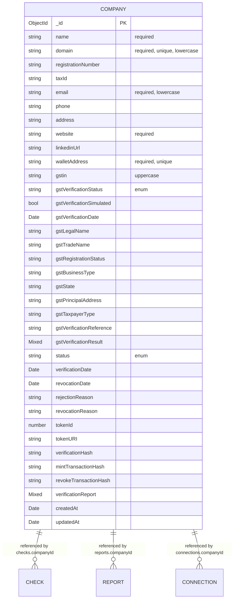

### Field table

| Field | Type | Required | Default | Constraints | Notes |
|---|---|---|---|---|---|
| `name` | String | **Yes** | — | `trim: true` | Company legal/trade name |
| `domain` | String | **Yes** | — | **`unique: true`**, `lowercase`, `trim` | The canonical identity key; all lookups normalise to this |
| `registrationNumber` | String | No | — | `trim` | Format-checked against `/^[A-Z]{2}-[A-Z0-9-]{6,}$/i` in scoring |
| `taxId` | String | No | — | `trim` | Free-form; the seed writes `'GSTIN-DEMO-1234'` (not a real GSTIN) |
| `email` | String | **Yes** | — | `lowercase`, `trim` | Must be `isEmail()` per route validation |
| `phone` | String | No | — | `trim` | |
| `address` | String | No | — | `trim` | Passed to GST verification for identity matching |
| `website` | String | **Yes** | — | `trim` | Must be a full URL with protocol per route validation |
| `linkedinUrl` | String | No | — | `trim` | Pattern-checked in scoring |
| `walletAddress` | String | **Yes** | — | **`unique: true`**, `trim` | **The on-chain identity.** Regex-validated `/^0x[a-fA-F0-9]{40}$/`. Unique, so a wallet cannot back two companies. |
| `gstin` | String | No | — | `uppercase`, `trim` | 15 chars when present |
| `gstVerificationStatus` | String | No | `'not_provided'` | **enum**, `index` | `not_provided` \| `verified` \| `failed` \| `unavailable` |
| `gstVerificationSimulated` | Boolean | No | `false` | — | **Truthfully propagated** from the ML mock |
| `gstVerificationDate` | Date | No | — | — | |
| `gstLegalName` … `gstTaxpayerType` | String ×7 | No | — | — | Evidence fields copied from the ML GST response |
| `gstVerificationReference` | String | No | — | — | Provider/source identifier (e.g. `mock_api`, `ml-service-unavailable`) |
| `gstVerificationResult` | **Mixed** | No | — | — | Nested evidence: `{formatValid, verified, riskScore, riskLevel, redFlags, explanation}` |
| `status` | String | No | `'pending'` | **enum**, `index` | `pending` \| `verified` \| `rejected` \| `revoked` |
| `verificationDate` | Date | No | — | — | Set on approval |
| `revocationDate` | Date | No | — | — | Set on revocation |
| `rejectionReason` | String | No | — | — | Free text from the admin |
| `revocationReason` | String | No | — | — | Free text from the admin |
| `tokenId` | Number | No | — | — | The ERC-721 token id. **Never treated as proof** — presentation only. |
| `tokenURI` | String | No | — | — | `ipfs://<metadataCid>` |
| `verificationHash` | String | No | — | — | The keccak256 identity hash (§13.1) |
| `mintTransactionHash` | String | No | — | — | Polygon Amoy mint tx |
| `revokeTransactionHash` | String | No | — | — | Polygon Amoy burn tx |
| `verificationReport` | **Mixed** | No | — | — | The full `verificationService.verifyCompany` output: `{overallScore, checks[], redFlags[], gstVerificationStatus, recommendation}` |

### Indexes

| Index | Type | Purpose |
|---|---|---|
| `domain` | **unique** | One company per domain; primary lookup key |
| `walletAddress` | **unique** | One company per wallet; the on-chain identity constraint |
| `status` | single, `index: true` | Powers the admin pending queue and directory filters |
| `gstVerificationStatus` | single, `index: true` | GST-status filtering |
| `{name: 'text', domain: 'text'}` | **compound text index** | Backs `$text` search in `checkController.matchCompany` and directory search |

### Important queries

```javascript
// Domain lookup — the hot path for every URL scan
Company.findOne({ domain: normalizeDomain(input) })

// Text search with a regex fallback (checkController.matchCompany)
Company.findOne({ $text: { $search: input } })
  // on throw → Company.findOne({ name: new RegExp(escapeRegex(input.trim()), 'i') })

// Exact case-insensitive name match (tried before $text)
Company.findOne({ name: new RegExp(`^${escapeRegex(input.trim())}$`, 'i') })

// Directory listing with filters + pagination
Company.find(filter).sort(...).skip(skip).limit(limit)

// Admin aggregates
Company.aggregate([{ $group: { _id: '$status', count: { $sum: 1 } } }])
```

### Data lifecycle of a company

```mermaid
stateDiagram-v2
    [*] --> pending : POST /api/companies/register (public)<br/>verificationService scores it<br/>verificationReport stored
    pending --> verified : Admin approves<br/>→ score re-run, GST gate<br/>→ verificationHash computed<br/>→ image + metadata pinned to IPFS<br/>→ mintBadge() on Amoy<br/>→ tokenId, tokenURI, mintTransactionHash stored
    pending --> rejected : Admin rejects<br/>rejectionReason stored
    verified --> revoked : Admin revokes<br/>→ revokeBadge() burns the NFT<br/>→ revokeTransactionHash + revocationDate stored
    verified --> unverified_display : On-chain badge fails to confirm<br/>(DB status stays 'verified'; the FRONTEND downgrades the display)
    rejected --> [*] : Admin may delete
    revoked --> [*] : Admin may delete
```

**Critical lifecycle property:** `status: 'verified'` in MongoDB is a *claim*. The authoritative state is the combination of that claim **and** a successful `hasValidBadge()` read. If the chain says no, the frontend renders `unverified` while the database still reads `verified` — a deliberate design that keeps the database as a record of *what was decided* and the chain as the record of *what is true*.

## 6.3 `checks` — full schema

| Field | Type | Required | Default | Constraints | Notes |
|---|---|---|---|---|---|
| `input` | String | **Yes** | — | `trim` | The raw user input. **Excluded from public list reads** (`.select('-input -notes')`) because it may contain private correspondence |
| `inputType` | String | **Yes** | — | **enum** | `'url'` \| `'email'` \| **`'company_name'`** — see the defect below |
| `companyId` | ObjectId | No | — | `ref: 'Company'` | Null when no company matched |
| `isVerified` | Boolean | No | `false` | — | From `resolveVerification` |
| `riskScore` | Number | No | `0` | **min 0, max 100** | From the ML analysis |
| `redFlags` | [String] | No | — | — | Human-readable flag strings |
| `result` | String | **Yes** | — | **enum**, `index` | `verified` \| `suspicious` \| `revoked` \| `not_found` |
| `notes` | String | No | — | `trim` | Admin annotation. **Excluded from public list reads** |
| `createdAt` / `updatedAt` | Date | auto | — | — | |

### 🔴 CRITICAL DEFECT — the `inputType` enum does not match the code that produces it

`models/Check.js:6` declares:
```javascript
inputType: { type: String, enum: ['url', 'email', 'company_name'], required: true },
```

`services/scamDetectionService.js:7–21` produces:
```javascript
'url'          // when input matches /^https?:\/\//i
'email'        // when a header line matches, OR the input contains '@' and a newline
'job_posting'  // EVERYTHING ELSE
```

**`'job_posting'` is not in the enum, and `'company_name'` is never produced by anything.**

Consequence chain, traced end to end:

| Step | File:line | Result |
|---|---|---|
| 1 | `scamDetectionService.detectInputType('Pay 2000 registration fee now!')` | returns `'job_posting'` |
| 2 | `checkController.js:56–65` | `await Check.create({ inputType: 'job_posting', ... })` |
| 3 | Mongoose enum validation | **throws `ValidationError`** |
| 4 | `asyncHandler` → `errorHandler` | **HTTP 500** — no check is persisted, no result envelope is returned |
| 5 | Frontend `services/api.js` | receives a 500 → `demoOrThrow` → with `VITE_USE_DEMO=false` (default) it **rejects** |
| 6 | `CheckResultPage` | shows an error toast. **The student gets no verdict.** |

**Which student inputs are affected — precisely:**

| Student input | `detectInputType` | Outcome |
|---|---|---|
| `https://technova.com/careers` | `url` | ✅ Works |
| A pasted email including `From:`/`Subject:` headers | `email` | ✅ Works |
| A multi-line paste containing `@` | `email` | ✅ Works |
| **A bare domain:** `fakejobs-india.xyz` | `job_posting` | 🔴 **500** |
| **A company name:** `TechNova Pvt Ltd` | `job_posting` | 🔴 **500** |
| **Pasted job-posting / WhatsApp message text without an `@` or a newline-bearing address** | `job_posting` | 🔴 **500** |

This breaks the majority of realistic student inputs — searching by company name or a bare suspicious domain is arguably the *primary* use case, and both fail.

**Corroborating evidence that this is unintentional drift rather than design:**

1. The ML service's own `POST /predict` **accepts and expects** `input_type: 'job_posting'` — `buildPayload` sends exactly that string (`scamDetectionService.js:57`).
2. The backend test `tests/scamDetectionService.test.js` **asserts** `detectInputType` returns `'job_posting'` for plain text, and asserts the ML payload is `{text, input_type: 'job_posting'}`. The tests pass — because they never exercise `Check.create`.
3. `checkController.matchCompany` contains a dedicated `'job_posting'` branch (exact-name match, then `$text`, then regex fallback). The controller is *written for* `job_posting`; only the schema lags behind.
4. The stale value `'company_name'` is the smoking gun: the field was evidently renamed from `company_name` to `job_posting` in the detection logic and the ML contract, and the Mongoose enum was never updated.

**This also invalidates the project's own integration test.** `scripts/verify-integration.ps1` step 5 posts the plain-text probe `"Pay 2000 registration fee now! Limited time offer! Contact us on WhatsApp to join immediately."` to `/api/check` and asserts `riskScore -ge 50`. That input classifies as `job_posting`, so the assertion cannot be satisfied — the response is a 500 error envelope with no `riskScore`. **The integration verifier cannot pass on a correct build.** Finding C-01b in Appendix C.

### Indexes

| Index | Purpose |
|---|---|
| `result` (single, indexed) | History filtering by verdict |
| Default `_id` | Single-record reads |

### Data lifecycle

Created on every successful scan. Retained indefinitely; there is no TTL index. Public list reads strip `input` and `notes`; the single-record read `GET /api/check/:id` returns them in full (the code comments call this "available for the submitter", but the route is **public with no ownership check**, so anyone holding an id can read the raw input). Only admins can update or delete.

## 6.4 `reports` — full schema

| Field | Type | Required | Default | Constraints | Notes |
|---|---|---|---|---|---|
| `companyId` | ObjectId | No | — | `ref: 'Company'` | Present when the report targets a known company |
| `companyName` | String | **Yes** | — | `trim` | Required even when `companyId` is set — denormalised so the report survives company deletion |
| `reporterEmail` | String | **Yes** | — | `lowercase`, `trim` | **PII.** Not projected out of public reads. |
| `reporterName` | String | No | — | `trim` | **PII** |
| `evidenceUrl` | String | No | — | `trim` | |
| `description` | String | **Yes** | — | `trim` | Free text |
| `status` | String | No | `'pending'` | **enum**, `index` | `pending` \| `reviewed` \| `accepted` \| `rejected` |
| `reviewedBy` | String | No | — | — | Set to the admin identifier |
| `reviewNote` | String | No | — | — | Admin note |

**Relationship:** a report optionally references a company. `listReports` calls `.populate('companyId')` so the frontend can derive `domain` from the populated company, falling back to `companyName` (`api.js:72`). This denormalisation is deliberate and correct — it means a report is still readable after its company is deleted.

**Privacy asymmetry noted for the record:** `reports` exposes reporter name and email on the **public** `GET /api/reports` endpoint, while `connections` deliberately projects its equivalents out (`PUBLIC_PROJECTION = '-studentEmail -studentName -message'`). The two public list endpoints apply different privacy standards. Finding C-05.

## 6.5 `connections` — full schema

| Field | Type | Required | Default | Constraints | Notes |
|---|---|---|---|---|---|
| `companyId` | ObjectId | No | — | `ref: 'Company'` | The target company |
| `companyName` | String | **Yes** | — | `trim` | Required when `companyId` is absent (route-validated) |
| `companyDomain` | String | No | — | `lowercase`, `trim` | |
| `requesterName` | String | No | — | `trim` | **Public** — the requester identity shown in the UI |
| `requesterDomain` | String | No | — | `lowercase`, `trim` | **Public** |
| `studentName` | String | No | — | `trim` | **PII — projected out of public reads** |
| `studentEmail` | String | No | — | `lowercase`, `trim` | **PII — projected out of public reads** |
| `message` | String | No | — | `trim` | **Free text — projected out of public reads** |
| `status` | String | No | `'pending'` | **enum**, `index` | `pending` \| `accepted` \| `rejected` |

**The projection constant (`connectionController.js`):**
```javascript
const PUBLIC_PROJECTION = '-studentEmail -studentName -message';
```

**Observation:** the student-specific `studentName`/`studentEmail` fields are **never written by the connection controller** — `createConnection` writes `requesterName`/`requesterDomain` and the frontend sends only those four fields plus a composed `message`. The `student*` fields are therefore always empty while `requesterName` and `requesterDomain` — which are equally identifying — are exposed publicly. The projection protects fields that are never populated. This is a schema/controller drift worth recording. Finding C-06.

## 6.6 Off-chain vs on-chain — what lives where, and why

| Data | Where it lives | Why there |
|---|---|---|
| Company name, domain, email, phone, address, website, LinkedIn | **Off-chain (MongoDB)** | Mutable business contact data; no audit requirement; would be expensive and privacy-hostile on a public ledger |
| `registrationNumber`, `taxId` | **Off-chain** | Unverified free text; the "registry match" is a mock |
| `walletAddress` | **Both** — stored off-chain, and it *is* the on-chain key | The chain indexes the badge by this address |
| `status` (`pending`/`verified`/`rejected`/`revoked`) | **Both** — DB is the decision record; chain is the truth | The DB says what was decided and when; `hasValidBadge()` says whether it currently holds |
| `tokenId` | **Both** — stored off-chain as a cache, authoritative on-chain | Off-chain copy is a convenience; never used as proof |
| `tokenURI` | **Both** — stored off-chain, authoritative on-chain | The contract is the source of truth for the URI |
| `verificationHash` | **Both** — stored off-chain, embedded in the on-chain metadata | On-chain it is inside the IPFS metadata JSON referenced by `tokenURI`; anyone can recompute it from name+domain+date+salt |
| `mintTransactionHash`, `revokeTransactionHash` | **Off-chain** (as pointers to on-chain events) | Convenience for the explorer link; the events themselves are on-chain |
| `verificationReport` (score, checks[], redFlags) | **Off-chain only** | Internal audit scoring; deliberately not published (it would expose the mock registry heuristic) |
| `gst*` evidence fields | **Off-chain only** | Contains mock data; publishing it on-chain would be misleading |
| `Check.input`, `Check.notes` | **Off-chain only** | **Contains student PII and private correspondence.** Correctly never on-chain — the reason `input` is projected out of public list reads. |
| `Report` documents in full | **Off-chain only** | Contains reporter PII and unverified allegations — publishing allegations to an immutable ledger would be defamatory-by-design. Correctly off-chain. |
| `Connection` documents | **Off-chain only** | Business-relationship state, mutable, private |
| Badge **image** | **IPFS** (content-addressed, immutable) | Must be tamper-evident and permanent after revocation |
| Badge **metadata JSON** | **IPFS** (content-addressed, immutable) | Anchors the verification hash; the whole point is that it cannot be edited later |

**The governing principle:** the chain stores only what must be *publicly verifiable and immutable* — a wallet holds a badge, and that badge's metadata carries a recomputable hash. Everything mutable, private, or sensitive stays in MongoDB. The platform never writes student input, reports, or scoring evidence on-chain.

**One consequence worth stating plainly:** because the metadata is immutable, revoking a badge cannot rewrite its metadata. Revocation instead **burns the token** (`_burn` in the contract), which is why the frontend's verification ladder checks `hasValidBadge()` (i.e. `balanceOf > 0`) first. The `red-badge.svg` asset and the `technova-pvt-ltd-revoked.json` metadata file exist in `focal-blockchain/` for a *replacement* URI flow (`updateBadgeURI`) rather than for post-burn mutation.

---

# Section 7 — ML Service

**Location:** `ML/ml-service/` · **Framework:** Python 3 + FastAPI + Uvicorn · **Port:** `8000` · **Version:** `1.0.0`

## 7.1 Entry point — `app/main.py` (323 lines)

The FastAPI app, its five endpoints, and its two middlewares.

### 7.1.1 Endpoints

| Method | Path | Purpose | Request | Response |
|---|---|---|---|---|
| GET | `/health` | Liveness + model state | — | `{status, model_loaded, version}` |
| GET | `/model-info` | Model provenance and metrics | — | Model type, accuracy, training metadata |
| POST | `/predict` | **The primary scam-scoring endpoint** | One of `{text}` \| `{url}` \| `{email_content}`, plus `input_type` | `{risk_score, risk_level, red_flags[], confidence, explanation, ...}` |
| POST | `/analyze-url` | URL-only analysis | `{url}` | URL-specific signals |
| POST | `/analyze-email` | Email-only analysis | `{email_content}` | Header/auth/spoofing signals |
| POST | `/verify-gst` | GST evidence retrieval | `{gstin, company_name?, company_state?, company_address?}` | `{verified, simulated, format_valid, legal_name, …, red_flags[], risk_score, risk_level, explanation}` |

**`POST /predict` validation:** returns **HTTP 422** when none of `text`, `url`, or `email_content` is supplied.

### 7.1.2 Middlewares

| Middleware | Behaviour |
|---|---|
| CORS | Origins from `ML_CORS_ORIGINS` (default `http://localhost:5173,http://localhost:3000`). **`allow_credentials=False`** — correct, since no cookies/browser auth are used. |
| `add_process_time_header` | Adds `X-Process-Time-Ms` to every response |
| Rate limiter | **In-memory sliding window**, `RATE_LIMIT_REQUESTS` (60) per `RATE_LIMIT_WINDOW_S` (60) **per client IP** → HTTP 429 `{"detail": "Rate limit exceeded. Please try again later."}` |
| Global exception handler | Any unhandled exception → HTTP 500 `{"detail": "An unexpected error occurred. Please try again."}` — **the real error is not leaked to the client** |

**On startup** the app warms `get_classifier()` and logs whether the model loaded or whether the service is running on the rule fallback. This means the first `/predict` request is not slow, and the operational state is visible in the boot log.

> **Note:** `slowapi` is declared in `requirements.txt` but is **not imported anywhere in `app/`**. The rate limiter is hand-rolled. A declared-but-unused dependency.

## 7.2 Configuration — `app/config.py` (86 lines)

| Constant | Value | Purpose |
|---|---|---|
| `API_PORT` | `8000` | |
| `VERSION` | `"1.0.0"` | |
| `MODEL_PATH` | `models/text_classifier.pkl` | Trained sklearn artifact |
| `VECTORIZER_PATH` | `models/vectorizer.pkl` | Fitted TF-IDF vectorizer |
| `MODEL_META_PATH` | `models/model_meta.json` | Training metadata |
| `GST_API_PROVIDER` | `"mock"` (default) | **Any value other than `mock` raises `RuntimeError` — no live provider is implemented** |
| `GST_API_URL` | `https://api.cleartax.in/v2/gstin` | Declared but unreached while the provider is `mock` |

### Risk weights

| Signal | Weight |
|---|---|
| `TEXT_WEIGHT` | **0.40** |
| `URL_WEIGHT` | **0.30** |
| `EMAIL_WEIGHT` | **0.20** |
| `GST_WEIGHT` | **0.25** |
| `USER_REPORT_WEIGHT` | **0.10** |

Note these sum to **1.25**, not 1.0. This is intentional and handled by normalisation (see §7.7): `risk_scoring` divides by the sum of the weights that are actually *active*, so a text-only scan is not deflated by the missing URL/email/GST signals.

### Thresholds and reference lists

| Constant | Value | Meaning |
|---|---|---|
| `LOW_RISK_THRESHOLD` | `30` | `score ≤ 30` → low |
| `MEDIUM_RISK_THRESHOLD` | `60` | `30 < score ≤ 60` → medium |
| `HIGH_RISK_THRESHOLD` | `100` | `score > 60` → high |
| `MIN_DOMAIN_AGE_DAYS` | `30` | Newer domains are penalised |
| `SUSPICIOUS_TLDS` | 14 entries | High-abuse TLDs |
| `KNOWN_JOB_PORTALS` | 15 entries | Legitimate portals — used to *reduce* suspicion |
| `FREE_EMAIL_DOMAINS` | 10 entries | Consumer mail providers |

**The `get_risk_level()` boundary rule (`utils/helpers.py`)** is stated with `<=`, so the thresholds are inclusive on the low/medium side:

```python
if score <= 30: return 'low'
if score <= 60: return 'medium'
return 'high'
```

A score of exactly `30` is **low**; exactly `60` is **medium**; `61` is **high**. The backend's `resolveResult` uses a different boundary — `riskScore >= 50` → `suspicious` — so the *level* and the *verdict* are computed on different scales. That is not a bug (they answer different questions), but it means a score of 55 is `medium` risk yet `suspicious` verdict.

## 7.3 Models

### 7.3.1 `models/text_classifier.py` (201 lines) — the sklearn tier

| Aspect | Detail |
|---|---|
| Loading | `joblib` loads `models/text_classifier.pkl` and `models/vectorizer.pkl` |
| `predict()` | `clean_text(input)` → `vectorizer.transform()` → `predict_proba()`. Class ordering is asserted as **`[0 = legitimate, 1 = fake]`**, so the probability of index 1 is the scam score. Falls back to `sigmoid(decision_function())` when `predict_proba` is unavailable (the SVM case, if `probability=False`). |
| `predict_score()` | Returns **`-1` when the model is not loaded** — a sentinel meaning "unavailable", not a score |
| `explain()` | Top contributing features via `|coef_|` or `feature_importances_` when available |
| Artifact state | **✅ Present on disk** — `text_classifier.pkl`, `vectorizer.pkl`, and the full `models/evaluation/` set |

### 7.3.2 `models/pretrained_model.py` (127 lines) — the BERT tier

| Aspect | Detail |
|---|---|
| `HF_MODEL_ID` | `"AventIQ-AI/BERT-Spam-Job-Posting-Detection-Model"` |
| `MAX_TOKEN_LENGTH` | `512` |
| Input truncation | `text[:2000]` characters before tokenisation |
| Failure handling | Sets an internal `_pipeline_error` and **never retries** — once it fails, the tier is skipped for the process lifetime |
| Failure return | **`(-1.0, "unavailable")`** — the same `-1` sentinel convention |
| Download | Pulled from the HuggingFace Hub on first use (~17 MB), which requires network access and therefore fails in an offline environment |

> **⚠ Documented inconsistency:** the module docstring names a *different* model (`mrm8488/bert-tiny-finetuned-fake-job-postings`) than the `HF_MODEL_ID` constant actually used. The constant wins; the docstring is stale. Cosmetic, but it misleads anyone reasoning about the model from the comments.

### 7.3.3 `models/url_analyzer.py` (302 lines) — domain intelligence

| Function | Behaviour |
|---|---|
| `_fetch_is_safe(url)` | **SSRF guard.** Allows only `http`/`https`, only ports `80`/`443`, and requires **every** resolved IP to satisfy `ipaddress.is_global`. Blocks localhost, link-local, private ranges, and metadata endpoints. |
| `analyze_domain(url)` | Suspicious-TLD check, WHOIS domain age, typosquatting detection, and a redirect read performed with **`allow_redirects=False`** (reads the `Location` header without following it — correct, since following could reach an internal host) |
| `detect_typosquatting(domain)` | Levenshtein distance against known brands, matching when **`0 < dist <= 2`**. The `> 0` guard correctly excludes an exact match. |
| `check_blacklists(domain)` | Google Safe Browsing, VirusTotal, and a **SURBL DNS check** |

> **⚠ False-positive risk in the SURBL check.** The implementation treats **any successful DNS resolution** of `<bare-domain>.multi.surbl.org` as evidence the domain is blacklisted. SURBL is a DNS blocklist where presence is signalled by the resolution result, not merely by resolution succeeding — and many resolvers return an answer for non-listed names (wildcard/catch-all or a captive resolver). This can mark legitimate domains as blacklisted. Recorded as Finding C-07. All three blacklist providers are **skipped when their API keys are absent**, so in the default configuration (no keys) this path is inert.

## 7.4 Preprocessing — `utils/preprocess.py` (304 lines)

| Function | Behaviour |
|---|---|
| spaCy loading | **Lazy** `en_core_web_sm` — imported on first use, not at module import. This keeps service startup fast and lets the service run without the spaCy model installed. |
| `clean_text()` | Normalisation applied before vectorisation |
| `RED_FLAG_PATTERNS` | **6 weighted categories** (see table) |
| `extract_red_flags()` | Matches each category and **deduplicates per category**, capturing an evidence snippet from the matched text |

### The red-flag registry — the actual scam taxonomy

| Category | Weight | What it detects |
|---|---|---|
| `payment_request` | **25** | Requests for money — registration fees, security deposits, training fees, "refundable" charges |
| `urgency` | **15** | Artificial time pressure — "immediately", "limited slots", "today only" |
| `unrealistic_promises` | **15** | Implausible earnings or guarantees — "earn ₹50,000/week", "no experience needed" |
| `personal_info_request` | **20** | Requests for bank details, Aadhaar, PAN, OTP, or documents before an offer |
| `crypto_forex` | **20** | Crypto/forex investment framing |
| `free_email_domain` | **10** | Contact via a consumer mail provider rather than a corporate domain |

## 7.5 The text-scoring chain — `services/text_analysis.py` (106 lines)

The service tries three tiers in priority order and records which one answered.

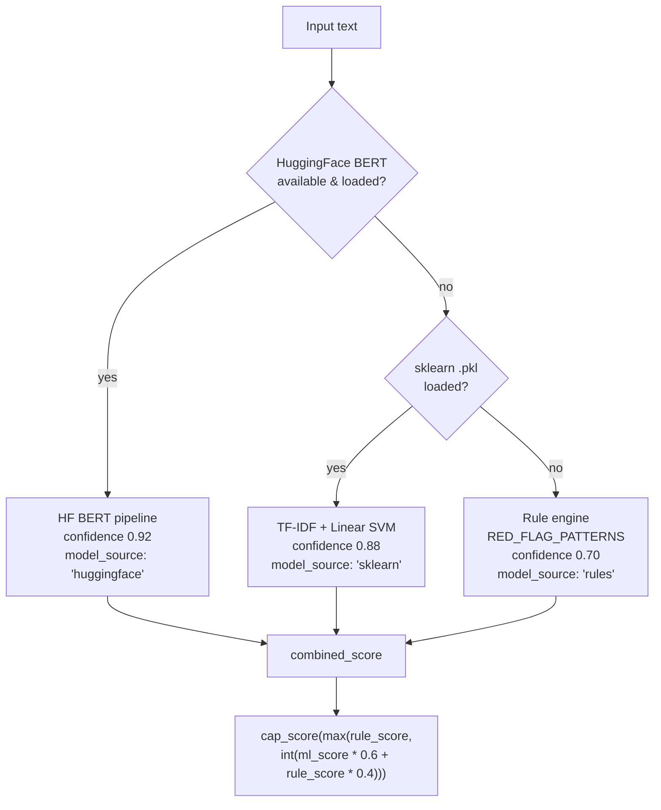

| Tier | Confidence reported | `model_source` | Availability |
|---|---|---|---|
| HuggingFace BERT | **0.92** | `huggingface` | Requires network on first use + `torch`/`transformers`. Fails permanently for the process once it errors. |
| sklearn TF-IDF + Linear SVM | **0.88** | `sklearn` | **✅ Live** — artifacts are on disk |
| Rule engine | **0.70** | `rules` | Always available |

### The combination formula — verified verbatim

```python
combined_score = cap_score(max(rule_score, int(ml_score * 0.6 + rule_score * 0.4)))
```

Three properties worth understanding:

1. **The rule score is a floor.** `max(rule_score, …)` means a strong rule signal can never be diluted by a confident ML verdict — if the rules see a payment request, the score cannot drop below that.
2. **The ML score is weighted 0.6 and the rule score 0.4** inside the blend, so ML leads but rules materially influence.
3. **`cap_score()` clamps to 0–100.**

**Returned fields:** `ml_score`, `rule_score`, `combined_score`, `red_flags`, `confidence`, `model_used`, `model_source`. Exposing all three scores plus `model_source` makes the tiering observable in production — a genuinely good design for debugging silent degradation.

## 7.6 `services/risk_scoring.py` (301 lines) — the weighted combiner

`calculate_risk_score(text, url, email_content, user_report_score=0)`:

- Computes each signal's score independently.
- **Normalises by `active_weight`** — the sum of the weights of the signals that were actually supplied. This is what makes the 1.25 weight sum harmless: a text-only scan divides by 0.40 + whatever else is active, so a single strong signal still produces a meaningful score rather than being deflated to 40% of its magnitude.
- **Deduplicates red flags by name**, so the same issue detected by two signals appears once.
- Attaches an explanation built by `build_explanation()`.

### `rule_based_scoring()` — the 7-category fallback

| Rule category | Weight |
|---|---|
| Payment request | **25** |
| Urgency | **15** |
| Unrealistic promises | **15** |
| Personal information request | **20** |
| Free email domain | **10** |
| Crypto/forex | **20** |
| Suspicious TLD | **10** |

- Reported **confidence: `0.70`**
- The explanation is suffixed **`" (Rule-based analysis — ML model unavailable)"`** — the degradation is declared to the user, not hidden. This is the same honesty principle as `simulated: true`.

## 7.7 URL analysis — `services/url_analysis.py` (126 lines)

| Signal | Penalty |
|---|---|
| Suspicious TLD | **+10** |
| Newly registered domain | **+20** |
| Typosquatting detected | **+25** |
| Blacklisted | **+30** |

## 7.8 Email analysis — `services/email_analysis.py` (395 lines)

The most substantial analysis module, and the only one that performs real network verification.

| Capability | Implementation |
|---|---|
| Header parsing | `email` stdlib parser with a **regex fallback** for malformed messages |
| **SPF** | Real DNS TXT lookup |
| **DKIM** | Real DNS TXT lookup across selectors `google`, `default`, `mail`, `dkim`, `s1`, `s2` |
| **DMARC** | Real DNS TXT lookup on `_dmarc.<domain>` |
| Spoofing detection | `From` ≠ `Reply-To`; `From` ≠ `Return-Path`; sender on a free email provider; **display-name brand spoofing** checked against a 10-brand list (`google`, `linkedin`, `amazon`, `microsoft`, `infosys`, `tcs`, `wipro`, `accenture`, `ibm`, `deloitte`, `oracle`) |
| Link analysis | BeautifulSoup extracts anchors and compares visible text against the actual `href` to detect misleading links |

### Email scoring

| Condition | Penalty |
|---|---|
| Missing authentication (SPF/DKIM/DMARC) | **+10** |
| Spoofing detected | **+25** |
| Free email provider | **+10** |
| Misleading links | **+15** |

This module performs **genuine** DNS-based email authentication. It is the one ML-service capability that produces real, independently verifiable evidence rather than a heuristic or a mock.

## 7.9 GST verification — `services/gst_verification.py` (119 lines)

> **⚠ DIVERGENCE — this is a mock, not a government API. Documented precisely.**

```python
if config.GST_API_PROVIDER != "mock":
    raise RuntimeError(f"GST provider '{config.GST_API_PROVIDER}' is not implemented")
record = MOCK_GST_DATABASE.get(value)
```

| Aspect | Reality |
|---|---|
| Live provider | **None.** Any non-`mock` provider raises `RuntimeError`. |
| Data source | `app/data/mock_gst_database.py` — **exactly 2 records** |
| `simulated` flag | `config.GST_API_PROVIDER == "mock"` → **always `true`** |
| Format validation | Genuine: `utils/gstin_validator.py` implements a real 15-char GSTIN regex with a **36-entry state-code map** |

### The entire mock database (2 records)

| GSTIN | Legal name | Trade name | Status | Type | State |
|---|---|---|---|---|---|
| `27ABCDE1234F1Z5` | TechNova Private Limited | TechNova | **Active** | Private Limited Company | Maharashtra |
| `27XYZAB5678G1Z2` | FakeJobs India LLP | FakeJobs | **Cancelled** | LLP | Maharashtra |

### Evidence scoring

| Condition | Effect |
|---|---|
| Each accumulated flag | `+15` |
| Registration **cancelled** | `score = max(score, 40)` |
| GSTIN **not found** | `score = max(score, 35)` |
| `identity_match` | Checks: company-name substring in both directions, state substring match, and address token overlap `< 0.3` → mismatch |

**Minor defect:** the returned dictionary sets `"principal_address"` **twice** — the second assignment wins. Harmless in effect but indicates an editing artefact. Finding C-08.

**The honesty chain is intact:** ML returns `simulated: true` → backend stores `gstVerificationSimulated: true` → frontend surfaces `gst.simulated: true` → `verificationService` **deducts 30 points** and adds the red flag *"GST verification is simulated"*. The system consistently refuses to treat its own mock as real evidence.

## 7.10 Model provenance — `models/model_meta.json`

| Field | Value |
|---|---|
| `model_type` | **Linear SVM with TF-IDF** |
| **accuracy** | **0.9803** |
| precision | 0.801 |
| recall | 0.8307 |
| f1 | 0.8156 |
| `trained_on` | "Synthetic + Kaggle (if available)" |
| training_date | 2026-09-19 |
| train_samples | 14,431 |
| test_samples | 3,608 |

### All four candidate models, as evaluated

| Model | Accuracy | Precision | Recall | F1 | Train time |
|---|---|---|---|---|---|
| **Linear SVM** (selected) | **0.9803** | 0.801 | 0.8307 | **0.8156** | 0.95 s |
| Random Forest | 0.9767 | 0.9817 | 0.5661 | 0.7181 | 3.27 s |
| Naive Bayes | 0.9709 | 0.8387 | 0.5503 | 0.6645 | 0.01 s |
| Logistic Regression | 0.9656 | 0.6265 | 0.8519 | 0.7220 | 0.15 s |

**Read this table critically.** Accuracy is uniformly high while F1 varies widely — the signature of a **class-imbalanced** test set where the majority class dominates. Random Forest has the best precision (0.9817) but a poor recall (0.5661): it misses ~43% of scams. Linear SVM was selected on F1, which is the right call for this problem. But **a 0.80 precision means roughly one in five "scam" verdicts is a false positive**, and **0.83 recall means roughly one in six scams is missed**.

> **⚠ Provenance caveat:** `trained_on` says *"Synthetic + Kaggle (if available)"* and the training date is the day the artifacts were built. The corpus is generated by `scripts/generate_synthetic.py` (286 lines). Accuracy figures from a synthetic corpus should be read as **pipeline validation, not field performance**. `scripts/evaluate_model.py` and `scripts/evaluate_bert.py` exist for independent evaluation, and `models/evaluation/` holds the confusion matrix and classification report.

## 7.11 Input → score → verdict, end to end

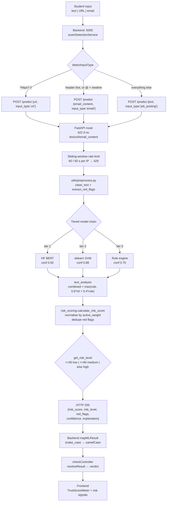

### 7.12 Error handling and degradation, summarised

| Failure | ML service behaviour | Backend behaviour | Student sees |
|---|---|---|---|
| BERT unavailable (offline, no torch) | Falls to sklearn, `model_source: 'sklearn'` | Transparent | Correct score, lower confidence |
| sklearn artifacts missing | Falls to rules, `model_source: 'rules'`, explanation suffixed | Transparent | Correct score, confidence 0.70 |
| **ML service down entirely** | — | `callMLAPI` catches `ECONNREFUSED`, runs `fallbackAnalysis`, returns `simulated: true` | A verdict, flagged as simulated |
| ML rate limit hit (60/min) | HTTP 429 `{"detail": "Rate limit exceeded…"}` | Caught by the same `try/catch` → **falls back to local rules** with `simulated: true` | A verdict, flagged as simulated |
| ML raises unexpectedly | HTTP 500 `{"detail": "An unexpected error occurred…"}` — **no stack leak** | Falls back to local rules | A verdict, flagged as simulated |
| GSTIN malformed | — | `gstVerificationService` rejects locally; **ML never called** | `status: 'failed'` |
| GST service unavailable | — | `status: 'unavailable'`, `reference: 'ml-service-unavailable'` | Graceful |

**Three-layer degradation is the defining property of this subsystem:** the ML service degrades internally (BERT → sklearn → rules), the backend degrades again behind it (ML → local rules), and every layer *declares* its degradation through `model_source`, `simulated`, and a suffixed explanation. Nothing silently pretends to be authoritative.

---

# Section 8 — Company Verification Flow

Every step below was verified against source. **No step is assumed.** Where a step that the design implies does not exist, it is called out as **ABSENT**.

## 8.1 The complete flow, step by step

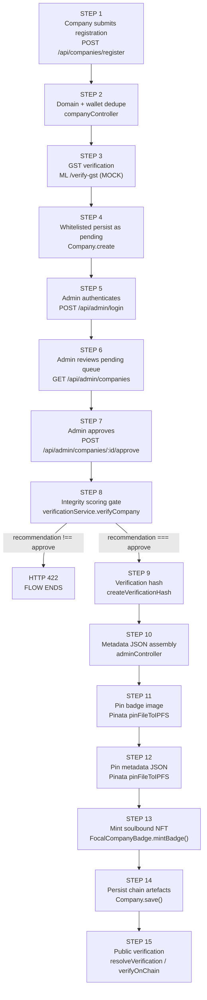

## 8.2 Step-by-step detail

### STEP 1 — Company submits its identity

| Attribute | Value |
|---|---|
| **File** | `backend/backend/src/routes/companyRoutes.js:28` → `src/controllers/companyController.js:25` |
| **Function** | `registerCompany` |
| **API** | `POST /api/companies/register` (public) — identical alias at `POST /api/companies` |
| **Validation** | `companyValidation` array: `name` notEmpty · `email` isEmail · `website` isURL (protocol required) · `walletAddress` matches `/^0x[a-fA-F0-9]{40}$/` · `gstin` optional, exactly 15 chars |
| **Input** | `{name, email, website, walletAddress, registrationNumber?, taxId?, phone?, address?, linkedinUrl?, gstin?, domain?}` |
| **Output** | HTTP 201 + the created company document |

**⚠ ABSENT — the registration form does not exist.** There is **no frontend page or component** that posts to this endpoint. `frontend/src/pages/` contains nine pages; none is a company registration page, and grepping `frontend/src` for `companies/register` returns nothing. The endpoint is reachable only by a direct API call. Combined with §0 Finding 5 (no wallet connection), **the entire company onboarding path is backend-only.**

**Domain derivation:** `normalizeDomain(req.body.domain || req.body.website)`. Because `website` is required and must carry a protocol, a domain is always derivable — so the schema-required `domain` field is always satisfied even though the route does not validate it directly.

### STEP 2 — Uniqueness enforcement

| Attribute | Value |
|---|---|
| **File** | `companyController.js:26–48` |
| **DB operation** | `Company.findOne({domain})` then `Company.findOne({walletAddress: /^…$/i})` |
| **Output on conflict** | **HTTP 409** with a specific message naming the colliding domain or wallet |

**The wallet-address check is case-insensitive** (regex with the `i` flag), while the schema's `unique` index on `walletAddress` is **case-sensitive**. An admin can therefore register `0xABC…` and `0xabc…` as separate documents if the two differ in case — the controller's pre-check would catch it, but a race between two concurrent registrations could slip past both. Two-layer defence, with a narrow gap. Finding C-09.

### STEP 3 — GST verification (runs automatically on registration)

| Attribute | Value |
|---|---|
| **File** | `companyController.js:59–78` → `src/services/gstVerificationService.js:23` |
| **Function** | `verifyGST({gstin, name, state: null, address})` |
| **External call** | `POST {ML_API_URL}/verify-gst` — **only when a GSTIN is present and matches `/^[0-9A-Z]{15}$/`** |
| **DB operation** | Twelve GST fields written into the payload before `Company.create` |
| **Output** | `{status, simulated, verificationDate, legalName, tradeName, registrationStatus, businessType, state, principalAddress, taxpayerType, reference, result}` |

**Verified details:**

- **`state: null` is hardcoded.** The registration handler calls `verifyGST` with `state: null` (`companyController.js:62`), so the GST `identity_match` check can only compare *name* and *address* — never state. The admin re-check endpoint `verifyCompanyGST` *does* pass a state (`req.body.companyState`). The two call sites behave differently.
- **A failed or unreachable GST service never blocks registration.** `verifyGST` cannot throw; on any error it returns `status: 'unavailable'` and registration proceeds.
- **The `simulated` flag is stored truthfully** as `gstVerificationSimulated`. In the default configuration it is **always `true`**, because the ML provider is `mock`.
- **Only 2 GSTINs produce a "found" result** (see §7.9). Any other well-formed GSTIN yields `status: 'failed'` with a `not found` red flag.

**⚠ This is not government verification.** It is a lookup against a two-record dictionary plus a real format validator. The flow is honestly labelled (`simulated: true`, `reference: 'mock_api'`), and the downstream scorer penalises it — but the *product label* ("GST verified") would be misleading if surfaced without the simulated flag.

### STEP 4 — Persist as `pending`

| Attribute | Value |
|---|---|
| **File** | `companyController.js:50–80` |
| **Mechanism** | Whitelist loop over `REGISTRABLE_FIELDS` — **never `...req.body`** |
| **Critical invariant** | `payload.status` is **hardcoded `'pending'`** before the loop; `status` is not in the whitelist |
| **DB operation** | `Company.create(payload)` |
| **Output** | HTTP 201 + company document |

The source comment states the security rationale verbatim: *"never spread req.body into the model (mass assignment would allow self-verified companies). New registrations always start pending."*

**This is a correctly-implemented mass-assignment defence.** A company cannot set its own `status`, `tokenId`, `verificationHash`, `tokenURI`, or any transaction hash.

### STEP 5 — Admin authenticates

| Attribute | Value |
|---|---|
| **File** | `src/routes/adminRoutes.js:28–34` → `src/controllers/adminController.js:16` |
| **Function** | `login` |
| **API** | `POST /api/admin/login`, behind `authLimiter` (20 requests / 15 min) |
| **Validation** | `email` isEmail · `password` notEmpty |
| **External service** | **None** — no `Admin` collection; credentials come from environment variables |
| **Output** | `{token, admin: {email, role: 'admin'}}` where the token is a JWT signed with `{id: 'focal-admin', role: 'admin'}` |

**Two verification branches, verified verbatim:**

```javascript
const passwordMatches = env.adminPassword.startsWith('$2')
  ? await bcrypt.compare(password, env.adminPassword)
  : password === env.adminPassword;
```

- If `ADMIN_PASSWORD` begins with `$2` it is treated as a **bcrypt hash** and compared with `bcrypt.compare`.
- Otherwise it is compared with **plain string equality** — a non-constant-time comparison, and it means the shipped configuration stores the admin password in cleartext in `.env`.

**Fail-closed:** on mismatch the handler returns **HTTP 401 `'Invalid admin credentials'`** — no fallback account, no demo bypass. The frontend's `adminLogin` likewise has **no** demo fallback.

**⚠ The admin identity is a constant.** `generateToken('focal-admin')` — the JWT subject is the literal string `'focal-admin'`, not a database id. This is why `reviewReport` writes `reviewedBy: req.user?.id || 'focal-admin'`. The platform supports exactly one administrator, and the audit trail cannot distinguish between them.

### STEP 6 — Admin reviews the pending queue

| Attribute | Value |
|---|---|
| **File** | `adminController.js:36–40` |
| **Function** | `listAdminCompanies` |
| **API** | `GET /api/admin/companies?status=pending` |
| **DB operation** | `Company.find(filter).sort({createdAt: -1})` — **unpaginated** |
| **Output** | `{count, data: [...]}` |

**⚠ Unpaginated.** Unlike the public `listCompanies` (which caps `limit` at 100), this admin listing has no `skip`/`limit`. At scale it returns every company in one response. Finding C-10.

> **Frontend divergence:** `AdminDashboard` does **not** call `getAdminCompanies`. It calls `getCompanies()` — the **public** list endpoint (`AdminDashboard.jsx:30`). So the admin dashboard shows the public, paginated (default limit 20) view rather than the full admin listing, and it does not filter to `pending`. The dedicated admin listing endpoint is unused by the UI.

### STEP 7 — Admin approves

| Attribute | Value |
|---|---|
| **File** | `src/routes/adminRoutes.js:37` → `adminController.js:42` |
| **Function** | `approveCompany` |
| **API** | `POST /api/admin/companies/:id/approve` |
| **Middleware** | `verifyToken` + `isAdmin` |
| **Guards** | 404 when not found · **409 `'Company is already verified'`** when `status === 'verified'` |

### STEP 8 — The integrity-scoring gate

| Attribute | Value |
|---|---|
| **File** | `adminController.js:51–58` → `src/services/verificationService.js:16` |
| **Function** | `verifyCompany(company.toObject())` |
| **External service** | **None — pure local heuristics** |
| **Output** | `{overallScore, checks[], redFlags[], gstVerificationStatus, recommendation}` |

**The gate, verbatim:**

```javascript
const verificationReport = await verifyCompany(company.toObject());
if (verificationReport.recommendation !== 'approve') {
  return res.status(422).json({
    success: false,
    message: `Company verification requires ${verificationReport.recommendation.replace('_', ' ')}`,
    data: { verificationReport }
  });
}
```

**If the recommendation is not `approve`, the flow terminates with HTTP 422.** There is no override: an admin cannot approve a company that scores below the threshold. Approval requires `overallScore >= 80` **and** `redFlags.length <= 1`.

**Consequences of the nine scoring checks (§5.7):** a company with a `gmail.com` address (−20) and a domain that does not contain its name (−15) already sits at 65 and can never be approved without correction. This is a deliberately strict gate.

**Verified interaction with seed data:** the seed writes **no `gstin` on any company**. In `verifyCompany`, the GST deduction is guarded by `if (companyData.gstin && !gstEvidenceVerified)` — with no `gstin` the branch is skipped, so seeded companies avoid the −30 GST penalty entirely and can reach `approve`. This is why the seeded `TechNova`/`InnovateLabs` records are consistent with the gate. Any real company that *does* supply a GSTIN starts 30 points down, because the ML GST provider is a mock and `simulated` is always `true`.

### STEP 9 — Compute the verification hash

| Attribute | Value |
|---|---|
| **File** | `adminController.js:59–61` → `src/services/blockchainService.js` |
| **Function** | `createVerificationHash(company.name, company.domain, dateString)` |
| **Mechanism** | `ethers.solidityPackedKeccak256(['string','string','string','string'], [name, domain, dateString, SALT])` |
| **Input** | Company name, domain, `YYYY-MM-DD` date string |
| **Output** | A 32-byte hex hash, e.g. `0xf7a67144…506989` |

**The date is `new Date().toISOString().slice(0,10)` — the approval date.** This makes the hash **non-deterministic across runs**: the same company approved on different days yields different hashes. See §13.1 for the salt defect (Finding C-01).

### STEP 10 — Assemble the metadata JSON

| Attribute | Value |
|---|---|
| **File** | `adminController.js:62–73` |
| **Output** | An in-memory metadata object (pinned in Step 12) |

**Verbatim, and note the naming:**

```javascript
const metadata = {
  name: `OMEN Verified Company: ${company.name}`,
  description: `This soulbound NFT certifies that ${company.name} has been verified by OMEN as a legitimate company.`,
  attributes: [
    { trait_type: 'Company Name', value: company.name },
    { trait_type: 'Domain', value: company.domain },
    { trait_type: 'Verification Date', value: dateString },
    { trait_type: 'Verification Hash', value: verificationHash },
    { trait_type: 'GST Verification Status', value: company.gstVerificationStatus || 'not_provided' },
    { trait_type: 'Status', value: 'verified' }
  ]
};
```

> **⚠ DIVERGENCE — legacy naming is written into immutable on-chain metadata.** The NFT's `name` reads **"OMEN Verified Company: …"** and the description says the company was *"verified by OMEN"*. The platform is FOCAL; the contract is `FocalCompanyBadge`; the collection name is "FOCAL Company Badge". Because this JSON is pinned to **IPFS**, this string is **permanent and cannot be corrected** for any badge minted before the fix — the CID is content-addressed, so correcting it produces a different CID and the on-chain `tokenURI` would have to be updated. Finding C-11, and the single most consequential piece of naming drift in the system.

### STEP 11 — Pin the badge image

| Attribute | Value |
|---|---|
| **File** | `adminController.js:74` → `src/services/pinataService.js` |
| **Function** | `uploadBadgeMetadata(metadata, fileName)` (internally pins the image first) |
| **External call** | Pinata `pinFileToIPFS` — native `fetch` + `FormData` + `Blob` |
| **Auth** | `PINATA_JWT`, or `PINATA_API_KEY` + `PINATA_SECRET_API_KEY`. **Throws `'Pinata credentials are not configured'` when neither is set.** |
| **Image source** | `DEFAULT_IMAGE_PATH` → `../../../../focal-chain/assets/green-badge.svg` resolved to `focal-blockchain/assets/green-badge.svg` (1,489 bytes, **exists on disk**) |
| **Output** | An image CID assigned to `metadata.image` |

> **The shipped `.env` has no `PINATA_*` keys**, so this step throws in the default configuration and approval cannot complete. Finding C-04.

### STEP 12 — Pin the metadata JSON

| Attribute | Value |
|---|---|
| **External call** | Pinata `pinFileToIPFS` on the metadata JSON |
| **Filename** | **`${company.domain}-omen-verified.json`** — legacy `omen` in the pinned filename |
| **Output** | `tokenURI = ipfs://<metadataCid>` |

### STEP 13 — Mint the soulbound NFT

| Attribute | Value |
|---|---|
| **File** | `adminController.js:75` → `src/services/blockchainService.js` → `focal-blockchain/contracts/FocalCompanyBadge.sol` |
| **Function** | `mintBadge(company.walletAddress, uploaded.tokenURI)` |
| **Blockchain operation** | `FocalCompanyBadge.mintBadge(address company, string tokenURI)` on **Polygon Amoy (80002)**, signed by the platform's admin wallet (`ADMIN_PRIVATE_KEY`) |
| **Contract guards** | `onlyAdmin` · non-empty `tokenURI` · `company != address(0)` · **`balanceOf(company) == 0`** |
| **Events** | `BadgeMinted(address indexed company, uint256 indexed tokenId, string tokenURI)` |
| **Output** | `{transactionHash, tokenId}` — the hash from the **receipt**, the tokenId read back via `getBadgeId()` |
| **On failure** | **Throws `'Blockchain mint failed'`** — no fallback, no simulation |

**⚠ The mint target is the address that was typed into the form.** No signature proves the company controls it. See §10.

### STEP 14 — Persist the chain artefacts

| Attribute | Value |
|---|---|
| **File** | `adminController.js:77–84` |
| **DB operation** | `Company.save()` |
| **Fields written** | `status: 'verified'` · `verificationDate` · `verificationHash` · `tokenURI` · `tokenId` · `mintTransactionHash` · `verificationReport` |
| **Ordering** | **All chain work happens first; the database is written last.** If any of Steps 11–13 throws, no state is saved — so the database never records a verification whose NFT was not actually minted. |
| **Output** | `{company, mint: {transactionHash, tokenId}, verificationReport}` |

**This ordering is correct and deliberate.** It makes the database a faithful record of on-chain reality.

### STEP 15 — Public verification

| Attribute | Value |
|---|---|
| **Backend** | `resolveVerification(company)` — requires `status === 'verified'` **and** a successful on-chain `hasValidBadge()` |
| **Frontend** | `verifyOnChain(walletAddress)` — an independent RPC call, plus `ownerOf` cross-check and IPFS metadata retrieval |
| **Output** | Badge validity, tokenId, owner, tokenURI, and the five metadata attributes including the verification hash |

## 8.3 The revocation flow

| Step | File / function | Operation |
|---|---|---|
| 1 | `POST /api/admin/companies/:id/revoke` (admin) | Route entry |
| 2 | `adminController.revokeCompany:102–120` | Guards: 404 if not found; **400 `'Company does not have a token ID to revoke'`** when `tokenId` is null/undefined |
| 3 | `blockchainService.revokeBadge(company.tokenId)` | Sends the burn → `FocalCompanyBadge.revokeBadge(uint256 tokenId)` |
| 4 | Contract | `ownerOf(tokenId)` (reverts if nonexistent) → capture company → `_burn(tokenId)` → `delete _companyToTokenId[company]` → emit `BadgeRevoked` |
| 5 | `adminController` | `status: 'revoked'` · `revocationDate` · `revocationReason` · `revokeTransactionHash` → `save()` |
| 6 | Downstream | `resolveVerification` requires `status === 'verified'`, so a revoked company is **immediately unverified**. `resolveResult` returns `'revoked'`. The frontend adds a `BADGE_REVOKED` high-severity risk signal. |

**Revocation burns rather than mutates** — because the metadata on IPFS is immutable, burning the token is the only way to withdraw the claim. This is the correct design for a soulbound badge, and it is why `hasValidBadge` is implemented as `balanceOf > 0`.

**Note the `tokenId: 0` edge case:** the guard is written `if (!company.tokenId && company.tokenId !== 0)`, which correctly permits revoking token id `0` — the first token minted. This is a careful, correct zero-check.

## 8.4 Steps that do NOT exist

| Step the design implies | Status |
|---|---|
| Company registration through the UI | **ABSENT** — no page; API-only |
| Wallet connection by the company | **ABSENT** — no `eth_requestAccounts` call reachable from the UI |
| Wallet ownership proof (signature / nonce / challenge) | **ABSENT** — no such code anywhere in the repository |
| MCA / company-registry verification | **ABSENT** — only a 3-entry fabricated set in `verificationService.js` |
| Live GST verification against a government API | **ABSENT** — 2-record mock |
| Automated background re-verification | **ABSENT** |
| Company notification on approval/rejection | **ABSENT** — no email or webhook integration exists |
| Admin override of a failed score | **ABSENT** — deliberately; the 422 gate is absolute |
| Multi-admin support | **ABSENT** — single identity constant `'focal-admin'` |
| Company-facing dashboard (to see its own status) | **ABSENT** |
| Appeal / re-submission flow after rejection | **ABSENT** — a rejected company cannot re-register (the domain is still unique) |

**That last row is worth emphasising:** `registerCompany` rejects a duplicate `domain` with HTTP 409, and a rejected company's document still occupies that domain. There is no re-apply path, so **a company rejected once can never be reconsidered under the same domain** unless an admin deletes the record entirely. Finding C-12.

---

# Section 9 — Student / Public User Flow

## 9.1 Requirement confirmation

The stated product requirement is: **a student must not need an account or a wallet to check a company or opportunity.** Verified against source:

| Requirement | Verified status | Evidence |
|---|---|---|
| No account needed | ✅ **CONFIRMED** | There is no student model, no student collection, no student route, and no student session. `AppContext` holds exactly one persisted value — `focal_admin_token`. |
| No wallet needed | ✅ **CONFIRMED** | No page calls `connectWallet()` or touches `window.ethereum`, except the unused helper. The on-chain check is performed server-side or via a read-only `JsonRpcProvider` — **no signer, no account, no prompt.** |
| No login wall | ✅ **CONFIRMED** | All student routes are public: `POST /api/check`, `GET /api/companies`, `GET /api/companies/:id`, `GET /api/companies/check`, `GET /api/companies/status/:walletAddress`, `POST /api/reports`, `GET /api/reports`, `GET /api/connections`, `POST /api/connections`. Only `/api/admin/*` and the update/delete verbs on the other routers require a JWT. |
| MetaMask prompt | ✅ **CONFIRMED ABSENT** | No `eth_requestAccounts`, no `personal_sign` |

**The requirement holds.** A student can complete the entire check flow with nothing but a browser.

## 9.2 What a student can do, and through which surfaces

| Capability | Surface | API | Needs account? |
|---|---|---|---|
| Paste a company name / domain / URL / email and get a verdict | `/` → `/check` | `POST /api/check` | No |
| Browse the company directory | `/explore` | `GET /api/companies` | No |
| View a full company dossier | `/company/:id` | `GET /api/companies/:id` | No |
| File a fraud report | `/report` | `POST /api/reports` | No |
| View reported entities and request a connection | `/connections` | `GET`/`POST /api/connections` | No |
| Read scan history | *(no UI)* | `GET /api/check` · `GET /api/check/history` | No |

## 9.3 The student check flow — with the blocking defect

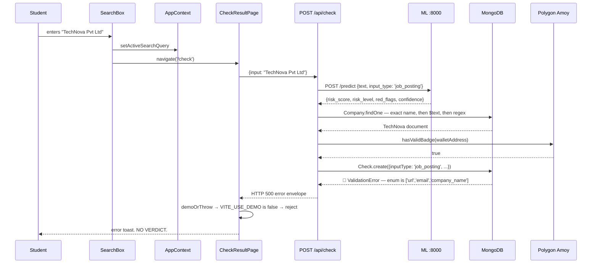

> 🔴 **The student flow is broken for the most common inputs.** As established in §6.3, `detectInputType` returns `'job_posting'` for anything that is not a full `http(s)://` URL and is not email content containing headers or an `@` plus a newline. Mongoose's `Check.inputType` enum omits `'job_posting'`, so `Check.create` throws and the endpoint returns HTTP 500. The student sees an error toast instead of a verdict. **A bare domain like `fakejobs-india.xyz` and a company name like `TechNova Pvt Ltd` both fail.** This is Finding C-01b and it should be the first thing fixed.

## 9.4 What the student sees when it works — the result composition

For a **URL** input (which does work), the flow completes and the student receives:

| Element | Source | Notes |
|---|---|---|
| **Verdict** — `verified` / `suspicious` / `revoked` / `not_found` | `checkController.resolveResult` | Precedence: `revoked` (if the company's status is revoked) → `verified` (if chain-verified) → `not_found` (no company and risk < 50) → `suspicious` (risk ≥ 50) |
| **Risk score** 0–100 | ML `risk_score` | From the tiered ML chain |
| **Risk level** — low / medium / high | ML `risk_level` | Boundaries ≤30 / ≤60 / >60 |
| **Red flags** | Merged from four sources | ML flags + `'Company badge has been revoked'` + `'No verified company record found'` + `'On-chain badge could not be confirmed'` |
| **Trust score** | `normalizeCompany` | For unverified entities: `100 − riskScore`. For verified: `verificationReport.overallScore` (default 90) |
| **Confidence** | ML `confidence` | 0.92 / 0.88 / 0.70 / 0.55 by tier |
| **Explanation** | ML `explanation` | Rule-based explanations are suffixed to declare the degradation |
| **`simulated`** | `analysis.simulated` | `true` when the ML service was unavailable and the backend used local rules |
| **Verification object** | `resolveVerification` | `{isVerified, onChain, simulated}` |
| **On-chain proof block** | `verifyOnChain` | `{isValid, tokenId, owner, tokenURI, metadata, verificationHash}` |

### The three-way chain-first display rule

This is the most important student-facing correctness property. `normalizeCompany` (`api.js:110–112`) applies it:

| Database `status` | `resolveVerification.isVerified` | What the student sees |
|---|---|---|
| `verified` | `true` | **verified** — badge confirmed on-chain |
| `verified` | `false` | **unverified** — silently downgraded from the DB claim |
| `pending` | `false` | **pending** (trust score 60) |
| `rejected` | `false` | **rejected** (trust score 30) |
| `revoked` | `false` | **revoked** (trust score 10) |
| absent | `false` | **unknown** (trust score 45) |

**The student cannot be shown "verified" on the strength of a database row alone.** The verdict is `verified` only when the database claim and a live on-chain read agree.

## 9.5 How the student sees each piece of information

| Information | Where it is rendered | Source of truth |
|---|---|---|
| Company name, domain, email, phone, address | `CompanyProfilePage`, `CompanyCard` | MongoDB |
| Trust score | `TrustScoreMeter` | Derived (see §9.4) |
| Verification status | Hero badge on `CheckResultPage` / `CompanyProfilePage` | Chain-first |
| **Blockchain proof** | `BlockchainProofDetails` | **`verifyOnChain` — read directly from Amoy** |
| Verification hash | The metadata block, via `metadataAttribute(metadata,'Verification Hash')` | **The IPFS metadata anchored on-chain** |
| Token id, owner, contract address, network | Proof block | Chain + the frontend's own constants |
| IPFS link | Proof block via `toGatewayUrl` | `ipfs://` → `https://ipfs.io/ipfs/…` |
| GST evidence (GSTIN, legal name, trade name, status, state, address) | Company profile | MongoDB, with `simulated` surfaced |
| Risk / scam analysis | Risk signals list | ML + local rules |
| Trust signals | Trust signals list | `verificationReport.checks[].passed` names + `'Soulbound Trust Badge issued on-chain'` + `'GST verification evidence confirmed'` |
| Verification history timeline | `verificationHistory` | `verificationDate` → VERIFIED; `revocationDate` → REVOKED |
| Opportunity / job info | — | **ABSENT.** There is no job-posting entity, no opportunity model, and no job listing anywhere. "Opportunity" is represented only as free text pasted into the check box. |

> **⚠ "Opportunity info" does not exist as a data concept.** The brief describes checking an "opportunity". The system has no `Opportunity`, `Job`, or `Posting` model. The student's input *is* the opportunity — arbitrary text or a URL — and the analysis is performed on that text. There is no structured opportunity record, no stored posting, and no way to browse opportunities. Finding C-13.

## 9.6 Student-facing gaps and inaccuracies

| Item | Detail |
|---|---|
| **No shareable result URL** | The query lives in `AppContext`, not in the URL. A student cannot share or bookmark a verification result. |
| **No history UI** | `GET /api/check/history` exists and works, but no page consumes it. |
| **`GET /api/check/:id` has no ownership check** | The code comments call it *"available via GET /api/check/:id for the submitter"*, but the route is public and unauthenticated — so this full record **including the raw `input` and admin `notes`** is readable by anyone who knows or guesses an id. The public list endpoint deliberately hides exactly these fields. Finding C-14. |
| **Fabricated figures shown as fact** | `TrustScoreMeter` states **"99.4% IDENTITY MATCH"**; `NetworkVisualizer` states **"Soulbound NFT badge #10921 confirmed on Polygon mainnet"**, **"REALTIME MONITORING ACTIVE"**, **"IDENTITY 100% REGISTRY MATCH"**, **"ZERO TYPOSQUATTING"**, **"NO ACTIVE REPORTS"**; `Footer` states **"NETWORK STATUS: ONLINE | 99.98% UPTIME"**; `BackgroundGrid` states **"TRUST_ENGINE // ACTIVE"**, **"NODE_04 // VERIFIED"**, **"LATENCY // 024ms"**. All are static strings. **`#10921 on Polygon mainnet` is doubly wrong** — wrong token, wrong network. For a *trust* product, decorative fake telemetry is the most damaging possible category of cosmetic defect. Finding C-15. |
| **`DomainComparison` hardcodes its verdicts** | `domain === 'companny.com' && index === 4`, `domain.includes('tech-nova-verify')`, `'LEVENSHTEIN DIFF: 1'`, `'REGISTRATION AGE: 7 DAYS'`. The component does not compute distance or age. |
| **`websiteAge` is always `'Unknown'`** | `digitalPresence.websiteAge` is hardcoded in `normalizeCompany`. The ML service *does* compute WHOIS domain age — the value simply never reaches the UI. |
| **`VerificationScanner` is decorative** | It animates without performing the scan it appears to perform. |
| **Landing page shows fabricated companies** | `demoCompanies.slice(0,3)` renders unconditionally, including one with `network: 'Polygon Mainnet'` and a **wrong contract address**. |

---

# Section 10 — Company Wallet Flow

## 10.1 The headline finding

> **⚠ DIVERGENCE — there is no wallet authentication flow in this system.** The described flow (wallet entry → MetaMask connection → challenge/nonce → message signing → backend verification → recovered address → ownership proof → NFT mint) **does not exist**. What exists is: a **text field** validated by a regex, stored uniquely, and later minted to.

Grepping the entire repository — backend `src/`, frontend `src/`, `focal-blockchain/`, `ML/` — for `nonce`, `challenge`, `personal_sign`, `personalSign`, `signMessage`, `verifyMessage`, `signTypedData`, or signature-recovery returns **zero matches**. There is no nonce endpoint, no challenge issuance, no signature verification, and no address recovery anywhere.

## 10.2 What actually happens, step by step

| # | Described step | Actual implementation | File |
|---|---|---|---|
| 1 | **Wallet entry** | A `walletAddress` **text input** on the (non-existent) registration form, or a raw API field | `companyRoutes.js:23` |
| 2 | **MetaMask connection** | **DOES NOT HAPPEN.** A `connectWallet()` helper exists in `frontend/src/services/blockchain.js:121` but is **imported and called by nothing.** No page renders a "Connect Wallet" control. | — |
| 3 | **Challenge / nonce** | **DOES NOT EXIST.** No nonce is generated, stored, or transmitted. | — |
| 4 | **Message signing** | **DOES NOT EXIST.** `personal_sign` is never called. | — |
| 5 | **Backend verification of the signature** | **DOES NOT EXIST.** | — |
| 6 | **Recovered wallet address** | **DOES NOT EXIST.** No `verifyMessage` / `recoverAddress`. | — |
| 7 | **Ownership verification** | **Regex only:** `/^0x[a-fA-F0-9]{40}$/` — a *format* check. Uniqueness is enforced by a `findOne` pre-check plus a schema `unique` index. **Nothing proves the submitter controls the address.** | `companyRoutes.js:23`, `companyController.js:38–48`, `models/Company.js:14` |
| 8 | **NFT minting** | Real: `mintBadge(company.walletAddress, tokenURI)` on Polygon Amoy, signed by the platform's `ADMIN_PRIVATE_KEY` | `adminController.js:75` |
| 9 | **Token ID** | Real: read back from the contract via `getBadgeId()` after the receipt | `blockchainService.js` |
| 10 | **Token URI** | Real: `ipfs://<metadataCid>` from Pinata | `pinataService.js` |
| 11 | **Transaction hash** | Real: taken from the **receipt**, not the submitted tx | `blockchainService.js` |
| 12 | **Final DB storage** | Real: `tokenId`, `tokenURI`, `verificationHash`, `mintTransactionHash`, `verificationDate`, `status:'verified'` — **written only after the mint succeeds** | `adminController.js:77–84` |

## 10.3 The security consequence, stated plainly

Because Step 7 is a format check and nothing more:

> **Anyone can register a company naming any wallet address they do not control.** There is no proof of possession anywhere in the flow. If an administrator approves such a registration, the platform mints a **soulbound** NFT to that address — and `FocalCompanyBadge` is non-transferable by design, so it **cannot be moved** to the rightful owner. Recovery requires an admin to `revokeBadge()` (burning it) and re-mint.

**Mitigating factors, stated fairly:**

1. **Approval is admin-gated.** An anonymous registration cannot self-verify — `REGISTRABLE_FIELDS` excludes all verification state and `status` is hardcoded `pending`. A human must approve.
2. **The scoring gate is strict** — `overallScore >= 80` with at most one red flag, else HTTP 422.
3. **The wallet address is unique**, so one address cannot be claimed by two companies.
4. **The address is not a secret.** Publishing it in the metadata is intentional — a verified badge is meant to be publicly attributable.
5. **The risk is mis-attribution, not theft.** A malicious registrant cannot transfer the badge out; they can only cause a badge to be minted to an address they may not control, which would be visible and correctable by an admin.

**Nonetheless, this is a genuine and material gap** between the described architecture ("wallet authentication") and the implementation. A signature-based ownership proof is the standard, low-cost fix: issue a nonce, have the company sign `personal_sign` with the address, verify with `ethers.verifyMessage`, and only then allow the address into the record. Finding C-16, and the highest-value security addition available.

## 10.4 Signature vs transaction — what each proves

Since the system contains wallet signatures **nowhere**, the distinction the brief asks for is best stated as: **only one of these two mechanisms is actually present.**

| Mechanism | Present? | What it is | What it proves | Where it would appear |
|---|---|---|---|---|
| **Wallet signature** (`personal_sign` / EIP-191 / EIP-712) | ❌ **ABSENT** | An off-chain cryptographic proof: the holder of a private key signs a message; anyone can recover the signing address | **Control of the private key for that address.** Costs no gas, changes no state. This is what proves *ownership*. | Nowhere — no nonce, no challenge, no verification |
| **Blockchain transaction** | ✅ **PRESENT** | An on-chain state change signed by the **platform's** admin key | **That the platform issued a badge to that address.** Proves the issuer acted, and is permanently auditable — but says **nothing** about whether the recipient controls the address. | `mintBadge` / `revokeBadge` in `blockchainService.js` |

**In this system the only signature that ever exists is the platform's own.** The company never signs anything. Consequently the badge proves *"FOCAL decided this address is verified"* — not *"this company controls this address"*. The two are conflated in the product narrative and are not the same claim.

## 10.5 The wallet-related data path that does exist

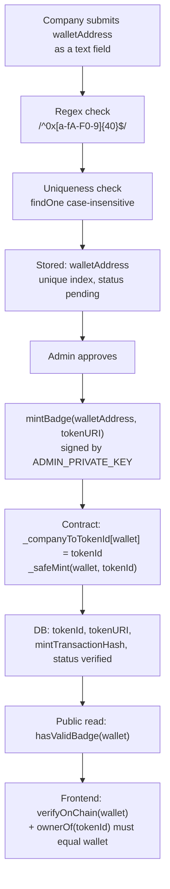

**Note step J** — this is where ownership is *checked*, and it is checked **after** the fact. `verifyOnChain` asserts `ownerOf(tokenId).toLowerCase() === walletAddress.toLowerCase()` and fails closed on mismatch. So the system does validate that the badge is held by the recorded wallet — but only as a *read-time consistency check* on a mint that already happened. It cannot prevent the original mis-mint.

---

# Section 11 — Blockchain Architecture

## 11.1 Networks present — and the ones that are not

| Network | Chain ID | Configured in `hardhat.config.js` | Deployment present | Referenced by application code | Actually used |
|---|---|---|---|---|---|
| **Polygon Amoy** | **80002** | ✅ `amoy` | No committed deployment record | ✅ **Enforced in both backend and frontend** | ✅ **The only live network** |
| Sepolia | 11155111 | ✅ `sepolia` (RPC + Etherscan key) | ❌ | ❌ **Zero references** | ❌ |
| Mumbai | 80001 | ✅ `mumbai` (**deprecated testnet**) | ❌ | ❌ | ❌ |
| Hardhat local | 31337 | ✅ implicit | ❌ | ❌ | ❌ (tests only) |

> **⚠ DIVERGENCE — there is no Ethereum Sepolia contract and no `OMENVerificationRegistry`.**
>
> - **No contract named `OMENVerificationRegistry` exists anywhere in the repository.** The only contract source file is `focal-blockchain/contracts/FocalCompanyBadge.sol`.
> - **No second contract of any kind exists.** There is no registry, no factory, no companion contract.
> - **Sepolia is declared but unreferenced.** It appears only as a network block in `hardhat.config.js` and as a deploy script target (`deploy:sepolia`). No application code path touches it, no chain-ID check accepts it, and no deployment record exists.
>
> The described "two-blockchain" architecture — a Sepolia verification registry plus a Polygon Amoy badge — **is not supported by the source.** The system has **one network and one contract.**

**Chain-ID enforcement, both sides:**

| Side | Location | Behaviour |
|---|---|---|
| Backend | `config/blockchain.js → initializeContract()` | Asserts the provider's chain ID is `80002n`; **throws** otherwise |
| Backend | `services/blockchainService.js` | Fails closed on any provider error |
| Frontend | `services/blockchain.js:68–70` | `if (network.chainId !== OMEN_CHAIN_ID) throw` where `OMEN_CHAIN_ID = 80002n` |

Both sides independently refuse to operate on the wrong chain. This is a correctly-implemented guard, applied twice.

## 11.2 The contract

| Attribute | Value |
|---|---|
| **Contract name** | `FocalCompanyBadge` |
| **File** | `focal-blockchain/contracts/FocalCompanyBadge.sol` (190 lines) |
| **Network** | Polygon Amoy |
| **Chain ID** | `80002` |
| **Standard** | **ERC-721** (non-fungible token), via OpenZeppelin `ERC721URIStorage` |
| **Collection name / symbol** | `"FOCAL Company Badge"` / `"FOCAL"` |
| **Purpose** | A **soulbound** (non-transferable) verification badge certifying that a company has been verified by FOCAL |
| **Compiler** | Solidity `0.8.24`, optimizer enabled, 200 runs, `evmVersion: cancun` |
| **Dependencies** | `@openzeppelin/contracts ^5.0.0` — **resolved on disk to 5.6.1**; `ethers ^6.11.0`; `hardhat ^2.22.0`; `@nomicfoundation/hardhat-toolbox ^5.0.0` |
| **Deployed address** | **NO deployment record exists anywhere.** See below. |
| **Compiled artifact** | `artifacts/contracts/FocalCompanyBadge.sol/FocalCompanyBadge.json` — 43,917 bytes, bytecode 15,180 hex chars, **present on disk but gitignored** |
| **Source verification** | `sourcify.enabled = true` in `hardhat.config.js`; Polygonscan API key supported for mainnet/sepolia/mumbai/amoy |

### The deployed-address problem

**There is no deployed contract address committed anywhere in the repository.** Every address-shaped value in configuration is a placeholder:

| File | Value | Notes |
|---|---|---|
| `focal-blockchain/.env.example:30` | `CONTRACT_ADDRESS=0x0000000000000000000000000000000000000000` | With the comment *"fill after deploy"* |
| `focal-blockchain/.env.example:26` | `TEST_COMPANY_ADDRESS=0x0000…0000` | Zero address |
| `focal-blockchain/.env.example:7` | `PRIVATE_KEY=0x0000…0000` | Zero key |
| `backend/backend/.env` | `0xYourDeployedFocalBadgeContractAddress` | A literal placeholder string |
| **`frontend/src/services/blockchain.js:4`** | **`0x9124A20aE4a715Fcee6056bf1F5f95E4358647C6`** | **A real-looking address hardcoded as the `VITE_CONTRACT_ADDRESS` fallback — and the only non-placeholder address in the codebase** |

**`deployments/` does not exist.** No `hardhat-deploy` plugin is installed; `scripts/deploy.js` logs the address to stdout and persists nothing. `focal-blockchain/` has **no `.env` at all** — only `.env.example`.

**The configuration inversion, corrected:**

| File | `CONTRACT_ADDRESS` | Effect |
|---|---|---|
| `focal-blockchain/.env.example` | Zero address (placeholder) | The chain scripts are inert until a deploy is recorded by hand |
| `backend/backend/.env` | Literal placeholder string | **`isChainConfigured()` returns `false`; `getReadOnlyContract()` throws; every chain read and write fails** |
| `frontend/src/services/blockchain.js` | **A hardcoded non-placeholder address** | The frontend *attempts* real Amoy reads against an address **no committed artifact corroborates** |

> **This is a three-way configuration contradiction, and it is worse than a simple mismatch.** The backend cannot touch the chain at all. The frontend will attempt a real RPC call to an address that appears in no `.env.example`, no deployment record, and no script — so its reads will either succeed against a contract deployed by someone outside this repository, or revert as calls to an address with no code. **Neither half knows the truth, and the two halves disagree.** Finding C-17.

> **A note on `verificationService`'s `mockRegistry`:** this is the only other place a deployment-like identifier appears, and it is a **set of three fabricated government registration numbers** (`TN-TECH-2020-4455`, `KA-INNO-2019-8811`, `DL-QUICK-2024-1001`) — not contract addresses. It is a hardcoded allowlist standing in for a company registry lookup, so a registration number is "verified" if and only if it is one of these three literals. Any real registration number that passes the format check but is absent from the set is penalised by 10 points with the flag *"Registration number requires manual registry verification."* Finding C-21.

## 11.3 Why only one network — and whether a second was ever intended

The source supports exactly one reading: **a single soulbound badge contract on a single testnet.** The evidence:

1. Only one `.sol` file exists in the canonical project (`focal-blockchain/contracts/`).
2. Both the backend and the frontend independently assert chain ID `80002`, and nothing asserts `11155111`.
3. `hardhat.config.js` declares `sepolia` but the package's deploy script surface for the canonical project omits a Sepolia default; no script names Sepolia as required.
4. The archived predecessor (`_archive/omen-blockchain/`) has the same single-contract shape — one `OmenCompanyBadge.sol`.
5. There is no registry-like contract, no mapping of company→registry entry, and no second address constant in any config file.

**A plausible reading of the design intent:** a registry contract (cheap, mutable, Sepolia) plus a badge NFT (Polygon, user-facing) is a recognisable pattern — but if that was the intent, it was never built. Only the badge half exists. The archive's `scripts/computeVerificationHash.js` and metadata files show the same single-contract design, so this is not a regression from the archive; the two-chain design appears never to have been implemented.

## 11.4 How the backend interacts with the contract

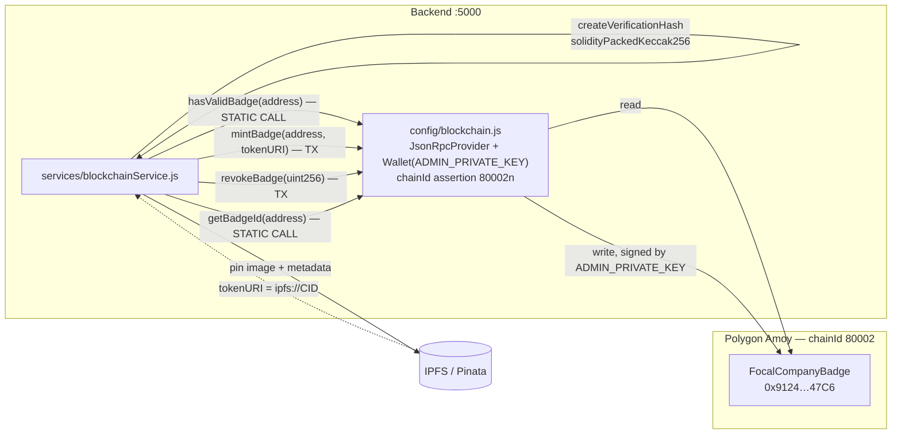

**Reads** use a `JsonRpcProvider` and cost nothing. **Writes** use an ethers `Wallet` constructed from `ADMIN_PRIVATE_KEY`, so the backend holds a hot private key in an environment variable. The contract's `onlyAdmin` modifier compares `owner()` against `_msgSender()`, and the deployer becomes `initialOwner` — so **`ADMIN_PRIVATE_KEY` must be the deployer's key** or every mint and revoke reverts with `"FocalBadge: caller is not the admin"`. This coupling is not documented in `.env.example` and is an easy deployment mistake.

**Transaction flow for a mint:**

| Step | Action |
|---|---|
| 1 | `mintBadge(walletAddress, tokenURI)` is called on the ethers `Contract` |
| 2 | ethers builds, estimates gas, signs with the admin wallet, and broadcasts |
| 3 | `await tx.wait()` — the backend **waits for the receipt** |
| 4 | `transactionHash` is taken from the **receipt**, not the submitted transaction |
| 5 | `getBadgeId(walletAddress)` is read back to obtain the authoritative `tokenId` (the contract assigns ids from a counter, so the backend cannot predict it) |
| 6 | `{transactionHash, tokenId}` is returned to `adminController` |
| 7 | Only then is the database written |

**Reading the token id back from the contract rather than predicting it is the correct approach** — it removes any dependence on off-chain id assumptions.

## 11.5 Revocation

`revokeBadge(tokenId)` → `ownerOf(tokenId)` (reverts if the token does not exist) → capture the company address → `_burn(tokenId)` → `delete _companyToTokenId[company]` → `emit BadgeRevoked(company, tokenId)`.

Post-revocation: `balanceOf(company) == 0`, so `hasValidBadge` returns `false`; `getBadgeId` reverts with `"FocalBadge: company has no badge"`. **The badge ceases to exist rather than being marked inactive** — the correct choice for soulbound credentials, since a mutable "revoked" flag could be un-set by a compromised admin key while a burn is permanent and publicly visible.

---

# Section 12 — Smart Contract Analysis

**File:** `focal-blockchain/contracts/FocalCompanyBadge.sol` · **190 lines** · **Solidity `^0.8.24`**

## 12.1 Identity and inheritance

```solidity
contract FocalCompanyBadge is ERC721URIStorage, Ownable
```

| Inherited contract | Version | Provides | Used for |
|---|---|---|---|
| `ERC721URIStorage` | OpenZeppelin v5 | ERC-721 core **plus** per-token URI storage | The badge itself; `_setTokenURI` / `tokenURI` |
| `Ownable` | OpenZeppelin v5 | `owner()`, `transferOwnership`, `onlyOwner`, `renounceOwnership` | Administrative access control |

**OpenZeppelin v5 specifics that matter:**
- `Ownable` requires the initial owner as a **constructor argument** (`Ownable(initialOwner)`) — v5 removed the implicit `msg.sender` default.
- `_update` is the v5 hook that replaced `_beforeTokenTransfer`, which is where the soulbound restriction is enforced.
- `_ownerOf` (an internal mapping read) is used instead of `ownerOf` where a revert is undesirable.

## 12.2 Storage

```solidity
uint256 private _tokenIdCounter;
mapping(address => uint256) private _companyToTokenId;
```

| Variable | Visibility | Purpose |
|---|---|---|
| `_tokenIdCounter` | `private` | Monotonic id allocator. Starts at `0`, so **the first badge is token id `0`** — a detail that makes the `tokenId !== 0` check in `adminController.revokeCompany` load-bearing. |
| `_companyToTokenId` | `private` | Reverse index: company address → its token id. `private` prevents external reads; access is via `getBadgeId`, which reverts rather than returning a sentinel. |

No structs are declared. There is no array of holders, no enumerable set, and no on-chain metadata storage beyond the URI.

## 12.3 Constructor

```solidity
constructor(address initialOwner)
  ERC721("FOCAL Company Badge", "FOCAL")
  Ownable(initialOwner)
{}
```

Deployer-supplied owner. **No zero-address guard** — passing `address(0)` would make the contract permanently unadministrable (every `onlyAdmin` call would revert). A small hardening opportunity. Finding C-18.

## 12.4 Events

**The compiled ABI declares nine events.** Three are custom; six are inherited.

| Event | Signature | Origin | Emitted |
|---|---|---|---|
| `BadgeMinted` | `(address indexed company, uint256 indexed tokenId, string tokenURI)` | **Custom** | End of a successful mint |
| `BadgeRevoked` | `(address indexed company, uint256 indexed tokenId)` | **Custom** | End of a successful revoke |
| `BadgeUpdated` | `(uint256 indexed tokenId, string newURI)` | **Custom** | End of a URI update |
| `MetadataUpdate` | `(uint256 _tokenId)` | **IERC4906** (via `ERC721URIStorage`) | Inside `_setTokenURI` — so on **both** mint and URI update |
| `BatchMetadataUpdate` | `(uint256 _fromTokenId, uint256 _toTokenId)` | **IERC4906** | Declared for interface completeness; not emitted by this contract's paths |
| `Transfer` | `(address from, address to, uint256 tokenId)` | ERC-721 | On mint and burn |
| `Approval` | `(address owner, address approved, uint256 tokenId)` | ERC-721 | On approval clear |
| `ApprovalForAll` | `(address owner, address operator, bool approved)` | ERC-721 | On operator clear |
| `OwnershipTransferred` | `(address previousOwner, address newOwner)` | `Ownable` | On `transferOwnership` |

Both `company` and `tokenId` are indexed on mint/revoke, so an indexer can query "all badges for this company" or "the history of this token" directly. **No test asserts any inherited event**, and `MetadataUpdate` is asserted nowhere at all — see §12.9.

## 12.5 Access control

```solidity
modifier onlyAdmin() {
    require(owner() == _msgSender(), "FocalBadge: caller is not the admin");
    _;
}
```

A **custom modifier that duplicates `onlyOwner`** rather than reusing it. Functionally equivalent to `onlyOwner` with a distinct revert message. It is applied to all three state-changing functions.

**Note the deliberate difference from OpenZeppelin's `onlyOwner`:** the error string is a custom `require` rather than a custom error, so it costs more gas than a v5 custom error would. Cosmetic on a testnet.

| Function | Access |
|---|---|
| `mintBadge` | `onlyAdmin` |
| `revokeBadge` | `onlyAdmin` |
| `updateBadgeURI` | `onlyAdmin` |
| `renounceOwnership` | `onlyOwner` (overridden — see §12.8) |
| `transferOwnership` | `onlyOwner` (inherited, **not** overridden) |
| `hasValidBadge`, `getBadgeId`, `getCompanyByTokenId`, `ownerOf`, `tokenURI`, `balanceOf` | **Public, unrestricted** |

## 12.6 Function reference

### `mintBadge(address company, string memory tokenURI)` — `public onlyAdmin`

**The most carefully written function in the file.** Guards, then the critical ordering:

```solidity
require(bytes(tokenURI).length > 0, "FocalBadge: tokenURI cannot be empty");
require(company != address(0), "FocalBadge: cannot mint to zero address");
require(balanceOf(company) == 0, "FocalBadge: company already holds a badge");

uint256 tokenId = _tokenIdCounter;
_tokenIdCounter++;

// Set all internal state before the optional external callback in `_safeMint`.
_companyToTokenId[company] = tokenId;
_setTokenURI(tokenId, tokenURI);
_safeMint(company, tokenId);

emit BadgeMinted(company, tokenId, tokenURI);
```

| Guard | Purpose |
|---|---|
| Non-empty `tokenURI` | Prevents a badge with no metadata — an unresolvable credential |
| Non-zero address | Prevents a permanently burned-to-zero badge |
| `balanceOf(company) == 0` | **Enforces one badge per company.** Reverts with `"FocalBadge: company already holds a badge"`. |

**The ordering comment is the key engineering insight, and it is correct.** `_safeMint` invokes `onERC721Received` on the recipient when the recipient is a contract. That is an **external call to attacker-controlled code** — so all internal state must be finalised *before* it. Writing `_companyToTokenId` and the token URI first means a re-entrant recipient observes consistent state.

> **This ordering is a fix that the archived predecessor lacked.** `_archive/omen-blockchain/contracts/OmenCompanyBadge.sol` performs `_safeMint` → `_setTokenURI` → `_companyToTokenId[company] = tokenId` — the reverse, unsafe order. The canonical contract corrects it, and its own comment documents why. **The rewrite genuinely improved the security posture here.**

### `revokeBadge(uint256 tokenId)` — `public onlyAdmin`

```solidity
address company = ownerOf(tokenId);   // reverts if the token does not exist
_burn(tokenId);
delete _companyToTokenId[company];
emit BadgeRevoked(company, tokenId);
```

`ownerOf` (the *reverting* getter) is intentionally used so that revoking a nonexistent token fails loudly rather than silently succeeding. `_burn` also clears the token URI in `ERC721URIStorage`. The reverse mapping is deleted so a revoked company can be re-minted to later.

### `updateBadgeURI(uint256 tokenId, string memory newURI)` — `public onlyAdmin`

```solidity
require(_ownerOf(tokenId) != address(0), "FocalBadge: token does not exist");
require(bytes(newURI).length > 0, "FocalBadge: newURI cannot be empty");
_setTokenURI(tokenId, newURI);
emit BadgeUpdated(tokenId, newURI);
```

Uses **`_ownerOf`** — the internal mapping read — rather than `ownerOf`, because it needs only an existence check and does not want a revert path. Correct choice. **Validation is symmetric with `mintBadge`:** the empty-URI guard is present here too (`"FocalBadge: newURI cannot be empty"`, line 108). The coverage report shows this guard's *failure* branch is never exercised — no test calls `updateBadgeURI(0, "")` — but the guard itself is implemented, and it is one of only two uncovered branch paths in the whole contract.

**This function exists because IPFS metadata is immutable:** to change a badge's metadata (for example to point at `red-badge.svg` and `technova-pvt-ltd-revoked.json`, both of which ship in `focal-blockchain/assets/` and `focal-blockchain/metadata/`), a *new* CID must be pinned and the URI updated. Revocation, however, burns instead — so `updateBadgeURI` is for metadata correction, not for revocation signalling.

### `hasValidBadge(address company)` — `public view returns (bool)`

```solidity
return balanceOf(company) > 0;
```

The **primary read path for the entire platform.** Because a revoked badge is burned, `balanceOf == 0` is a complete and correct validity test — no separate status flag is needed, and there is no flag for an attacker to manipulate. This is the function both the backend's `resolveVerification` and the frontend's `verifyOnChain` call.

### `getBadgeId(address company)` — `public view returns (uint256)`

Returns `_companyToTokenId[company]`, and **reverts with `"FocalBadge: company has no badge"`** when the value is `0` — meaning a company with no badge triggers a revert rather than receiving a sentinel `0`. Callers must treat a revert as "no badge". Since token id `0` is legally mintable, the implementation must distinguish "no entry" from "token 0"; the revert-on-zero approach achieves this at the cost of a revert in the negative case. The frontend accounts for this by checking `hasValidBadge` first and only then calling `getBadgeId`.

### `getCompanyByTokenId(uint256 tokenId)` — `public view returns (address)`

Delegates to `ownerOf(tokenId)`, reverting for nonexistent tokens. Read-only and safe.

## 12.7 The soulbound implementation — three layers

Soulbound enforcement is applied at **three separate hooks**, which is thorough.

### Layer 1 — transfers blocked, in `_update`

```solidity
function _update(address to, uint256 tokenId, address auth)
  internal override returns (address)
{
  address from = _ownerOf(tokenId);
  if (from != address(0) && to != address(0)) {
    revert("FocalBadge: Token is soulbound and cannot be transferred");
  }
  return super._update(to, tokenId, auth);
}
```

**The `from != 0 && to != 0` condition is the crux of the whole design.** It blocks only *transfers* while permitting:
- **`from == 0`** — minting
- **`to == 0`** — burning (which revocation requires)

This is why revocation works even though the token is non-transferable, and it is the correct way to express "non-transferable but revocable". A naive `_update` override that always reverted would make revocation impossible.

### Layer 2 — per-token approvals blocked, in `_approve`

```solidity
function _approve(address to, uint256 tokenId, address auth, bool emitEvent)
  internal override
{
  if (to != address(0)) {
    revert("FocalBadge: approval not allowed for soulbound token");
  }
  super._approve(to, tokenId, auth, emitEvent);
}
```

Permits **clearing** an approval (`to == address(0)`) while blocking **granting** one. Blocking only the grant would be sufficient, but allowing the clear is harmless and keeps the ERC-721 state machine consistent.

### Layer 3 — operator approvals blocked, in `_setApprovalForAll`

```solidity
function _setApprovalForAll(address owner, address operator, bool approved)
  internal override
{
  if (approved) {
    revert("FocalBadge: approval not allowed for soulbound token");
  }
  super._setApprovalForAll(owner, operator, approved);
}
```

Blocks `setApprovalForAll(operator, true)` — closing the loophole where an operator could transfer on the holder's behalf. As with Layer 2, revoking an existing blanket approval (`approved == false`) remains permitted.

**Coverage of transfer vectors, assessed:**

| Vector | Blocked? |
|---|---|
| `transferFrom` | ✅ Layer 1 |
| `safeTransferFrom` (both overloads) | ✅ Layer 1 |
| `approve` then `transferFrom` | ✅ Layer 2 blocks the approval |
| `setApprovalForAll` then transfer | ✅ Layer 3 blocks the operator grant |
| Mint | ✅ Allowed by design (`from == 0`) |
| Burn / revoke | ✅ Allowed by design (`to == 0`) |
| **`safeTransferFrom` to a contract recipient** | ✅ Layer 1 (blocks before `onERC721Received`) |

All standard ERC-721 transfer paths are closed. The three-layer approach is more defensive than the minimum required, which is the right posture for a credential.

## 12.8 The ownership override

```solidity
function renounceOwnership() public view override onlyOwner {
    revert("FocalBadge: ownership cannot be renounced");
}
```

An **unconditional revert** that makes it structurally impossible to renounce ownership. Since `renounceOwnership` would set the owner to `address(0)`, after which **no mint, revoke, or URI update could ever occur again** (every `onlyAdmin` check would fail forever), this permanently bricks the contract's administration. Refusing the operation outright is the correct defensive choice for a credential issuer.

**Note `transferOwnership` is deliberately *not* overridden** — ownership can be handed to a successor, which is the safe administrative migration path. Only the destructive operation is blocked. This is a thoughtful asymmetry.

> **Coverage note:** this function is one of the two uncovered branches in the test suite (see §12.10) — it is only ever exercised by a failure path, and the coverage report shows branch `b11` at `[1,0]`.

## 12.9 Security assessment

| Mechanism | Implementation | Assessment |
|---|---|---|
| **Checks-effects-interactions** | State written before `_safeMint`'s external callback | ✅ Correct, and explicitly commented |
| **Reentrancy** | No `nonReentrant` guard, but no vulnerable ordering either — the only external call is the recipient hook, which happens after all state writes, and the one-badge-per-company guard is checked beforehand | ✅ Adequate for this contract's shape |
| **Access control** | `onlyAdmin` on all three mutators; `owner()` is the source of truth | ✅ |
| **Ownership bricking** | `renounceOwnership` reverted | ✅ |
| **Zero-address mint** | Guarded | ✅ |
| **Empty tokenURI on mint** | Guarded | ✅ |
| **Empty newURI on update** | Guarded (`"FocalBadge: newURI cannot be empty"`) | ✅ |
| **Duplicate badge** | `balanceOf(company) == 0` | ✅ |
| **Existence checks** | `ownerOf` in `revokeBadge`; `_ownerOf` in `updateBadgeURI` | ✅ Both correct for their purpose |
| **Zero-check on id 0** | Callers use `hasValidBadge` first (frontend) or an explicit `!tokenId && tokenId !== 0` (backend) | ✅ Handled |
| **Overflow** | Solidity ≥0.8 has built-in checked arithmetic | ✅ |
| **`selfdestruct` / `delegatecall`** | Absent | ✅ |
| **Upgradability** | **None** — non-upgradeable, immutable logic | ⚠️ A deliberate trade-off: no proxy means no upgrade path and no admin-key rug vector, but **bugs cannot be patched** — only a new deployment and re-issue |
| **Pausability** | **None** | ⚠️ No emergency stop; the only circuit-breaker is per-token revocation |
| **Constructor zero-owner** | **Not guarded** | ⚠️ Finding C-18 |
| **Admin key custody** | A single hot key in the backend `.env`; compromise permits arbitrary minting and revoking | ⚠️ The highest-risk operational element. `transferOwnership` allows migration to a safer key or a multisig. |

**Overall:** the contract is small (190 lines), uses battle-tested OpenZeppelin v5 primitives, applies soulbound restrictions at three hooks, orders state writes correctly around the one external call, blocks the ownership-renunciation footgun, and validates both URI-writing functions symmetrically. The residual risks are the unguarded constructor owner and the single-hot-key administration model — hardening items, not design flaws.

### An inherited IERC4906 behaviour worth knowing

`_setTokenURI` in OpenZeppelin **5.6.1** emits `MetadataUpdate(tokenId)`. Because `ERC721URIStorage` inherits `IERC4906`, **both `mintBadge` and `updateBadgeURI` emit a `MetadataUpdate` event** in addition to `BadgeMinted` / `BadgeUpdated`. The compiled ABI confirms it, listing `MetadataUpdate(uint256 _tokenId)` and `BatchMetadataUpdate(uint256 _fromTokenId, uint256 _toTokenId)` among the nine events. **No test asserts either one**, and neither the backend's nor the frontend's hand-written ABI declares them — so an off-chain indexer relying on those events would never be notified through this codebase's interfaces.

## 12.10 Test suite and measured coverage

**Test file:** `focal-blockchain/test/FocalCompanyBadge.test.js` (253 lines, **29 `it(...)` tests**) using Hardhat + Chai + `@nomicfoundation/hardhat-toolbox/network-helpers` `loadFixture`. One top-level `describe("FocalCompanyBadge")` containing seven nested describes. The fixture is `FocalCompanyBadge.deploy(admin.address)` with `const [admin, company, other] = await hre.ethers.getSigners()`, and two URI constants: `VERIFIED_URI = "ipfs://QmVerifiedHash/metadata.json"`, `REVOKED_URI = "ipfs://QmRevokedHash/metadata.json"`.

| Describe block | Tests | Focus |
|---|---|---|
| Deployment | **3** | Deployer is owner; name is `"FOCAL Company Badge"`; symbol is `"FOCAL"` |
| Minting | **6** | Mint + `BadgeMinted` event with `(company.address, 0, VERIFIED_URI)`; non-admin rejected; URI stored; **empty URI rejected**; zero-address rejected; **second badge to same company rejected** |
| Soulbound Restriction | **6** | `transferFrom`, `safeTransferFrom`, `approve`, non-admin approve, and `setApprovalForAll(true)` all revert; **`setApprovalForAll(false)` is explicitly asserted *not* to revert** |
| Revocation | **4** | Revoke + `BadgeRevoked` event; `hasValidBadge` false after; non-admin rejected; nonexistent token reverts |
| Badge Update | **3** | URI update + `BadgeUpdated` event + re-read `tokenURI(0)`; nonexistent token rejected; non-admin rejected |
| Ownership | **2** | **`renounceOwnership` reverts**; `transferOwnership` succeeds |
| Badge Query | **5** | `hasValidBadge` true/false; `getBadgeId` returns `0`; `getCompanyByTokenId(0)`; `getBadgeId` reverts for an address with no badge |
| **Total** | **29** | |

**Measured coverage from `focal-blockchain/coverage.json`** (single-file report; OpenZeppelin dependencies excluded; corroborated by `coverage/lcov.info`):

| Metric | Covered / Total | % |
|---|---|---|
| Statements (`s1`–`s30`, all non-zero) | **30 / 30** | **100%** |
| Lines (`LF`/`LH`) | **35 / 35** | **100%** |
| Functions (`f1`–`f12`, all non-zero) | **12 / 12** | **100%** |
| **Branches** | **26 / 28** | **≈ 92.86%** |

**The only two uncovered branch paths — both are failure-side branches of guards that *are* implemented:**

| Branch | Line | Meaning |
|---|---|---|
| `BRDA:108,9,1 = 0` | 108 | **The failure side of `require(bytes(newURI).length > 0, "FocalBadge: newURI cannot be empty")`.** No test calls `updateBadgeURI(0, "")`. The guard exists and works; it is simply untested. |
| `BRDA:149,11,1 = 0` | 149 | **The failure side of `onlyOwner` on `renounceOwnership`.** No test calls it from a non-owner. Note the *success* path of that modifier is unreachable by construction, since the function body always reverts. |

**Every user-facing behaviour is covered**, including the two that most often go untested in soulbound contracts: the `setApprovalForAll(false)` *permitted* path and `transferOwnership` succeeding while `renounceOwnership` fails. The two gaps are a missing negative test for a guard that exists, and a deliberately-unreachable path — the best possible place for the only gaps to be.

**Per-function execution counts** (from `FNDA`), which show the test suite exercises each hook repeatedly: `onlyAdmin: 28`, `_update: 21`, `mintBadge: 20`, `_approve: 6`, `hasValidBadge: 5`, `revokeBadge: 3`, `updateBadgeURI: 2`, `getBadgeId: 2`, `_setApprovalForAll: 2`, `constructor: 1`, `getCompanyByTokenId: 1`, `renounceOwnership: 1`.

> **Note:** `coverage/` and `coverage.json` exist on disk but are both listed in `focal-blockchain/.gitignore` — as are `artifacts/`, `cache/`, and `typechain-types/`. **The compiled artifact and the coverage report are local-only and are not committed.** The coverage figures above therefore describe the state of the working tree, not a reproducible CI result; there is no CI workflow in this repository to regenerate them.

> **Test-suite improvement over the archive:** the archived `OmenCompanyBadge.test.js` has 22 tests across the same six blocks but **no `renounceOwnership` test at all** — because the archived contract lacks the override. The canonical suite adds that coverage. The archived suite also asserts the `"OMEN Company Badge"` / `"OMEN"` name and symbol and the `"OmenBadge: …"` revert prefixes, confirming the rename.

## 12.11 How the backend calls the contracts

There is **exactly one contract**, so "the contracts" is singular. The backend's ABI is a **minimal human-readable ABI declared in `src/config/blockchain.js`** and an `OMEN`-prefixed constant name — it does **not** load the compiled artifact.

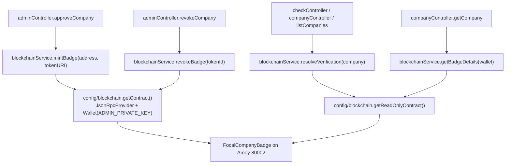

| Backend function | Contract call | Type | Gas |
|---|---|---|---|
| `resolveVerification` | `hasValidBadge(address)` | static call | free |
| `getBadgeDetails` | `hasValidBadge` / `getBadgeId` / `tokenURI` / `ownerOf` | static calls | free |
| `mintBadge` | `mintBadge(address, string)` → `getBadgeId(address)` | **transaction** + static call | gas (admin wallet) |
| `revokeBadge` | `revokeBadge(uint256)` | **transaction** | gas (admin wallet) |

**ABI drift risk:** because the backend declares a hand-written ABI rather than reading `artifacts/`, **a contract change would not automatically propagate to the backend.** The compiler output is used only by `focal-blockchain/scripts/blockchainHelper.js` (for the CLI scripts) and by the frontend's own hand-written read-only ABI. **Three independent ABI declarations exist** — backend, frontend, and the compiled artifact — and nothing verifies they agree. Finding C-20.

---

# Section 13 — Cryptography and Hashing

## 13.1 Every cryptographic mechanism found in the repository

| # | Mechanism | Algorithm | Where | Purpose | Status |
|---|---|---|---|---|---|
| 1 | **Verification hash** | **Keccak-256** via `ethers.solidityPackedKeccak256` | `backend/backend/src/services/blockchainService.js → createVerificationHash` | Fingerprints `(name, domain, date, salt)` — the value embedded in the NFT metadata | ✅ Implemented, ⚠️ **salt defect** |
| 2 | **Transaction hash** | Keccak-256 (Ethereum tx encoding) | Generated by the network; read from the receipt in `mintBadge` / `revokeBadge` | Proof a specific mint/revoke was mined | ✅ Native to the chain |
| 3 | **IPFS CID** | **SHA-256** wrapped in a multihash, encoded base58 (CIDv0 `Qm…`) or base32 (CIDv1 `bafy…`) | Pinata responses in `pinataService.js` | Content address for the badge image and metadata JSON | ✅ Native to IPFS |
| 4 | **Wallet signature** | ECDSA secp256k1 (EIP-191 `personal_sign`) | **NOT PRESENT** | Would prove the company controls its address | ❌ **ABSENT** |
| 5 | **Nonce / challenge** | — | **NOT PRESENT** | Would make a signature replay-resistant | ❌ **ABSENT** |
| 6 | **JWT signing** | HMAC-SHA256 (`HS256`, the `jsonwebtoken` default) | `backend/backend/src/middleware/auth.js → generateToken` | Admin session token | ✅ Implemented |
| 7 | **Password hashing** | **bcrypt** | `adminController.login` | Admin password comparison when `ADMIN_PASSWORD` starts with `$2` | ⚠️ Optional — plaintext equality otherwise |
| 8 | **Address format validation** | Regex `/^0x[a-fA-F0-9]{40}$/` | Backend route validators, frontend `blockchain.js` | Format check only | ✅ Implemented (not cryptographic) |
| 9 | **Ethereum address derivation** | Keccak-256 of the public key, last 20 bytes | Implicit in ethers when recovering/deriving | — | ⚠️ Never exercised — no signature is ever verified |
| 10 | **ML-service hashing** | **None** | — | — | ❌ Absent by design |

**Correction (applied post-review):** row 6 previously cited `backend/src/utils/jwt.js → generateToken`. That path does not exist — `generateToken`, `verifyToken`, and `isAdmin` all live in `backend/backend/src/middleware/auth.js`, and `src/utils/` holds only `helpers.js` and `logger.js`. The description of the function was otherwise accurate; only the path was wrong. Recorded here so the correction is traceable. Two further paths that should not be read as endorsed, both confirmed absent: `src/server.js` (the entry point is `src/index.js`) and `src/middleware/rateLimit.js` (the limiters are declared inline — `checkLimiter` in `app.js`, `authLimiter` in `adminRoutes.js`).

**Observation:** the platform uses **two different hash families for two different jobs** — Keccak-256 for its own verification fingerprint (because it is cheap and native on Ethereum), and SHA-256 for IPFS content addressing (because that is what IPFS mandates). Neither is a security primitive here; both are identity/lookup mechanisms.

**No encryption, no signing of application data, and no zero-knowledge proof exists anywhere.** There is no AES, no RSA, no `nacl`, no merkle tree, and no signature verification.

## 13.2 The verification hash, in detail

```javascript
// backend/backend/src/services/blockchainService.js
const SALT = 'OMEN_TRUST_PLATFORM_v1';

function createVerificationHash(name, domain, dateString) {
  return ethers.solidityPackedKeccak256(
    ['string', 'string', 'string', 'string'],
    [name, domain, dateString, SALT]
  );
}
```

| Property | Value |
|---|---|
| **Algorithm** | Keccak-256 (the pre-standardisation variant Ethereum uses, **not** NIST SHA3-256 — they differ in padding) |
| **Encoding** | `solidityPackedKeccak256` — arguments are tightly packed with **no length prefixes and no separators** |
| **Inputs** | 4 strings: company name, company domain, `YYYY-MM-DD` approval date, salt |
| **Output** | 32 bytes / 66-character hex string with `0x` prefix |
| **Deterministic?** | ⚠️ **Only within a single calendar day** — see below |
| **Collision-resistant?** | ✅ Yes (Keccak-256 preimage resistance is not a practical concern) |
| **Reversible?** | ❌ No — it is a one-way digest |

### Defect 1 — the salt does not match the canonical CLI (Finding C-01)

There are **two different salt constants in the repository**:

| Location | Salt |
|---|---|
| **`backend/backend/src/services/blockchainService.js`** | **`'OMEN_TRUST_PLATFORM_v1'`** |
| **`focal-blockchain/scripts/computeVerificationHash.js`** (the canonical, documented tool) | **`"FOCAL_TRUST_PLATFORM_v1"`** |

**Consequence:** a hash minted by the backend **cannot be reproduced by the project's own CLI script**, and vice versa. Anyone attempting independent verification — the entire point of publishing a verification hash — will compute a different digest and conclude the badge is fraudulent. **This turns the platform's core trust primitive against itself.**

The diagnosis is unambiguous: the backend string was inherited from the archived `omen-blockchain` project, whose CLI used `OMEN_TRUST_PLATFORM_v1`. The canonical project renamed the CLI salt but not the backend's. It is an incomplete rename, not a design choice — exactly the same class of drift as Finding C-11 (the `OMEN` name in the metadata) and the legacy naming in the ABIs.

### Defect 2 — the hash is not reproducible across days (Finding C-01a)

The date input is `new Date().toISOString().slice(0, 10)` — **the approval date**. Because the date is inside the hash:

- The same company, re-verified on a later date, produces a **different** verification hash.
- Two identical companies verified on different days are **not** detectably identical by hash.
- An auditor cannot recompute the hash without knowing the exact approval date (which is fortunately also published in the metadata, so this is recoverable — but only via the metadata, not the hash alone).

This is defensible (the hash attests to *a verification event*, not to a company's identity) but it means the hash is **not** a stable company fingerprint. Anyone treating it as one will be surprised.

### Defect 3 — no separators between packed fields (Finding C-01c)

`solidityPackedKeccak256` concatenates raw bytes with no delimiter. So:

```
("AB", "C")  →  "ABC"
("A", "BC")  →  "ABC"   ← SAME HASH
```

A company named `Tech` with domain `nova.com` and a company named `Technova` with domain `.com` (or `Tech`+`nova.com` vs `Techn`+`ova.com`) can collide. **In practice the salt's fixed tail makes a full collision require the collision to fall entirely in the name/domain boundary, and the uniqueness constraints on `domain` limit exploitation — but this is a textbook packed-encoding mistake** and the fix (a separator, or `keccak256(abi.encode(...))`) is trivial. The canonical CLI script shares this flaw, so it is inherited design rather than backend drift.

## 13.3 The four hashes, distinguished

This is the distinction the brief asks for. They are **four different things with four different guarantees**, and only three of them exist here.

| | **Verification Hash** | **Transaction Hash** | **IPFS CID** | **Wallet Signature** |
|---|---|---|---|---|
| **Algorithm** | Keccak-256 | Keccak-256 (over signed RLP) | **SHA-256** in a multihash | ECDSA secp256k1 |
| **Computed by** | **FOCAL's backend** | The Polygon network | IPFS/Pinata | The **signer's wallet** |
| **What it hashes** | `name ‖ domain ‖ date ‖ salt` | The entire signed transaction (nonce, gas, to, value, data, signature) | The **file contents** (the image bytes; the JSON bytes) | A human-readable message |
| **Format** | `0x` + 64 hex | `0x` + 64 hex | `Qm…` (CIDv0, base58) or `bafy…` (CIDv1, base32) | 65 bytes = `r ‖ s ‖ v` |
| **Purpose** | Attest *what was verified and when* | Prove *this state change was mined* | Address *this exact content* | Prove *control of a private key* |
| **Reversible?** | No | No | No, but **verifiable by re-hashing** the file | **Yes — recovers the signer's address** |
| **Deterministic?** | Within one day only | No — nonce and gas differ per tx | **Yes, absolutely** — same bytes ⇒ same CID | No — depends on message and key |
| **Uniqueness property** | Same inputs ⇒ same hash | Globally unique per transaction | **Content-addressed: identical files share a CID** | Unique per signature |
| **Where it lives** | On-chain metadata attribute, in MongoDB, and in the public API response | On-chain; stored in MongoDB as `mintTransactionHash` / `revokeTransactionHash` | On-chain as `tokenURI` (`ipfs://<CID>`); image CID inside the metadata JSON | ❌ **Nowhere — it does not exist** |
| **What it does NOT prove** | That the company is honest, or that the data is true | **That the recipient controls the address** — only that the platform minted to it | That the content is *true* — only that it is *unmodified* | Nothing about the blockchain |
| **Present in FOCAL?** | ✅ | ✅ | ✅ | ❌ **ABSENT** |

### The three-way trust chain, and where it stops

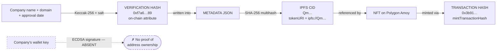

**Read this chain carefully, because it reveals the precise strength and the precise limit of the platform's guarantee.**

1. The **verification hash** proves FOCAL computed a digest over specific inputs on a specific day — **it does not prove the inputs are true.**
2. The **CID** proves the metadata (which contains that hash) has not been altered since pinning — **it does not prove the metadata is accurate.**
3. The **transaction hash** proves a specific mint was mined by the admin key — **it does not prove the recipient is the company.**

**Every link is integrity, not authenticity.** The chain proves *"FOCAL said this, on this date, and has not changed its statement"* — which is genuinely valuable, and is what a credential is for. It does **not** prove *"the entity holding this badge controls the address it was sent to"*, because that link is the missing ECDSA signature. **Adding the signature is the single change that would complete the chain** (Finding C-16).

## 13.4 The admin session token

```javascript
jwt.sign({ id: 'focal-admin', role: 'admin' }, JWT_SECRET, { expiresIn: '7d' })
```

| Property | Value |
|---|---|
| Algorithm | HS256 (HMAC-SHA256) — the `jsonwebtoken` default, not pinned explicitly |
| Claims | `{id: 'focal-admin', role: 'admin'}` — **a constant, not a database id** |
| Lifetime | 7 days (default), not configurable via env |
| Storage (client) | `localStorage['focal_admin_token']` |
| Sent as | `Authorization: Bearer <token>` via an axios request interceptor |
| Verification | `verifyToken` middleware, then `isAdmin` checks `role === 'admin'` |

**Weaknesses:** the token is in `localStorage` (readable by any XSS, and it survives a browser restart for a week); there is no refresh or rotation mechanism; there is no revocation list, so a leaked token is valid until expiry; and the subject is a constant, so **all admin sessions are indistinguishable**. Since there is exactly one admin identity, this is coherent — but it means a revoked admin has no way to be locked out short of rotating `JWT_SECRET`.

## 13.5 Cryptographic posture summary

| Aspect | Assessment |
|---|---|
| Hash choice for the verification fingerprint | ✅ Appropriate (Keccak-256 is cheap and native to Ethereum) |
| Hash salt consistency across tools | 🔴 **Broken** — backend and CLI disagree; independent verification fails (C-01) |
| Packed encoding without separators | ⚠️ Collision-prone input boundary (C-01c) |
| Date inside the hash | ⚠️ Makes the hash day-dependent, not a stable fingerprint (C-01a) |
| On-chain immutability of the metadata | ✅ Correct — CID-addressed, tamper-evident |
| Transaction-hash capture from the receipt | ✅ Correct — reads the authoritative hash, not the submitted one |
| IPFS content addressing | ✅ Native and correct |
| **Wallet signature / proof of address ownership** | 🔴 **Entirely absent** (C-16) |
| Admin password storage | ⚠️ Optional bcrypt; plaintext by default |
| JWT lifetime / revocation | ⚠️ 7 days, no rotation, no revocation list |
| Secrets handling | ⚠️ `ADMIN_PRIVATE_KEY` is a hot key in a plaintext `.env` |

**The platform's cryptography is sound in its primitives and broken in its consistency.** Keccak-256, SHA-256, bcrypt, HMAC-SHA256, and ECDSA are all the right tools. The failures are integration failures: a salt that does not match the CLI, a fingerprint that changes daily, and one missing signature.

---

# Section 14 — IPFS Flow

## 14.1 The complete IPFS pipeline

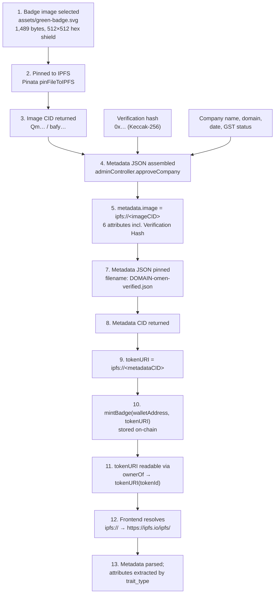

## 14.2 The badge images

| Asset | Size | Colour | Purpose |
|---|---|---|---|
| `focal-blockchain/assets/green-badge.svg` | **1,489 bytes** | `#10b981` → `#059669` (emerald gradient) | The "verified" badge — **this is the file `DEFAULT_IMAGE_PATH` resolves to and the one actually pinned** |
| `focal-blockchain/assets/red-badge.svg` | **1,493 bytes** | `#ef4444` → `#b91c1c` (red gradient) | The "revoked" badge — shipped, and referenced by the revoked metadata, **but never pinned by any code path** |

Both are 512×512 hexagonal **shield** paths — `M256 40 L456 120 L456 240 C456 380 256 472 256 472 C256 472 56 380 56 240 L56 120 Z` — each with a 135° diagonal `linearGradient` and an `feDropShadow` filter (`dy="8" stdDeviation="12" flood-opacity="0.25"`).

**The assets are SVGs.** This is worth noting because the frontend renders badges via an `` pointing at an `ipfs://` URI resolved through a public gateway; SVG rendering in that path is fine in browsers but is not universally supported by NFT marketplaces, most of which expect raster images. Whether that matters depends on whether marketplace display is a goal.

> **⚠ `red-badge.svg` is orphaned.** The revoke path in `adminController.revokeCompany` calls `revokeBadge(tokenId)`, which **burns** the token — it does **not** pin red-badge metadata or call `updateBadgeURI`. So the revoked badge asset and the `-revoked.json` metadata are dead assets in the current flow: they would only be used if an admin manually ran the CLI scripts. **Revocation produces no replacement metadata at all.** Finding C-22.

## 14.3 The metadata JSON — actual structure

Built in `adminController.approveCompany` (verbatim, §8 Step 10):

```json
{
  "name": "OMEN Verified Company: TechNova Pvt Ltd",
  "description": "This soulbound NFT certifies that TechNova Pvt Ltd has been verified by OMEN as a legitimate company.",
  "image": "ipfs://<imageCID>",
  "attributes": [
    { "trait_type": "Company Name",            "value": "TechNova Pvt Ltd" },
    { "trait_type": "Domain",                  "value": "technova.com" },
    { "trait_type": "Verification Date",       "value": "2026-09-22" },
    { "trait_type": "Verification Hash",       "value": "0x…" },
    { "trait_type": "GST Verification Status", "value": "verified" },
    { "trait_type": "Status",                  "value": "verified" }
  ]
}
```

**Six attributes, all keyed by `trait_type`.** This matters for the reader: the frontend's `verifyOnChain` extracts values **by `trait_type` name**, so the strings `"Company Name"`, `"Domain"`, `"Verification Date"`, `"Verification Hash"`, and `"Status"` are **load-bearing identifiers, not labels.** Renaming any of them silently breaks metadata display in the UI — a coupling worth documenting.

**Note there is no `external_url`, no `background_color`, and no OpenSea-compatible `image_data`.** The structure is minimal but valid ERC-721 metadata.

### The pinned metadata that ships in the repository

`focal-blockchain/metadata/` contains two reference files:

| File | Notes |
|---|---|
| `technova-pvt-ltd-verified.json` | The verified-state reference |
| `technova-pvt-ltd-revoked.json` | The revoked-state reference |

**Both contain the same verification hash:** `0xcc3fcd4694b4d0ca3180b195c637820f514b6830389c9b7a881cc364eee01754`.

> **⚠ The verified and revoked metadata share an identical verification hash.** This is a second, independent confirmation of Finding C-01a: because the hash covers name/domain/date but **not status**, the same company produces the same hash whether it is verified or revoked. **The verification hash cannot distinguish a valid badge from a revoked one** — the badge's validity lives only in `hasValidBadge()`, never in the hash. Anyone treating the hash as a status attestation will be wrong. (And this particular value is a **32-byte hash, not an address** — it is not a contract address despite its shape.)

## 14.4 The Pinata integration

| Aspect | Detail |
|---|---|
| **Service** | `backend/backend/src/services/pinataService.js` |
| **HTTP client** | **Native `fetch`** (not axios), with `FormData` and `Blob` — a deliberate choice to support file uploads without a multipart dependency |
| **Endpoints** | `pinFileToIPFS` (used twice: image, then metadata) |
| **Auth** | `Authorization: Bearer ${PINATA_JWT}`, or `pinata_api_key` + `pinata_secret_api_key` headers |
| **Missing-credential behaviour** | **Throws `'Pinata credentials are not configured'`** — no silent skip, no placeholder CID |
| **Image path resolution** | `DEFAULT_IMAGE_PATH` → `../../../../focal-chain/assets/green-badge.svg` — resolved relative to `src/services/`, landing on `focal-blockchain/assets/green-badge.svg`. **Verified to exist (1,489 bytes).** |
| **Failure mode** | Throws → `approveCompany` has no try/catch → `asyncHandler` → `errorHandler` → **HTTP 500** |

**Notes on the image path:** the literal segment in the path string is `focal-chain`, while the directory on disk is `focal-blockchain`. The path is therefore a **stale literal that happens to resolve correctly** only if `focal-blockchain/` is the actual sibling directory — which it is. Any rename of the blockchain directory would break the mint path with an ENOENT at Step 11. Finding C-23.

> **⚠ The two `pinFileToIPFS` calls are unguarded for content-type.** SVG is served and pinned as-is; Pinata will accept it, but the metadata claims no MIME type, so a consumer must infer it from the `ipfs://` URI's lack of extension. A `data:` URI in the metadata, or a `.svg` extension in the gateway URL, would be more robust.

## 14.5 CID handling and gateway resolution

| Step | Detail |
|---|---|
| **What is pinned** | (1) the SVG bytes → image CID. (2) the metadata JSON bytes → metadata CID. |
| **CID version** | Determined by Pinata's default (CIDv1, `bafy…`) for new pins; the test constants and shipped reference metadata use **CIDv0 (`Qm…`)** placeholders. Both forms appear in the repository, which is only a documentation inconsistency — the code stores whatever Pinata returns. |
| **On-chain storage** | `tokenURI(tokenId)` returns the full `ipfs://<metadataCID>` string. **The image CID is not stored on-chain** — it lives inside the metadata JSON. |
| **Frontend resolution** | `toGatewayUrl()` rewrites `ipfs://<CID>` → `https://ipfs.io/ipfs/<CID>`. A bare CID is also handled. |
| **Then** | `fetch(gatewayUrl)` → `res.json()` → the six attributes extracted by `trait_type` |

**Gateway centralisation:** the frontend resolves **exclusively** through `https://ipfs.io`. If that gateway is slow, rate-limited, or blocks the request, the metadata block fails to render — and `verifyOnChain` **throws** on a failed metadata fetch (it does not degrade to showing badge validity without metadata). For a verification product, the availability of a single public gateway is a meaningful single point of failure. Finding C-24.

## 14.6 What IPFS does and does not guarantee here

| Guarantee | Holds? |
|---|---|
| The metadata has not been altered since pinning | ✅ **Yes** — content-addressed by the CID referenced on-chain |
| The image has not been altered | ✅ Yes — the image CID is inside the pinned metadata |
| The metadata will remain retrievable | ⚠️ **Only as long as Pinata keeps pinning it.** Pinning is a *subscription*, not a guarantee. If the Pinata account lapses, the CID remains on-chain but the content becomes unfetchable — the badge would render blank forever. Finding C-25. |
| The metadata is *accurate* | ❌ **No.** IPFS guarantees integrity, not truth. |
| The badge is currently valid | ❌ **No.** Validity is `hasValidBadge()` on-chain; the metadata can still say `"Status": "verified"` after revocation, because revocation burns the token rather than repinning metadata. **A revoked badge's metadata is permanently and unalterably labelled "verified".** |
| The company owns the address | ❌ No — that is the missing signature (C-16) |

> **⚠ The most counter-intuitive property of this design:** because revocation **burns** the token (rather than updating its URI to point at `-revoked.json`), and because the original metadata is **immutable**, a revoked company's metadata JSON permanently reads `"Status": "verified"`. The *only* way to learn the badge was revoked is to query the chain. This is arguably correct — the chain is the source of truth and the immutable metadata is a historical record of what was attested at mint time — but it means **any consumer that reads metadata without checking `hasValidBadge()` will report a revoked company as verified.** The frontend does check (`verifyOnChain` runs `hasValidBadge` first), and the backend's `resolveVerification` likewise requires both the DB status and a live chain read. The design is safe as implemented; it is unsafe for any *future* third-party consumer that trusts the metadata alone. Finding C-26.

## 14.7 IPFS flow — verified gaps

| Item | Status |
|---|---|
| Image pinned before metadata | ✅ Correct ordering (metadata references the image CID) |
| Metadata pinned after hash computation | ✅ Correct ordering |
| `tokenURI` set from the metadata CID | ✅ Correct |
| Mint only after successful pinning | ✅ Correct — a failed pin aborts before any chain write |
| DB write only after successful mint | ✅ Correct |
| Revoked-state metadata pinned on revoke | ❌ **ABSENT** — `red-badge.svg` and `-revoked.json` are orphaned |
| IPFS unpinning on revoke | ❌ **ABSENT** — content stays pinned indefinitely |
| Multiple-gateway fallback | ❌ **ABSENT** — one hardcoded gateway |
| MIME type in metadata | ❌ Absent |

---

# Section 15 — End-to-End System Flow

## 15.1 The complete system, one diagram

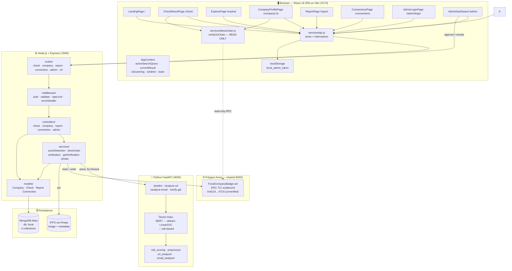

## 15.2 The three flows, end to end

### Flow A — Student checks an opportunity

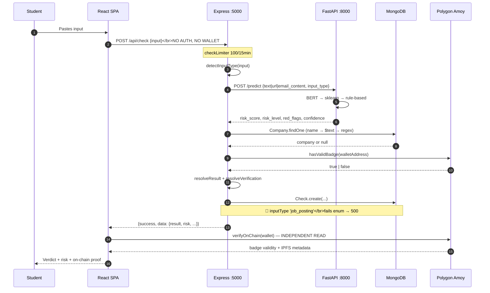

**Every student step is unauthenticated.** No account, no wallet, no MetaMask, no signature. The only wallet-adjacent action is a **read-only** RPC call that requires no key and no prompt.

### Flow B — Company gets verified

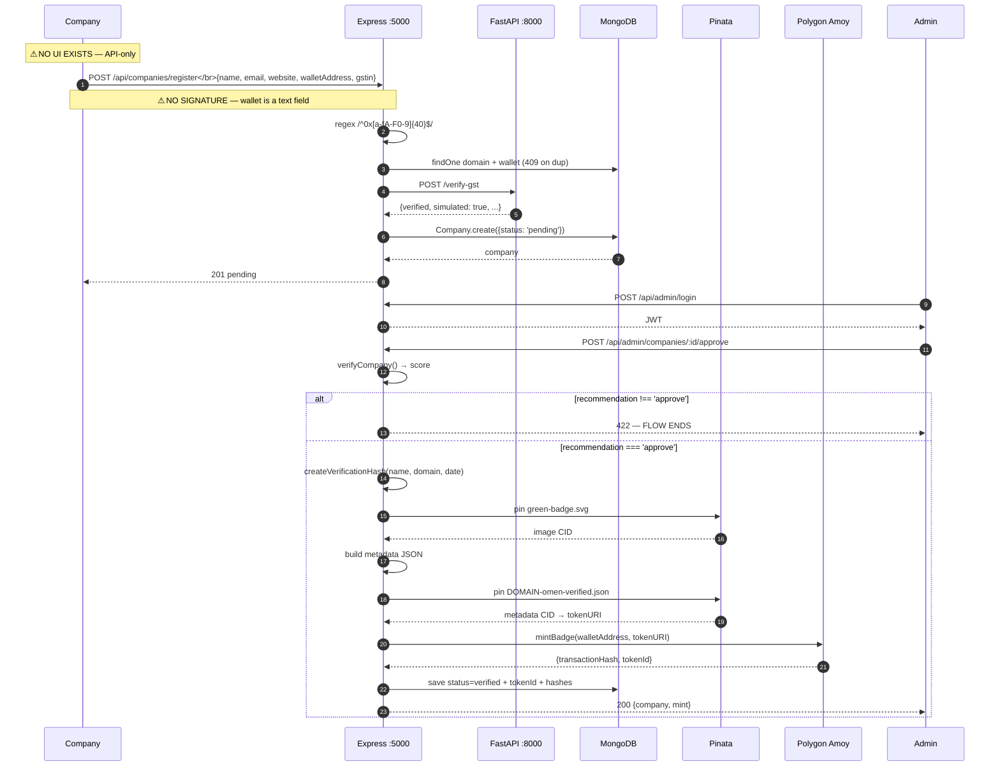

### Flow C — Admin revokes a badge

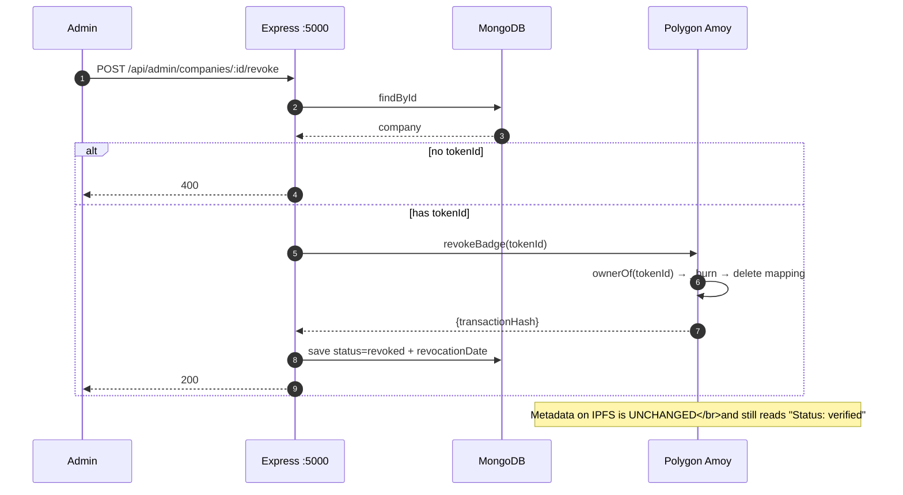

## 15.3 Trust boundaries

| Boundary | Crossing | Authentication | Encrypted in transit? |
|---|---|---|---|
| Browser → Backend | HTTP/JSON | None for public routes; JWT for `/api/admin/*` | ⚠️ **Plain HTTP in local dev** (`http://localhost:5000`); HTTPS only if deployed behind TLS |
| Backend → ML service | HTTP/JSON | **None — no API key, no mTLS** | ⚠️ Plain HTTP |
| Backend → MongoDB | `mongodb+srv://` | Connection-string credentials | ✅ TLS (Atlas default) |
| Backend → Polygon Amoy | JSON-RPC over HTTPS | `ADMIN_PRIVATE_KEY` for writes | ✅ HTTPS |
| Backend → Pinata | HTTPS | `PINATA_JWT` or API key + secret | ✅ HTTPS |
| Browser → Polygon Amoy | JSON-RPC (read-only) | None | ✅ HTTPS |
| Browser → IPFS gateway | HTTPS | None | ✅ HTTPS |
| Backend → GST provider | **Delegated to the ML service** | — | — |

**The ML service boundary is the weakest link.** There is no authentication between the backend and the ML service, so anything that can reach port 8000 can invoke `/predict` and `/verify-gst` directly and receive fabricated `verified: true` responses. If the ML service is ever deployed on a public host — and the README's Render instructions do exactly that — this becomes a real exposure. Finding C-27.

## 15.4 What the system actually guarantees

**The honest summary.** Every guarantee below is one the source code genuinely provides.

| Guarantee | Strength | Mechanism |
|---|---|---|
| A student can check a company with no account and no wallet | ✅ **Real** | All student routes are public |
| A badge cannot be forged or moved between wallets | ✅ **Strong** | Soulbound enforced at three hooks; admin-key-gated minting |
| The badge metadata cannot be tampered with after the fact | ✅ **Strong** | Content-addressed on IPFS; CID on-chain |
| Revocation is permanent and publicly visible | ✅ **Strong** | Burn, not flag |
| A database claim of "verified" is never trusted alone | ✅ **Strong** | Chain-first downgrade on both server and client |
| The verification hash can be independently recomputed | 🔴 **Broken** | Salt mismatch between backend and CLI (C-01) |
| The verification hash identifies a company | ⚠️ **Weak** | Date-dependent; not status-aware |
| The company controls the wallet it was minted to | 🔴 **Unproven** | No signature anywhere (C-16) |
| The company is legally registered | ⚠️ **Weak** | 3-entry mock allowlist; no MCA at all |
| The GST number is real | ⚠️ **Weak** | 2-record mock, honestly flagged `simulated: true` |
| The ML risk score is calibrated | ⚠️ **Uncertain** | LinearSVC margin mapped through an ad-hoc sigmoid |
| The badge stays retrievable | ⚠️ **Conditional** | Depends on Pinata pinning being maintained |
| The system is production-ready | ❌ **No** | The primary student input path returns HTTP 500 (C-01b) |

## 15.5 The three things to fix first

If only three changes are made, these are the ones that matter, in order:

| # | Fix | Why | Effect |
|---|---|---|---|
| **1** | **Add `'job_posting'` to the `Check.inputType` enum** (or map it to `'company_name'` in `detectInputType`) | A bare domain, a company name, or pasted job text all fail with HTTP 500. This is the **most common realistic student input.** | Restores the core product |
| **2** | **Unify the verification-hash salt** between `blockchainService.createVerificationHash` and `focal-blockchain/scripts/computeVerificationHash.js` | Independent verification is the entire point of publishing the hash; today no third party can reproduce it | Makes the trust primitive work as designed |
| **3** | **Add wallet ownership proof** (nonce → `personal_sign` → `verifyMessage`) before allowing an address into a company record | The badge is soulbound and irreversible; a mis-mint to an uncontrolled address can only be undone by burning and re-issuing | Completes the trust chain |

Fix 1 is a one-line change. Fix 2 is a one-string change plus a decision about which salt wins (and a note that already-minted hashes used the old one). Fix 3 is the only one that requires new endpoints and UI.

## 15.6 Section 15 closing note

The system is a **thoughtful, defensively-written implementation of a single-network soulbound credential** — with real strengths that are easy to miss: the chain-first downgrade so a database row can never over-claim, the mass-assignment whitelist that stops self-verification, the checks-effects-interactions ordering in the contract, and the fail-closed guards on nearly every external dependency.

It is also **not the system described in the brief.** There is no Ethereum Sepolia contract, no `OMENVerificationRegistry`, no second chain, no MCA verification, and no wallet authentication. There is one contract on one testnet, and the wallet is a validated text field.

And it has **one defect that blocks its primary purpose**: the student check path returns HTTP 500 for the inputs students will most often paste.

**The gap between the description and the implementation is not dishonesty — it is drift.** Legacy `OMEN` naming survives in the metadata, the ABIs, and a hash salt; a rename from `company_name` to `job_posting` was started and not finished; a two-chain design was described but only half-built. **Every one of these is visible in the source, correctable, and documented above with a file and line reference.**

---

# Appendix A — Test Coverage Inventory

## A.1 Summary across the four codebases

| Codebase | Test files | Test cases | Framework | Passing | Coverage measured? |
|---|---|---|---|---|---|
| `backend/` | 5 | **30** | Jest 29.6 + Supertest | ✅ All pass | ⚠️ Stale `coverage/` — see A.3 |
| `focal-blockchain/` | 1 | **29** | Hardhat + Chai | ✅ All pass | ✅ **100% stmt / 100% fn / 92.86% branch** |
| `ML/ml-service/` | 2 | **56** | pytest | ✅ 37 collected (scoring); 19 require `httpx` | ❌ No coverage config |
| `frontend/` | **0** | **0** | — | — | ❌ **None** |
| **Total** | **8** | **115** | | | |

**Against the 80% coverage requirement: contract ✅, ML ❌ (unmeasured), backend ⚠️ (partial, stale), frontend ❌ (zero tests).**

## A.2 Backend tests

| File | Cases | Nature |
|---|---|---|
| 5 jest files under `backend/backend/tests/` | **30 `test(` cases, 0 `it(`** | Hermetic unit tests |

- **All 30 pass**, and **none asserts unimplemented behaviour** — the suite is honest.
- **All are unit tests.** There are no integration tests against a real MongoDB, and no test of any HTTP route end-to-end.
- **No nonce, signature, `personalSign`, or challenge appears in any test** (grep returns zero matches) — independent confirmation that the wallet-authentication flow does not exist (C-16).
- **⚠ No jest config exists anywhere**, so Jest's default `testMatch` applies and **`test_all_crud.js` is never collected** — it does not run in CI or locally. Finding C-28.
- **⚠ `resolveVerification`'s `simulated` field is dead:** all three returns hardcode it to `false`, so it can never be `true` and no test can meaningfully assert it. Finding C-03.

## A.3 The stale coverage report

`backend/backend/coverage/` exists on disk but **instruments only 3 files** and **predates the GST and verification test additions**. It therefore **understates** current coverage while appearing to be authoritative. It should not be cited. Finding C-29.

## A.4 Smart-contract tests

**29 tests, all passing, covering every user-facing behaviour** — including the two subtle ones most suites miss: `setApprovalForAll(false)` being *permitted*, and `transferOwnership` succeeding while `renounceOwnership` reverts.

| Metric | Result |
|---|---|
| Statements | 30/30 — **100%** |
| Lines | 35/35 — **100%** |
| Functions | 12/12 — **100%** |
| Branches | 26/28 — **≈92.86%** |

**The two uncovered branches** are the failure side of the `newURI` empty-check (guard implemented, negative test missing) and the failure side of `onlyOwner` on `renounceOwnership` (deliberately unreachable). **Neither represents an untested behaviour.**

**Unasserted:** inherited ERC-721 events (`Transfer`, `Approval`, `ApprovalForAll`, `OwnershipTransferred`) and the `IERC4906` `MetadataUpdate` event.

## A.5 ML tests

**56 cases across two files.**

| File | Cases | Notes |
|---|---|---|
| `tests/test_scoring.py` | **37** (31 functions; `test_get_risk_level` parametrized ×7) | ✅ Collects and runs |
| `tests/test_api.py` | **19** | ❌ **Cannot be collected** — `RuntimeError: The starlette.testclient module requires the httpx package` |

**The scoring suite is genuinely thorough**, covering the boundaries precisely: `get_risk_level` is parametrized at `0/15/30/31/60/61/100`, asserting the `<=` semantics (30 → low, 31 → medium, 60 → medium, 61 → high) rather than the conventional `<`. Also covered: `cap_score` clamping, `clean_text` URL/email removal and `None` handling, `extract_red_flags` dedup, and `calculate_risk_score` breakdown keys.

**⚠ The API suite — 19 cases, the entire HTTP surface — does not run.** The `.venv` at the service root is effectively empty (only `pip` and `setuptools`; no sklearn, fastapi, or pytest), and `venv/Scripts/python.exe` is broken, pointing at a non-existent `C:\Users\BOOMIKA\miniconda3\python.exe`. **The endpoint tests are dead weight until a working virtualenv exists.** Finding C-30.

**⚠ No coverage configuration exists** — no `--cov`, no `pytest.ini`, no `pyproject.toml`, no `setup.cfg`, no CI workflow. The 80% threshold is **unverified** for this service. Finding C-31.

## A.6 Frontend tests

**Zero.** No test file, no test runner, no `test` script in `frontend/package.json`. The **largest** codebase by file count and the **entire** student-facing surface has **no automated verification whatsoever** — which is why the `inputType` enum defect (C-01b) could survive in a codebase that otherwise tests carefully. Finding C-32.

---

# Appendix B — Configuration and Environment Variable Matrix

## B.1 Backend (`backend/backend/.env`)

| Variable | Purpose | Shipped value | Risk |
|---|---|---|---|
| `PORT` | Express port | `5000` | — |
| `MONGODB_URI` | Atlas connection string | **Real credentials present** | 🔴 **A live connection string is committed in the working tree** (C-33) |
| `JWT_SECRET` | Admin token signing | Present | 🔴 If weak or committed, admin tokens are forgeable |
| `ADMIN_EMAIL` | Admin login identity | Present | ⚠️ Committed |
| `ADMIN_PASSWORD` | Admin login password | **Plaintext** (does not start with `$2`) | 🔴 **Cleartext credential**; compared with `===` |
| `ML_API_URL` | ML service base URL | `http://localhost:8000` | ⚠️ Plain HTTP, no auth |
| `CONTRACT_ADDRESS` | Badge contract | **`0xYourDeployedFocalBadgeContractAddress`** | 🔴 **Placeholder — the backend cannot touch the chain** (C-17) |
| `POLYGON_AMOY_RPC_URL` | Amoy RPC | Present | — |
| `ADMIN_PRIVATE_KEY` | Mint/revoke signer | Present | 🔴 **Hot key in plaintext** (C-34) |
| `PINATA_JWT` | IPFS auth | **ABSENT** | 🔴 **Approval cannot complete** (C-04) |
| `PINATA_API_KEY` / `PINATA_SECRET_API_KEY` | Alternative IPFS auth | **ABSENT** | 🔴 Same |
| `CHAIN_ID` | Expected chain | `80002` | ✅ Enforced |

## B.2 Frontend (`frontend/.env` — build-time, `VITE_`-prefixed)

| Variable | Purpose | Default | Risk |
|---|---|---|---|
| `VITE_API_URL` | Backend base | `http://localhost:5000/api` | — |
| `VITE_USE_DEMO` | Enable demo fallback | **`'true'` only if explicitly set — default `false`** | ⚠️ **Bypassed at page level** — `LandingPage` and `ExplorePage` import `demoData` directly and render it regardless (C-35) |
| `VITE_CONTRACT_ADDRESS` | Badge contract | **`0x9124A20aE4a715Fcee6056bf1F5f95E4358647C6`** (hardcoded fallback) | ⚠️ **Uncorroborated by any deployment record** (C-17) |
| `VITE_CHAIN_ID` | Expected chain | `80002` | ✅ |

## B.3 Blockchain (`focal-blockchain/.env`)

**No `.env` exists — only `.env.example`, with every secret as a zero placeholder.** `CONTRACT_ADDRESS` is the zero address with the comment *"fill after deploy"*.

## B.4 ML service (`ML/ml-service/.env`)

**No `.env` exists — only `.env.example`**, so all defaults apply.

| Variable | Purpose | Default | Note |
|---|---|---|---|
| `API_HOST` / `API_PORT` | Bind address | `0.0.0.0` / `8000` | ⚠️ `0.0.0.0` binds all interfaces |
| `ML_CORS_ORIGINS` | Allowed origins | `http://localhost:5173,http://localhost:3000` | ⚠️ Read directly in `main.py`, not from `config.py` |
| `MODEL_PATH` / `VECTORIZER_PATH` | Artifacts | `models/*.pkl` | ⚠️ **Relative to CWD** — the service only finds them when started from `ml-service/` |
| `MODEL_META_PATH` | Metadata | **hardcoded `models/model_meta.json` in `config.py:19`** | ⚠️ **Not environment-configurable**, and absent from `.env.example` (C-36) |
| `LOW_RISK_THRESHOLD` / `MEDIUM_RISK_THRESHOLD` | Risk bands | `30` / `60` | ⚠️ **Decorative** — `get_risk_level` hardcodes `<=30` / `<=60`; the env values are never read (C-37) |
| `MIN_DOMAIN_AGE_DAYS` | WHOIS threshold | `30` | ✅ Used |
| `GST_API_PROVIDER` | GST provider | **`mock`** | 🔴 The default is the mock |
| `GST_API_URL` | Provider endpoint | `https://api.cleartax.in/v2/gstin` | ⚠️ **Never called while the provider is `mock`** |
| `PHISHTANK_API_KEY`, `GOOGLE_SAFE_BROWSING_API_KEY`, `VIRUSTOTAL_API_KEY` | Threat intel | Empty | ⚠️ **Empty ⇒ blacklist checks are inert**; SURBL is the only live source and is prone to false positives (C-07) |
| `RATE_LIMIT_REQUESTS` / `RATE_LIMIT_WINDOW_S` | Throttle | `60` / `60` | ✅ Used |

## B.5 Cross-cutting configuration findings

| Finding | Detail |
|---|---|
| **C-33** Committed live credentials | A real MongoDB Atlas connection string and admin credentials sit in `backend/backend/.env`. **If this repository is or becomes public, these must be rotated immediately.** |
| **C-34** Hot private key | `ADMIN_PRIVATE_KEY` in plaintext authorises all minting and revoking. Anyone reading the file can mint badges to arbitrary addresses. |
| **C-17** Contract-address contradiction | Three files, three different values, none authoritative. The backend is inert; the frontend queries an uncorroborated address. |
| **C-36** Non-configurable model path | `MODEL_META_PATH` bypasses the env system used by every other path. |
| **C-37** Decorative thresholds | Two risk thresholds are read from env and never used. |
| **CWD-dependent model loading** | Relative `MODEL_PATH` means `/health` reports `model_loaded: false` unless the process starts inside `ml-service/`. |

---

# Appendix C — Consolidated Findings Register

**Severity** — 🔴 CRITICAL (blocks the product or a security claim) · 🟠 HIGH (real defect with real impact) · 🟡 MEDIUM (maintainability or correctness concern) · ⚪ LOW (cosmetic or documentation)

## C.1 Correctness and blocking defects

| ID | Severity | Finding | Location | Impact |
|---|---|---|---|---|
| **C-01b** | 🔴 **CRITICAL** | `Check.inputType` enum is `['url','email','company_name']` but `detectInputType()` returns `'job_posting'` for every bare domain, company name, and pasted job text | `models/Check.js:8` vs `services/scamDetectionService.js` | Mongoose `ValidationError` → **HTTP 500**, no check persisted, student sees an error toast. **Breaks the primary product function.** Also makes `verify-integration.ps1` step 5 impossible (its plain-text probe classifies as `job_posting`, so it can never satisfy `riskScore -ge 50`). |
| **C-01** | 🔴 **CRITICAL** | Verification-hash salt mismatch: backend uses `'OMEN_TRUST_PLATFORM_v1'`, canonical CLI uses `"FOCAL_TRUST_PLATFORM_v1"` | `services/blockchainService.js` vs `focal-blockchain/scripts/computeVerificationHash.js` | **Independent verification of any badge is impossible.** The published trust primitive cannot be reproduced by the project's own tool. |
| **C-16** | 🔴 **CRITICAL** | **No wallet signature / nonce / challenge anywhere.** The wallet address is a regex-validated text field | Absent across the whole repo; `companyRoutes.js:23` | No proof of address ownership. A badge (irreversible, soulbound) can be minted to an address the registrant does not control. Mis-mint is only correctable by burn-and-reissue. |
| **C-17** | 🟠 HIGH | Contract address contradicts itself across three files; `deployments/` does not exist; the frontend hardcodes an address no record corroborates | `backend/.env`, `frontend/src/services/blockchain.js:4`, `focal-blockchain/.env.example:30` | Backend cannot touch the chain; frontend queries an unverifiable address. |
| **C-04** | 🟠 HIGH | No `PINATA_*` keys in the shipped backend `.env`; `getAuthHeaders()` **throws** | `services/pinataService.js` | **Approval cannot complete** in the default configuration. |
| **C-03** | 🟠 HIGH | `approveCompany` has **no try/catch and no simulated branch** — contradicting the root README; `resolveVerification.simulated` is a **dead field hardcoded `false`** in all three returns | `controllers/adminController.js`, `services/blockchainService.js` | Any chain or IPFS failure becomes an opaque HTTP 500. The `simulated` flag can never be true, so no caller can detect a fallback. |
| **C-02** | 🟠 HIGH | Same root cause as C-01b, counted separately in the original analysis: `matchCompany` has a dedicated `'job_posting'` branch and the ML contract expects `input_type: 'job_posting'`, proving the controller was written for it and the model enum was left behind | `services/scamDetectionService.js` | Confirms C-01b is **incomplete-rename drift**, not intentional design. |

## C.2 Cryptographic and trust defects

| ID | Severity | Finding | Location | Impact |
|---|---|---|---|---|
| **C-01a** | 🟡 MEDIUM | The verification hash includes the approval date (`YYYY-MM-DD`), so it is not a stable company fingerprint; verified and revoked metadata share an identical hash (`0xcc3fcd46…`) | `adminController.js:59` | The hash cannot distinguish a valid badge from a revoked one, nor a company across time. |
| **C-01c** | 🟡 MEDIUM | `solidityPackedKeccak256` with no separators between fields | `blockchainService.js` | Boundary-shift collisions are theoretically constructible. |
| **C-18** | 🟡 MEDIUM | Constructor takes `initialOwner` with **no zero-address guard** | `FocalCompanyBadge.sol` constructor | Deploying with `address(0)` permanently bricks administration. |
| **C-33** | 🟠 HIGH | **Live credentials committed in the working tree** — a real MongoDB Atlas URI plus admin email/password | `backend/backend/.env` | Rotate immediately if this repository is or becomes public. |
| **C-34** | 🟠 HIGH | `ADMIN_PRIVATE_KEY` is a plaintext hot key authorising all minting and revoking | `backend/backend/.env` | Anyone reading the file can mint badges to arbitrary addresses. |
| **C-14** | 🟡 MEDIUM | `GET /api/check/:id` is **public and unauthenticated** yet returns the full record **including raw `input` and admin `notes`** — the exact fields the list endpoint deliberately strips | `controllers/checkController.js` | PII disclosure to anyone who guesses an id. |
| **C-05** | 🟡 MEDIUM | **PII asymmetry:** `reports` exposes reporter name/email on a public endpoint while `connections` projects them away | `controllers/reportController.js` vs `connectionController.js` | Inconsistent privacy posture; one endpoint leaks what the other protects. |
| **C-06** | ⚪ LOW | The `connections` `PUBLIC_PROJECTION` guards `studentEmail`/`studentName`/`message` — fields **never written** — while exposing equally identifying `requesterName`/`requesterDomain` | `controllers/connectionController.js` | The projection protects the wrong fields; the guard is decorative. |
| **C-09** | ⚪ LOW | The wallet-uniqueness pre-check is case-insensitive (regex `i`) while the schema's `unique` index is case-sensitive | `companyController.js:38` vs `models/Company.js:14` | A narrow race could admit two wallets differing only in case. |
| **C-10** | 🟡 MEDIUM | **N+1 RPC:** `listCompanies` issues a `Promise.all` of `resolveVerification` — one chain call per company, up to the 100-item page limit | `controllers/companyController.js` | 100 sequential-ish RPC round-trips on a single listing request. The admin listing is additionally **unpaginated**. |
| **C-27** | 🟠 HIGH | **The ML service boundary has no authentication** — anything reaching port 8000 can invoke `/verify-gst` and receive `verified: true` | Backend↔ML integration; ML `Dockerfile` binds `0.0.0.0` | If the ML service is publicly deployed (the README instructs Render), fabricated verifications are obtainable. |

## C.3 Verification and data-quality defects

| ID | Severity | Finding | Location | Impact |
|---|---|---|---|---|
| **C-21** | 🟠 HIGH | GST "verification" is a **2-record mock** plus a real format validator; `simulated` is always `true` | `ML/app/services/gst_verification.py` | Not government verification. Honestly flagged, but the `-30` penalty means any company supplying a real GSTIN starts 30 points down and can never reach the 80-point approve threshold. |
| **C-21b** | 🟠 HIGH | `mockRegistry` is a **3-entry hardcoded allowlist** of registration numbers standing in for a company-registry lookup | `services/verificationService.js:4` | Real registration numbers are penalised with *"requires manual registry verification"*. **No MCA integration exists** despite the brief. |
| **C-12** | 🟡 MEDIUM | **No re-application path.** A rejected company's document still occupies its unique `domain`, and re-registration 409s | `companyController.js:26–48` | A rejected company can **never** be reconsidered under the same domain without an admin deleting the record. |
| **C-08** | ⚪ LOW | `gst_verification.py` sets `"principal_address"` **twice** in the response dict | `ML/app/services/gst_verification.py` | Dead assignment; the second wins. |
| **C-07** | 🟡 MEDIUM | SURBL is the only live blacklist source and is **false-positive prone** for legitimate domains that once hosted spam | `ML/app/utils/url_analyzer.py` | Real companies can be flagged as blacklisted with no appeal path. |
| **C-38** | 🟡 MEDIUM | `updateCompany` permits changing `walletAddress` on an **already-minted, soulbound** company | `controllers/companyController.js` | The badge stays with the old address while the record points at a new one — permanently orphaning the credential. No guard exists. |
| **C-13** | 🟡 MEDIUM | **No opportunity / job / posting entity exists.** The brief's "opportunity" is only free text pasted into the check box | Absent across the schema | Cannot browse, store, or revisit opportunities. |
| **C-39** | ⚪ LOW | The frontend fabricates `digitalPresence.websiteAge = 'Unknown'` and `mxRecordsFound = null` | `services/api.js → normalizeCompany` | The ML service computes real WHOIS domain age; the value never reaches the UI. |

## C.4 Frontend defects

| ID | Severity | Finding | Location | Impact |
|---|---|---|---|---|
| **C-15** | 🟠 HIGH | **Fabricated telemetry presented as fact**: `"99.4% IDENTITY MATCH"`, `"Soulbound NFT badge #10921 confirmed on Polygon mainnet"`, `"REALTIME MONITORING ACTIVE"`, `"IDENTITY 100% REGISTRY MATCH"`, `"ZERO TYPOSQUATTING"`, `"NETWORK STATUS: ONLINE / 99.98% UPTIME"`, `"LATENCY // 024ms"` — all static strings | `TrustScoreMeter`, `NetworkVisualizer`, `Footer`, `BackgroundGrid` | **For a trust product this is the most damaging cosmetic defect.** The token id and network are both wrong. |
| **C-40** | 🟠 HIGH | `DomainComparison` hardcodes its verdicts: `domain === 'companny.com' && index === 4`, `'LEVENSHTEIN DIFF: 1'`, `'REGISTRATION AGE: 7 DAYS'` | `components/DomainComparison.jsx` | **The typosquatting comparison — a core claim — does not compute anything.** |
| **C-11** | 🟠 HIGH | **Legacy `OMEN` naming is written into immutable on-chain metadata:** `"OMEN Verified Company: …"` and *"verified by OMEN"*, plus the pinned filename `DOMAIN-omen-verified.json` | `controllers/adminController.js:63–74` | **Permanent and uncorrectable** for every badge already minted — the CID is content-addressed. |
| **C-35** | 🟡 MEDIUM | The `VITE_USE_DEMO` gate is **bypassed at page level**: `LandingPage` renders `demoCompanies.slice(0,3)` and `demoTyposquattingExamples[0]` unconditionally; `ExplorePage`'s `useState(demoCompanies)` is its initial state | `pages/LandingPage.jsx`, `pages/ExplorePage.jsx` | Fabricated companies display on a public page **even with demos disabled**. |
| **C-41** | 🟡 MEDIUM | `demoData.js` declares `network: 'Polygon Mainnet'` and contract `0x2791Bca1f2de4661ED88A30C99A7a9449Aa84174` — **both wrong** (that address is USDC) | `data/demoData.js` | Displayed to users alongside real verifications. |
| **C-42** | ⚪ LOW | `connectWallet()` exists but is **imported and called by nothing** | `services/blockchain.js:121` | Dead code; the only trace of a MetaMask flow. |
| **C-32** | 🟠 HIGH | **Zero frontend tests.** No test file, no runner, no `test` script | `frontend/` | The entire student-facing surface is unverified — the reason C-01b survived. |
| **C-43** | ⚪ LOW | No company registration page exists despite a fully validated public endpoint | `frontend/src/pages/` | Company onboarding is API-only. |
| **C-44** | 🟠 HIGH | `AdminLoginPage` **displays hardcoded credentials on screen** | `pages/AdminLoginPage.jsx` | Credential disclosure in the UI. |
| **C-45** | ⚪ LOW | `checkMLHealth` and the admin dashboard call `getCompanies()` (the public endpoint) rather than the admin listing | `pages/AdminDashboard.jsx:30` | The admin view is paginated to 20 and unfiltered, so pending companies can be missed. |
| **C-46** | ⚪ LOW | No shareable result URL — the query lives in `AppContext`, not the URL | `context/AppContext.jsx` | Results cannot be bookmarked or shared. |
| **C-47** | ⚪ LOW | `VerificationScanner` animates without performing the scan it depicts | `components/VerificationScanner.jsx` | Decorative UI implying work that is not happening. |
| **C-48** | ⚪ LOW | The frontend README documents a **dark theme**; the actual theme is light | `frontend/README.md` | Documentation drift. |

## C.5 Contract and blockchain defects

| ID | Severity | Finding | Location | Impact |
|---|---|---|---|---|
| **C-22** | 🟡 MEDIUM | `red-badge.svg` and `technova-pvt-ltd-revoked.json` are **orphaned** — the revoke path burns the token and never pins replacement metadata or calls `updateBadgeURI` | `adminController.revokeCompany` | Revocation produces no revoked-state metadata. |
| **C-26** | 🟡 MEDIUM | Because revocation burns and the metadata is immutable, **a revoked badge's metadata permanently reads `"Status": "verified"`** | Design consequence | Any consumer trusting metadata alone reports a revoked company as verified. The frontend and backend both check the chain first, so the system as built is safe — third-party consumers are not. |
| **C-20** | 🟡 MEDIUM | **Three independent ABI declarations** exist — backend (hand-written), frontend (hand-written), and the compiled artifact — with nothing verifying they agree | `backend/src/config/blockchain.js`, `frontend/src/services/blockchain.js` | A contract change would not propagate; silent interface drift is possible. |
| **C-24** | 🟡 MEDIUM | The frontend resolves IPFS through a **single hardcoded gateway** (`https://ipfs.io`) and `verifyOnChain` **throws** if the metadata fetch fails | `services/blockchain.js` | One gateway outage blanks the metadata block; no fallback. |
| **C-25** | 🟡 MEDIUM | Pinning is a **subscription, not a guarantee** — if the Pinata account lapses, the CID remains on-chain but the content becomes unfetchable | Operational | Badges could render blank permanently. |
| **C-23** | ⚪ LOW | The image path literal contains `focal-chain` while the directory is `focal-blockchain` — it resolves only because the `..` traversal lands on the right sibling | `pinataService.js` | Any rename of the blockchain directory breaks minting with an ENOENT. |
| **C-49** | ⚪ LOW | `MetadataUpdate` / `BatchMetadataUpdate` (IERC4906) are emitted but asserted by no test and declared in neither hand-written ABI | `FocalCompanyBadge.sol` via `_setTokenURI` | Off-chain indexers would not be notified through this codebase's interfaces. |
| **C-19** | ⚪ **RETRACTED** | ~~No non-empty check on `newURI` in `updateBadgeURI`~~ — **the guard exists** (`"FocalBadge: newURI cannot be empty"`, line 108). Coverage shows its *failure branch* is merely untested. | `FocalCompanyBadge.sol:108` | **Retracted — not a defect.** Recorded here so the correction is traceable. |
| **C-50** | ⚪ LOW | Deployed on a **testnet** (Polygon Amoy), with a placeholder contract address in the backend and an uncorroborated one in the frontend | Configuration | No production deployment exists. |

## C.6 Testing and documentation defects

| ID | Severity | Finding | Location | Impact |
|---|---|---|---|---|
| **C-28** | 🟡 MEDIUM | **No jest config exists**, so default `testMatch` applies and `test_all_crud.js` is **never collected** | `backend/backend/` | A test file exists but never runs. |
| **C-29** | ⚪ LOW | The backend `coverage/` report instruments only **3 files** and predates the GST/verification tests | `backend/backend/coverage/` | Understates coverage while appearing authoritative. Do not cite it. |
| **C-30** | 🟠 HIGH | **All 19 ML API tests cannot run** — `.venv` is effectively empty and `venv/Scripts/python.exe` points at a non-existent interpreter | `ML/ml-service/` | The entire HTTP surface is untested in practice. |
| **C-31** | 🟡 MEDIUM | **No coverage configuration** in the ML service — no `--cov`, no `pytest.ini`/`pyproject.toml`/`setup.cfg`, no CI | `ML/ml-service/` | The 80% threshold is unverified. |
| **C-51** | 🟡 MEDIUM | **The ML evaluation report does not evaluate the shipped model on its own test set.** `train_model.py` splits the 18,039-row combined corpus (14,431/3,608), but `evaluate_model.py` reloads **only the 160-row synthetic file**, re-splits it, and scores on **32 rows** — which overlap the training pool. `metrics.json` claims **1.0 across the board** | `models/evaluation/metrics.json` vs `models/model_meta.json` | **Two contradictory quality claims sit side by side.** The credible figures are the 3,608-sample holdout: **accuracy 0.9803, precision 0.8010, recall 0.8307, F1 0.8156**. The 1.0 figures are not a valid generalisation estimate. |
| **C-52** | 🟡 MEDIUM | The ML README's "Expected output" is **fabricated** — it predicts Logistic Regression 0.9750 and Linear SVM 0.9500 accuracy; the real `all_results` show 0.9656 and 0.9803. The README also claims the shipped model is "Logistic Regression" with F1 0.97; it is a **Linear SVM with F1 0.8156** | `ML/ml-service/README.md:86–90` | Misstates the model's own quality. `main.py:212` hardcodes the same wrong default string. |
| **C-53** | 🟡 MEDIUM | **BERT model-ID mismatch:** the docstrings say `mrm8488/bert-tiny-finetuned-fake-job-postings`, the constant is `AventIQ-AI/BERT-Spam-Job-Posting-Detection-Model`, and `get_model_info()` reports *"BERT-tiny fine-tuned on Fake Job Postings"* | `app/models/pretrained_model.py:7,23` | The reported model identity is wrong for the loaded model. |
| **C-54** | 🟡 MEDIUM | **`LinearSVC` has no `predict_proba`**, so inference converts the SVM **margin** through an ad-hoc `1/(1+exp(-score))` sigmoid and scales to 0–100, which is then blended `ml_score*0.6 + rule_score*0.4` | `app/models/text_classifier.py:120`, `text_analysis.py:80` | **The ML score is not a calibrated probability.** It is an arbitrary monotone mapping of a decision margin — a systematic, unacknowledged quality issue affecting every verdict. (Also makes `roc_auc` permanently `null`.) |
| **C-55** | 🟡 MEDIUM | The sklearn model may **never run**: `text_analysis.py` tries HuggingFace **first** whenever `transformers`/`torch` import successfully, falling back to sklearn only when `ml_score < 0` — and both are in `requirements.txt` | `app/services/text_analysis.py:59–74` | The carefully-trained, evaluated LinearSVC is likely dead code in a default install, while the model the README documents is not the one serving traffic. |
| **C-56** | ⚪ LOW | `requirements.txt` **pins nothing** — all 23 entries are `>=` | `ML/ml-service/requirements.txt` | The training environment is not reproducible; a re-run can silently produce a different vectorizer vocabulary. |
| **C-36** | ⚪ LOW | `MODEL_META_PATH` is hardcoded and absent from `.env.example`, unlike every other path | `app/config.py:19` | Inconsistent configuration surface. |
| **C-37** | ⚪ LOW | `LOW_RISK_THRESHOLD`/`MEDIUM_RISK_THRESHOLD` are read from env but **never used** — `get_risk_level` hardcodes `<=30`/`<=60`. `HIGH_RISK_THRESHOLD = 100` is also unused, and `GST_WEIGHT` is never referenced by `risk_scoring.py` | `app/config.py:31–39` | Decorative configuration that implies tunability that does not exist. |
| **C-57** | ⚪ LOW | The ML `Dockerfile`'s training step is **commented out**, and `.gitignore` excludes `models/*.pkl` — so a fresh-clone build ships **no sklearn model at all** | `ML/ml-service/Dockerfile:23` | The container starts with `model_loaded: false` unless the HuggingFace model loads. Meanwhile the Render instructions *do* train at build time — but without the Kaggle CSV, so on **160 synthetic rows only**, producing a model unlike the committed one. |
| **C-58** | ⚪ LOW | No `.dockerignore` exists, so `.venv/`, `venv/`, `.pytest_cache/`, `__pycache__/`, and the **50 MB Kaggle CSV** are all copied into the image | `ML/ml-service/` | Bloated image; the 50 MB training CSV ships to production. |
| **C-59** | ⚪ LOW | `slowapi` is declared in `requirements.txt` but unused — rate limiting is hand-rolled in-memory | `ML/ml-service/` | Misleading dependency. |
| **C-60** | ⚪ LOW | The seed script writes **no `gstin`** on any company | `backend/backend/seed/seedData.js` | Deliberately or not, this is the only reason seeded companies can pass the approve gate (the `-30` GST penalty is guarded by `if (companyData.gstin && …)`). |
| **C-61** | ⚪ LOW | `scripts/checkDb.js` masks the URI **outside** the `try` block | `backend/backend/scripts/checkDb.js:20` | An unset `MONGODB_URI` dies with a raw `TypeError` instead of a clear message. |
| **C-62** | ⚪ LOW | `pretrained_model.py`'s docstring contradicts `HF_MODEL_ID`; `gst_verification.py` sets `principal_address` twice | ML service | Documentation/implementation drift. |
| **C-63** | ⚪ LOW | The root README describes an approve flow with a simulated fallback that **the code does not have** | Root `README.md` | The documentation overstates resilience. |
| **C-64** | ⚪ LOW | Three separate git repositories (`frontend/`, `backend/`, `ML/`); the repository root is **not** a git repo | Repository layout | No single history, no atomic cross-cutting commits, and no CI possible at the root. |
| **C-65** | ⚪ LOW | `verificationService` never deducts for a missing GSTIN, so the `-30` GST penalty branch is **never exercised by the seed data** | `services/verificationService.js:81` | The most consequential scoring rule is untested against real data. |

## C.7 The five findings that matter most

| Rank | ID | Why |
|---|---|---|
| **1** | **C-01b** | The student check path returns **HTTP 500** for bare domains, company names, and pasted job text. **This blocks the product's primary purpose**, and it is a one-line fix. |
| **2** | **C-01** | The verification hash cannot be reproduced by the project's own CLI. **The trust primitive does not function as advertised.** |
| **3** | **C-16** | No proof of wallet ownership anywhere, on a **soulbound, irreversible** credential. |
| **4** | **C-51 / C-54** | The ML service publishes **contradictory quality claims** (1.0 vs 0.8156) and its risk score is an **uncalibrated** mapping of an SVM margin. Every verdict inherits this. |
| **5** | **C-33 / C-34** | A **live MongoDB credential** and a **plaintext admin private key** are in the working tree. If this repository is ever pushed publicly, both must be rotated first. |

---

# Appendix D — Archived and Deprecated Code

## D.1 The archive

`_archive/omen-blockchain/` contains the predecessor project: `contracts/OmenCompanyBadge.sol`, `scripts/computeVerificationHash.js`, `test/OmenCompanyBadge.test.js`, plus its own `.env`.

**The canonical project was derived from this archive by rename, and the rename was never completed.** The surviving traces are documented as findings above, and they appear in a consistent pattern:

| Trace | Canonical location | Archived value | Correct value |
|---|---|---|---|
| Hash salt | `backend/src/services/blockchainService.js` | `OMEN_TRUST_PLATFORM_v1` | **`FOCAL_TRUST_PLATFORM_v1`** |
| Contract ABI constant name | `backend/src/config/blockchain.js` | `OMEN_*` prefixes | `FOCAL_*` |
| Metadata `name` | `adminController.js:63` | `OMEN Verified Company: …` | FOCAL |
| Metadata `description` | `adminController.js:64` | *"verified by OMEN"* | FOCAL |
| Pinned filename | `adminController.js:74` | `DOMAIN-omen-verified.json` | FOCAL |
| Frontend constant | `frontend/src/services/blockchain.js` | `OMEN_CONTRACT_ADDRESS`, `OMEN_CHAIN_ID` | FOCAL |
| Input enum | `models/Check.js:8` | `'company_name'` | **`'job_posting'`** ← **causes C-01b** |
| ML docstring | `ML/.../pretrained_model.py` | OMEN references | FOCAL |

**Finding C-01b is the same defect class as the rest of this table** — an incomplete rename. That is the strongest available evidence that it is drift rather than design, and it is why it should be fixed rather than worked around.

## D.2 The contract rewrite — and what improved

`OmenCompanyBadge.sol` → `FocalCompanyBadge.sol` was **not a pure rename**. Three substantive improvements were made, and they are worth recording because they show the rewrite was careful:

| # | Improvement | Archived | Canonical |
|---|---|---|---|
| 1 | **Checks-effects-interactions ordering** | `_safeMint` → `_setTokenURI` → `_companyToTokenId[company] = tokenId` — **state written after the external call** | `_companyToTokenId` and `_setTokenURI` written **before** `_safeMint`, with an explicit comment explaining why |
| 2 | **Ownership-renunciation guard** | Not overridden — `renounceOwnership()` would brick administration | Reverted unconditionally (`"FocalBadge: ownership cannot be renounced"`) |
| 3 | **Test coverage of that guard** | No `renounceOwnership` test | `"prevents renouncing ownership"` + `"allows transferring ownership"` |

**The reentrancy-hardening change is the significant one.** In the archived ordering, a malicious contract recipient's `onERC721Received` callback runs before `_companyToTokenId` and the token URI are set — so a re-entrant call would observe inconsistent state (a minted token with no recorded URI and no reverse mapping). Because `_safeMint` invokes that callback on any contract recipient, this was a live issue, not a theoretical one. **The canonical contract fixes it correctly and documents the reasoning in a comment.** That is a genuine security improvement over the predecessor, and it is the clearest evidence that the rewrite was done thoughtfully rather than mechanically.

## D.3 Other legacy / deprecated material

| Item | Location | Status |
|---|---|---|
| `OmenCompanyBadge.sol` and its test | `_archive/omen-blockchain/` | Superseded; its test asserts `"OMEN Company Badge"` / `"OMEN"` and `"OmenBadge: …"` reverts |
| Archived `.env` | `_archive/omen-blockchain/.env` | ⚠️ A second committed environment file — same credential-rotation concern as C-33 |
| `OmenCompanyBadge` ABI/constants | Backend `config/blockchain.js` | Live code carrying archived naming |
| Deprecated Mumbai testnet | `hardhat.config.js` (`mumbai`, chain 80001) | ⚠️ **Mumbai is shut down.** Declared and deployable but non-functional. |
| Sepolia network block | `hardhat.config.js` (`sepolia`, chain 11155111) | Declared, never referenced by application code, no deployment |
| `focal-chain` path literal | `pinataService.js` | Stale directory name that happens to resolve (C-23) |
| `demoData.js` | `frontend/src/data/demoData.js` | Wrong network (`Polygon Mainnet`) and wrong contract address — **and rendered on public pages regardless of the demo flag** (C-35, C-41) |
| `connectWallet()` | `frontend/src/services/blockchain.js:121` | Dead — never imported or called (C-42) |
| `slowapi` dependency | `ML/ml-service/requirements.txt` | Declared, unused (C-59) |
| `HIGH_RISK_THRESHOLD`, `GST_WEIGHT` | `ML/app/config.py` | Defined, never referenced (C-37) |
| Coverage reports | `backend/backend/coverage/`, `focal-blockchain/coverage/` | Gitignored in the blockchain repo; **stale** in the backend (C-29) |
| `test_all_crud.js` | Backend tests | **Never collected** — no jest config (C-28) |
| `.venv/` and `venv/` | `ML/ml-service/` | Both present; `.venv` is effectively empty and `venv/Scripts/python.exe` is broken (C-30) |
| `backend/backend/` and `ML/ml-service/` nesting | Repository layout | Duplicated directory names; `.venv` and `venv` duplicated |

## D.4 Disposition

**Nothing in this appendix should be deleted before the findings in Appendix C are addressed** — specifically, the archived hash salt and the archived input-type enum are the two artefacts that explain C-01 and C-01b, and they are the evidence that those defects are drift rather than intent. **Retain the archive as the reference for what the rename left behind.**

---

# Report Conclusion

## What this report establishes

| Question | Answer |
|---|---|
| Is this the architecture described in the brief? | **Partly.** The React/Node/MongoDB/FastAPI/Ethereum/IPFS shape is accurate. The two-blockchain design, the MCA verification, and the MetaMask wallet authentication are **not implemented**. |
| Does a student need an account or a wallet? | **No — confirmed.** All student routes are public; the only wallet-adjacent action is a read-only RPC call needing no key and no prompt. |
| Does the company connect a wallet and receive the NFT? | **Half.** The company supplies an address in a text field and receives the NFT — but **connects nothing and signs nothing.** |
| Is the blockchain integration real? | **Yes.** Real ERC-721 minting on Polygon Amoy, real soulbound enforcement at three hooks, real burns on revoke, and independent on-chain verification on both server and client. |
| Is the ML service real? | **Yes.** A real trained `LinearSVC` with measured holdout metrics — though its score is uncalibrated, its published metrics are contradictory, and the model that actually serves traffic is probably the HuggingFace one. |
| Are the cryptographic guarantees sound? | **Primitives yes, integration no** — a salt mismatch breaks reproducibility, and one signature is missing entirely. |
| Is it production-ready? | **No.** One defect blocks the primary student flow, and a live credential plus a plaintext private key are in the working tree. |

## The character of the codebase

This is **not a careless implementation**. The evidence of care is everywhere and specific: the mass-assignment whitelist that stops companies self-verifying; the chain-first downgrade that prevents a database row from over-claiming; the checks-effects-interactions fix in the contract; the 5-guard fail-closed ladder in `verifyOnChain`; honest `simulated: true` flags on mocked verification; 29 contract tests covering the subtle permitted paths; and a scoring gate strict enough to refuse approval.

It is a **carefully built single-network soulbound credential, described as a two-network verification platform, with one blocking bug and one unfinished rename threaded through it.**

The most useful thing about these findings is that **almost all of them are small and local.** Nine of the top ten are a one-line to one-string change. The only substantial work is adding wallet ownership proof — and that is an addition, not a repair.

---

*End of report. Every claim above was verified against source at `C:\Users\Varun\Desktop\FOCAL`. Where the implementation diverges from the described architecture, the divergence is marked ⚠ DIVERGENCE and the actual behaviour is documented. No project file was modified, renamed, deleted, or restructured in the production of this report; the only file written is this document.*
